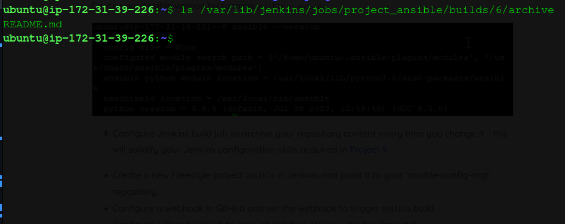
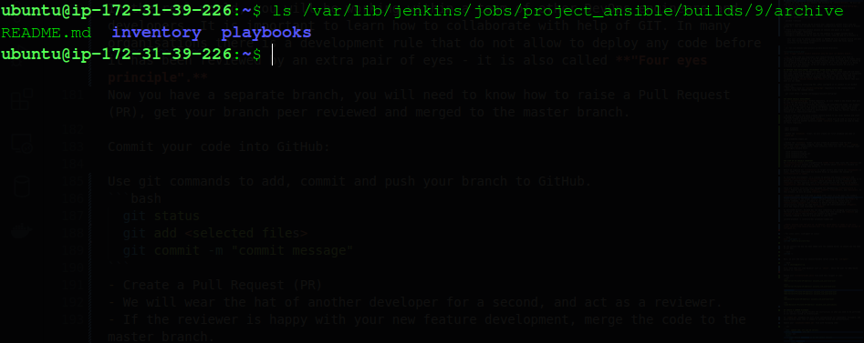
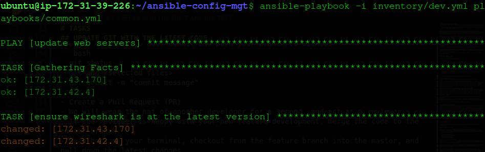
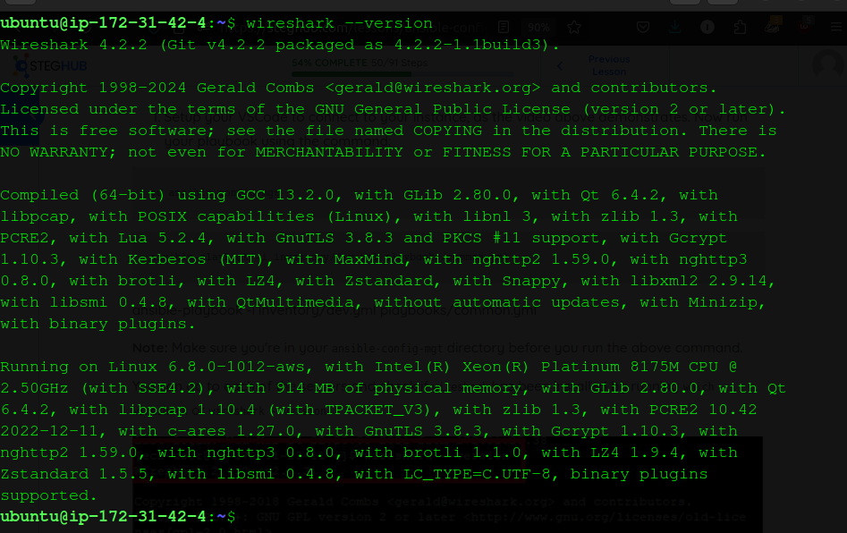
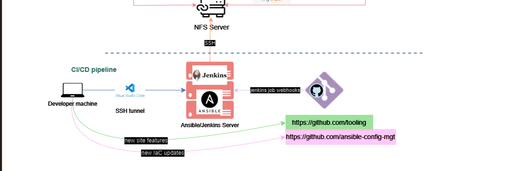

# ANSIBLE CONFIGURATION MANAGEMENT
<div style="display: flex; justify-content: center; align-items: center; margin: 20px 0;">
   
</div>

Today, our project focuses on automating tasks using **Ansible** to enhance our understanding of **DevOps** tools. By leveraging Ansible, we’ll simplify many routine processes like setting up servers and installing software, while gaining experience writing code in **YAML**.

We’ll also introduce the concept of a **Jump Server** (or **Bastion Host**), which acts as a secure intermediary server providing access to internal networks. This ensures that our web servers within a private network remain protected from direct internet access, improving overall security.

In this project, we’ll develop Ansible scripts to simulate using a **Jump Box/Bastion Host** for securely accessing our web servers. Let’s dive in and get started!


# TASKS
- Install and configure Ansible client to act as a Jump Server/Bastion Host
- Create a simple Ansible playbook to automate servers configuration

## INSTALL AND CONFUGURE ANSIBLE ON EC2 INSTANCE
- Update the Name tag on your Jenkins EC2 Instance to _Jenkins-Ansible_. We will use this server to run playbooks.
- In your GitHub account create a new repository and name it _ansible-config-mgt_.
- Install Ansible
```
 sudo apt update
 sudo apt install ansible
```
Check your Ansible version by running 
```
  ansible --version
```
- Configure Jenkins build job to archive your repository content every time you change it - this will solidify your Jenkins configuration skills acquired in Project 9.
- Create a new Freestyle project ansible in Jenkins and point it to your 'ansible-config-mgt' repository.
- Configure a webhook in GitHub and set the webhook to trigger ansible build.
- Configure a Post-build job to save all (**) files, like you did it in Project 9.

    Test your setup by making some change in README.md file in master branch and make sure that builds starts automatically and Jenkins saves the files (build artifacts) in following folder

```
  ls /var/lib/jenkins/jobs/project_ansible/builds/6/archive
```
 
_Note: Trigger Jenkins project execution only for main (or master) branch._

__Tip__: Every time you stop/start your Jenkins-Ansible server - you have to reconfigure GitHub webhook to a new IP address, in order to avoid it, it makes sense to allocate an Elastic IP to your Jenkins-Ansible server (you have done it before to your LB server in Project 10). Note that Elastic IP is free only when it is being allocated to an EC2 Instance, so do not forget to release Elastic IP once you terminate your EC2 Instance.

## PREPARE YOUR DEVELOPMENT ENVIRONMENT USING VISUAL STUDIO CODE
Since the first part of 'DevOps' is 'Dev', we will need to write code and use tools that make coding and debugging more efficient. This means we’ll require an Integrated Development Environment (IDE) or a source-code editor. There are many IDEs and editors available for different languages, each with its own pros and cons. We recommend using _**Visual Studio Code (VSC)**_ — a free, versatile editor that will meet all our needs.

- After successfully installing VSC, we’ll configure it to connect to our GitHub repository.
- Then, we’ll clone our `ansible-config-mgt` repository to the Jenkins-Ansible instance using the command below:
```
  git clone https://github.com/mwangiii/ansible-config-mgt
```

### BEGIN ANSIBLE DEVELOPMENT 
In our `ansible-config-mgt` GitHub repository, we will create a new branch that will be used for the development of a new feature.  
**Tip:** We will give our branches descriptive and comprehensive names. For example, if we use Jira or Trello as a project management tool, we will include the ticket number (e.g., PRJ-145) in the name of our branch, along with a topic and a brief description of what this branch is about—whether it’s a bug fix, hotfix, feature, or release (e.g., feature/prj-145-lvm).

- We will check out the newly created feature branch to our local machine and start building our code and directory structure.
- We will create a directory named `playbooks`, which will be used to store all our playbook files and another directory named `inventory`, which will be used to keep our hosts organized.

```
 mkdir playbooks
 mkdir inventory
```
- Within the `playbooks` folder, we will create our first playbook and name it `common.yml`.
```
touch playbooks/common.yml
```
- Within the `inventory` folder, we will create an inventory file for each environment (Development, Staging, Testing, and Production) named `dev`, `staging`, `uat`, and `prod`, respectively. These inventory files will use .ini language style to configure Ansible hosts.
```
  touch inventory/dev.yml
  touch inventory/staging.yml
  touch inventory/uat.yml
  touch inventory/prod.yml
```
### STEP UP AN ANSIBLE INVENTORY
An **inventory file** is a straightforward **YAML file** that lists the **hosts** and **groups of hosts** Ansible will manage. It defines which **servers** Ansible can connect to and the groups they belong to.

Before we organize our **inventory** of target servers and create our **playbook** of tasks, let’s first understand how Ansible helps us implement the concept of **infrastructure as code**.

In fast-paced environments, it's crucial to quickly and easily **deploy** and **manage infrastructure**. **Infrastructure as code** is a practice that allows us to define our infrastructure in **code**, which can then be used to **deploy** and **manage** it. This approach lets us treat infrastructure the same way we handle **application code**—by using **version control**, **testing**, and **automation**.

There are several excellent tools designed for implementing **infrastructure as code**. Popular ones include **Puppet**, **Chef**, **Terraform**, and **Ansible**. In this project, we will be using **Ansible**.

**Ansible** stands out from some of these other tools in a few ways. For example, unlike **Puppet**, Ansible is **agentless**, meaning we don’t need to install any client software on the target servers. Ansible connects to servers via **SSH** to execute commands, making it simple to set up. Additionally, Ansible uses a **declarative language** like **YAML** to define the desired state of our infrastructure, making the code easier to read and understand—unlike **Puppet**, which may require some knowledge of **Ruby**.

As mentioned earlier, Ansible has two main components for managing infrastructure. The first is the **inventory file**, a simple text file listing the **hosts** and **groups of hosts** that Ansible can connect to and manage.
A typical command to execute a play book is like this:
```
ansible-playbook -i inventory/dev playbooks/common.yml
```

_**Note: Ansible uses TCP port 22  by default, which means it needs to ssh into target servers from Jenkins-Ansible host - for this you can implement the concept of ssh-agent.**_ 


- For Linux users: [ssh-agent on Linux]

```bash
eval `ssh-agent -s`
ssh-add <path-to-private-key>
```

We can confirm the key has been added with the command below; we should see the name of our key:

```bash
ssh-add -l 
```

Next, we will SSH into our Jenkins-Ansible server using the `ssh-agent`:

```bash
ssh -A ubuntu@public-ip
```
Also, note that our Load Balancer user is `ubuntu`, while the user for RHEL-based servers is `ec2-user`.


Update your **inventory/dev.yml** file with this snippet of code:
```yml
[nfs]
<NFS-Server-Private-IP-Address> ansible_ssh_user=ec2-user

[nfs]
<NFS-Server-Private-IP-Address> ansible_ssh_user=ec2-user

[webservers]
<Web-Server1-Private-IP-Address> ansible_ssh_user=ec2-user
<Web-Server2-Private-IP-Address> ansible_ssh_user=ec2-user

[db]
<Database-Private-IP-Address> ansible_ssh_user=ec2-user 

[lb]
<Load-Balancer-Private-IP-Address> ansible_ssh_user=ubuntu
```

## CREATE A COMMON PLAYBOOK
It is time to start giving Ansible the instructions on what you need to be performed on all servers listed in inventory/dev.

In `common.yml` playbook you will write configuration for repeatable, re-usable, and multi-machine tasks that is common to systems within the infrastructure.

Update your `playbooks/common.yml` file with following code:

```yml
---
- name: update web, nfs and db servers
  hosts: webservers, nfs, db
  become: yes
  tasks:
    - name: ensure wireshark is at the latest version
      yum:
        name: wireshark
        state: latest
   

- name: update LB server
  hosts: lb
  become: yes
  tasks:
    - name: Update apt repo
      apt: 
        update_cache: yes

    - name: ensure wireshark is at the latest version
      apt:
        name: wireshark
        state: latest
```
Examine the code above and try to make sense out of it. This playbook is divided into two parts, each of them is intended to perform the same task: install wireshark utility (or make sure it is updated to the latest version) on your RHEL 8 and Ubuntu servers. It uses root user to perform this task and respective package manager: yum for RHEL 8 and apt for Ubuntu.

Feel free to update this playbook with following tasks:
    - Create a directory and a file inside it
    - Change timezone on all servers
    - Run some shell script

For a better understanding of Ansible playbooks - [watch this video](https://www.youtube.com/watch?v=ZAdJ7CdN7DY) from RedHat and [read this article](https://www.redhat.com/en/topics/automation/what-is-an-ansible-playbook).

## UPDATE GIT WITH THE LATEST CODE

Now all of your directories and files live on your machine and you need to push changes made locally to GitHub.

In the real world, you will be working within a team of other DevOps engineers and developers. It is important to learn how to collaborate with help of GIT. In many organisations there is a development rule that do not allow to deploy any code before it has been reviewed by an extra pair of eyes - it is also called **"Four eyes principle".**
Now you have a separate branch, you will need to know how to raise a Pull Request (PR), get your branch peer reviewed and merged to the master branch.

Commit your code into GitHub:

Use git commands to add, commit and push your branch to GitHub.
```bash
  git status
  git add <selected files>
  git commit -m "commit message"
```
- Create a Pull Request (PR)
- We will wear the hat of another developer for a second, and act as a reviewer.
- If the reviewer is happy with your new feature development, merge the code to the master branch.
- Head back on your terminal, checkout from the feature branch into the master, and pull down the latest changes.
```bash
git checkout main
git pull
```
Once our code changes appear in master branch - Jenkins will do its job and save all the files (build artifacts) to `/var/lib/jenkins/jobs/ansible/builds/<build_number>/archive/` directory on Jenkins-Ansible server.


## RUN THE FIRST ANSIBLE TEST
Now, it is time to execute ansible-playbook command and verify if oour playbook actually works:
Now let's  run our playbook using the command:
```bash
 cd ansible-config-mgt
 ansible-playbook -i inventory/dev.yml playbooks/common.yml
```
  
_**Note: Make sure you're in your ansible-config-mgt directory before you run the above command.**_

Let's  ssh into   each of the servers and check if wireshark has been installed by 
running 
```bash
wireshark --version
```

#### Our updated with Ansible architecture now looks like this:


# CONCLUSION
In this project, we explored the use of Ansible to automate the configuration of a simple web architecture. We created an inventory file that contains the private IP addresses of the web servers and the load balancer. We also developed a playbook to install the Wireshark package on the web servers. A separate playbook was created to update the APT repository on the load balancer server and ensure that Wireshark is at the latest version across all servers.