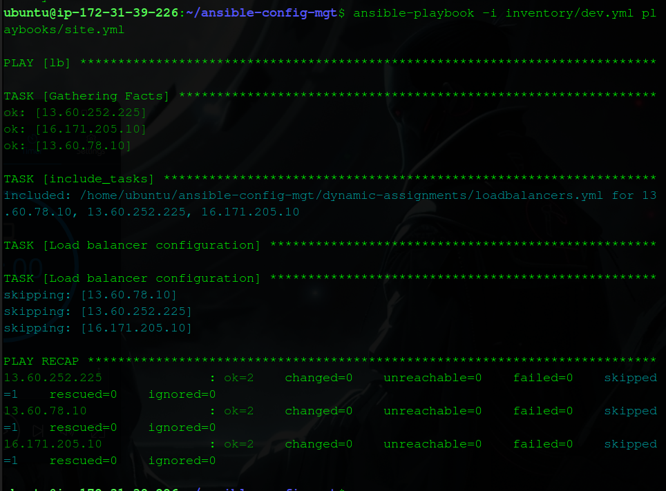
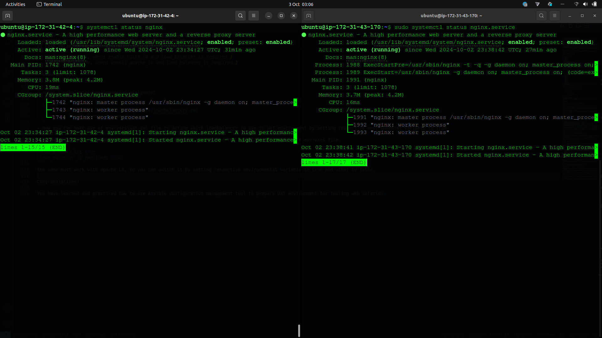

# ANSIBLE DYNAMIC ASSIGNMENTS (INCLUDE) AND COMMUNITY ROLES
In this project, I will introduce dynamic assignments using the include module. You may wonder about the difference between static and dynamic assignments. Previously, we learned that **static assignments** utilize the Ansible _import_ module, while the module that enables **dynamic assignments** is _include_.

- `import = Static`
- `include = Dynamic`

When the _import_ module is used, all statements are pre-processed during the playbook parsing. This means that when executing the _site.yml_ playbook, Ansible processes all referenced playbooks at parsing time. Consequently, if any statements change during execution, they will not be considered, making it static.

Conversely, the _include_ module processes statements only during the execution of the playbook. After parsing, any changes to the statements encountered during execution will be utilized. It is generally recommended to use static assignments for playbooks due to their reliability, as dynamic assignments can complicate debugging. However, dynamic assignments can be beneficial for environment-specific variables, which will be addressed in this project.

## INTRODUCING DYNAMIC ASSIGNMENT INTO OUR STRUCTURE
1. In the `https://github.com/<your-name>/ansible-config-mgt` GitHub repository, start a new branch named `dynamic-assignments`.
2. Create a folder named `dynamic-assignments` and add a new file named `env-vars.yml`. This will be referenced later in the `site.yml` playbook.

```bash
mkdir -p dynamic-assignments
touch dynamic-assignments/env-vars.yml
```

Your directory structure should now look like this:

```
├── dynamic-assignments
│   └── env-vars.yml
├── inventory
│   ├── dev
│   ├── stage
│   ├── uat
│   └── prod
├── playbooks
│   └── site.yml
├── roles (optional folder)
│   └── ...(optional subfolders & files)
└── static-assignments
    └── common.yml
```

Since I will be configuring multiple environments with unique attributes (such as server name and IP address), it is essential to set values for variables specific to each environment. 

3. Create a folder named `env-vars`, then add YAML files for each environment.

```bash
mkdir -p env-vars 
touch env-vars/dev.yml
touch env-vars/stage.yml
touch env-vars/uat.yml
touch env-vars/prod.yml
```

Your updated layout should now look like this:

```
├── dynamic-assignments
│   └── env-vars.yml
├── env-vars
│   ├── dev.yml
│   ├── stage.yml
│   ├── uat.yml
│   └── prod.yml
├── inventory
│   ├── dev
│   ├── stage
│   ├── uat
│   └── prod
├── playbooks
│   └── site.yml
└── static-assignments
    └── common.yml
```

4. Now, paste the following instructions into the `env-vars.yml` file:

```yaml
---
- name: Collate variables from environment-specific files, if they exist
  hosts: all
  tasks:
    - name: Loop through available files
      include_vars: "{{ item }}"
      with_first_found:
        - files:
            - dev.yml
            - stage.yml
            - prod.yml
            - uat.yml
          paths:
            - "{{ playbook_dir }}/../env-vars"
      tags:
        - always
```

Notice the following:

- The use of `include_vars` instead of `include` is because Ansible has separated the features of the module. From version 2.8, the `include` module is deprecated, and the following variants must be used:
  ```yaml
  include_role
  include_tasks
  include_vars
  ```

- Additionally, variants of `import` were introduced in the same version:
  ```yaml
  import_role
  import_tasks
  ```

- The special variables `{{ playbook_dir }}` and `{{ inventory_file }}` help Ansible determine the running playbook's location, enabling navigation to other paths. The `{{ inventory_file }}` variable dynamically resolves to the name of the inventory file being used, appending .yml to locate the required file within the env-vars folder.

- Including the variables uses a loop with `with_first_found`, ensuring the first found file in the list is used. This is useful for setting default values in case an environment-specific file does not exist.

## UPDATE SITE.YML WITH DYNAMIC ASSIGNMENTS  
Update the `site.yml` file to incorporate the dynamic assignment. (At this point, we cannot test it yet; we are simply setting the stage for what is to come.)

The `site.yml` should now look like this:

```yaml
---
- hosts: all
  name: Include dynamic variables 
  tasks:
    - import_playbook: ../static-assignments/common.yml 
    - include: ../dynamic-assignments/env-vars.yml
      tags:
        - always

- hosts: webservers
  name: Webserver assignment
  import_playbook: ../static-assignments/webservers.yml
```

## COMMUNITY ROLES
Next, I will create a role for the MySQL database, which will install the MySQL package, create a database, and configure users. However, instead of reinventing the wheel, I can leverage the many pre-existing roles developed by the open-source community. These roles are often production-ready and can accommodate various Linux flavors.

Using **Ansible Galaxy**, I can easily download a ready-to-use MySQL role developed by `geerlingguy`.

**Hint:** To maintain your GitHub repository's state after installing a new role, make a commit and push to the master branch of your `'ansible-config-mgt'` directory. Ensure that Git is installed and configured on the Jenkins-Ansible server. For more convenient code management, configure Visual Studio Code to work with this directory, eliminating the need for webhooks and Jenkins jobs to update your code on the Jenkins-Ansible server.

1. On the Jenkins-Ansible server, ensure that Git is installed, then navigate to the 'ansible-config-mgt' directory:

```bash
git --version
cd ansible-config-mgt
git init
git pull https://github.com/<your-name>/ansible-config-mgt.git
git remote add origin https://github.com/<your-name>/ansible-config-mgt.git
git branch roles-feature
git switch roles-feature
```

2. Inside the `roles` directory, create the new MySQL role with the command `ansible-galaxy install geerlingguy.mysql`, then rename the folder to `mysql`.

```bash
mv geerlingguy.mysql/ mysql
```

3. Review the `README.md` file and edit the role's configuration to use the correct MySQL credentials required for the tooling website.

4. Now, upload the changes to GitHub:

```bash
git add .
git commit -m "Commit new role files into GitHub"
git push --set-upstream origin roles-feature
```

5. If you are satisfied with your code, create a Pull Request and merge it into the main branch on GitHub.

## LOAD BALANCER ROLES
For our project, we have the flexibility to choose which load balancer to use, either Nginx or Apache, and we'll opt for Nginx in this instance.

Based on my experience with Ansible so far, I can:

- Decide whether to develop my own roles or find available ones from the community.
- Update both `static-assignment` and `site.yml` files to reference the roles.

### Important Hints
- Since only one load balancer can be used at a time (either Nginx or Apache), add a condition to enable either option by using variables.
- Declare variables in the `defaults/main.yml` file inside the Nginx and Apache roles:
  - For Nginx: `enable_nginx_lb`
  - For Apache: `enable_apache_lb`
  
Set both variables to `false` initially:

```yaml
# roles/nginx/defaults/main.yml
---
enable_nginx: false
load_balancer_is_required: false
```

```yaml
# roles/apache/defaults/main.yml
---
enable_apache: false
load_balancer_is_required: false
```

Declare another variable in both roles, `load_balancer_is_required`, and set its value to `false` as well.

Update the respective `assignment` and `site.yml` files accordingly.

## LOAD BALANCERS CONFIGURATION
Create a `loadbalancers.yml` file with the following content:

```yaml
---
- hosts: lb
  roles:
    - { role: nginx, when: enable_nginx_lb and load_balancer_is_required }
    - { role: apache, when: enable_apache_lb and load_balancer_is_required }
```

Update `site.yml` as follows:

```yaml
---
- name: Loadbalancer configuration assignment
  hosts: lb
  tasks:
    - include_tasks: ../dynamic-assignments/loadbalancers.yml
      when: load_balancer_is_required
```

Now, use the `env-vars/uat.yml` file to specify which load balancer to use in the UAT environment by setting the respective environmental variable to `true`.

Activate the load balancer and enable Nginx by adding the following to the environment's `env-vars` file:

```yaml
enable_nginx_lb: true
load_balancer_is_required: true
```

To switch

 to Apache, modify the `uat.yml` file:

```yaml
enable_apache_lb: true
load_balancer_is_required: true
```
You can the run the site.yml playbook by running the following command:
```yaml
ansible-playbook playbooks/site.yml
```

- Check nginx in the two servers

After all updates, ensure that the load balancer role is only enabled when required. To enable Nginx, set the `enable_nginx_lb` variable to `true` instead.

# CONCLUSION
In this project, I have highlighted the significance of dynamic assignments and community roles in improving the Ansible setup. Dynamic assignments allow me to flexibly allocate target servers to Ansible playbooks and roles, which simplifies deploying web infrastructure to new servers without the need to modify existing configurations. Community roles offer pre-built Ansible roles that facilitate the deployment of web infrastructure to any target server, eliminating the requirement to create playbooks from scratch.

To summarize my accomplishments, I established a new directory structure for dynamic assignments and environment variables, created supporting files, and configured variables for development, user acceptance testing, staging, and production environments. I also implemented community roles to deploy the MySQL database, along with Nginx and Apache web servers, to designated servers, and set up a new dynamic assignment for configuring the load balancer.

These updates significantly enhance the scalability of my web infrastructure, enabling seamless deployment to any target server without altering the playbooks or roles. This wraps up my work on the DevOps tooling web application. In the next project, I will undertake a capstone project to put my knowledge of DevOps tooling to the test. Stay tuned!