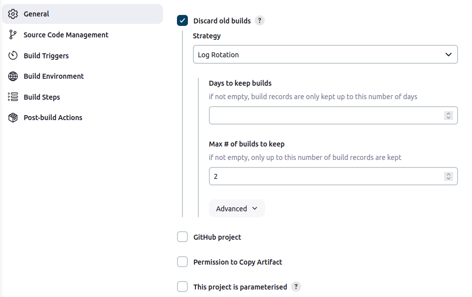
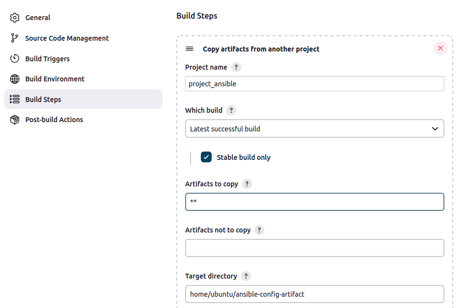
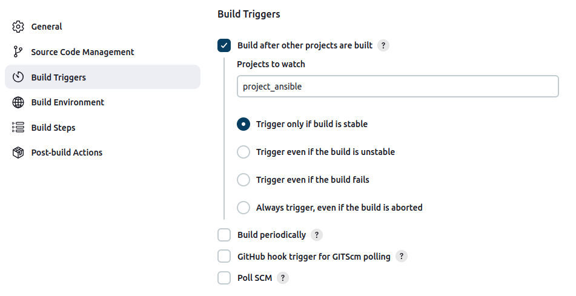
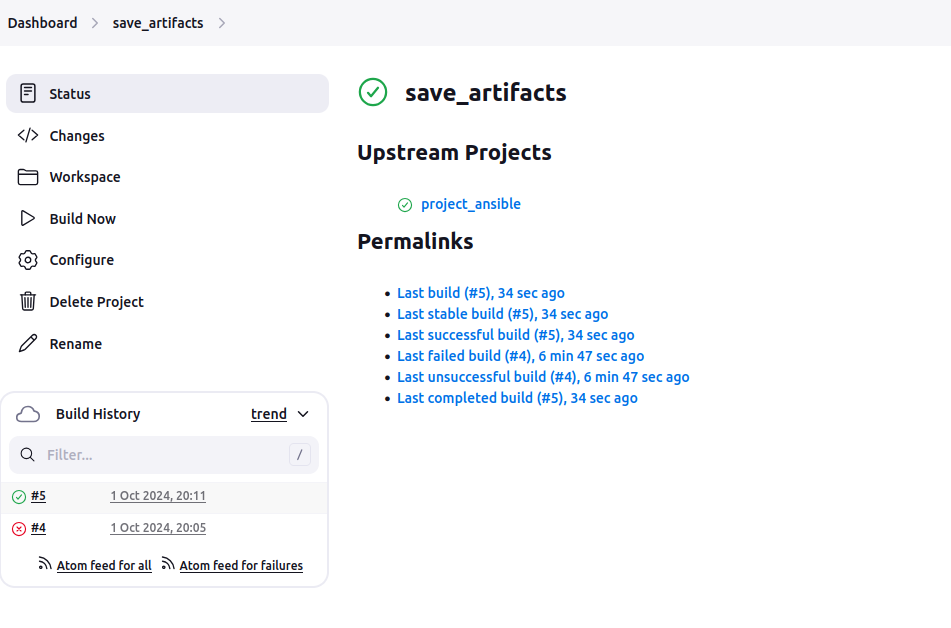
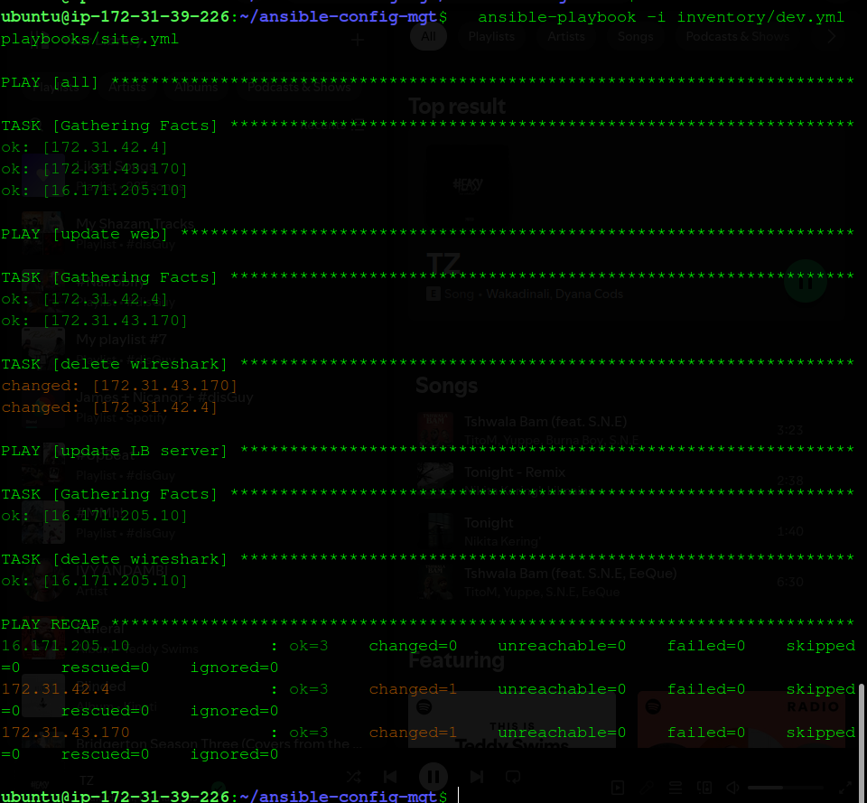
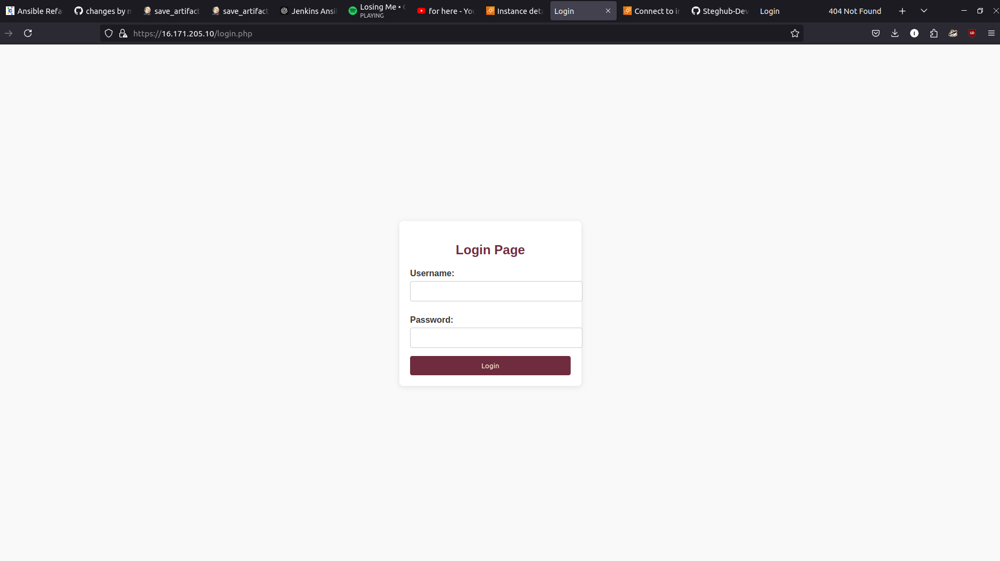
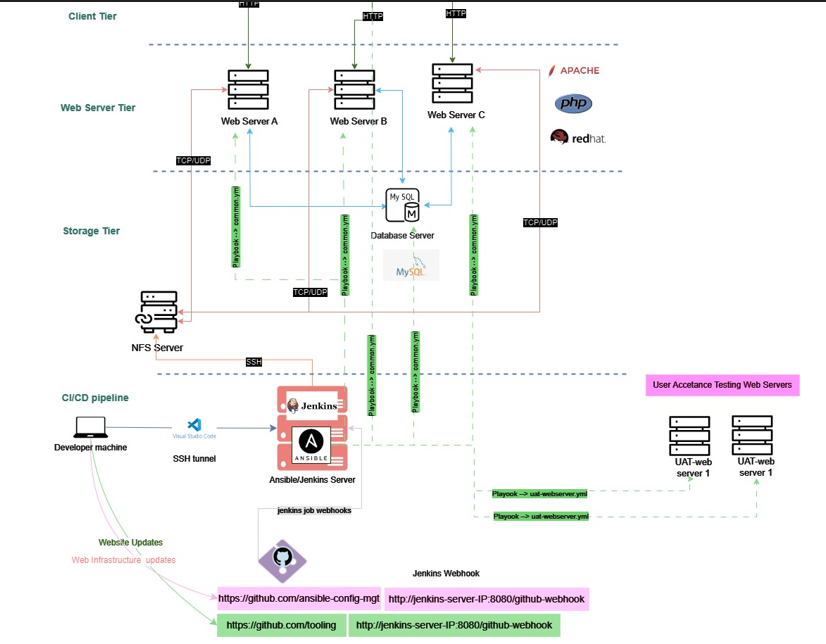

# ANSIBLE REFACTORING AND STATIC ASSIGMENTS (IMPORTS AND ROLES)
 

In the previous project, we worked with the `ansible-config-mgt` repository, and in this project, we will continue enhancing the code by refactoring the Ansible configuration. The focus will be on creating assignments and learning to utilize the imports functionality, which enables the efficient reuse of existing playbooks within new ones. This approach helps organize tasks and allows for better code management and reusability.


## CODE REFACTORING 
_**Refactoring**_ - means making changes to the source code without changing expected behaviour of the software. The main idea of refactoring is to enhance code readability, increase maintainability and extensibility, reduce complexity, add proper comments without affecting the logic.

- In our case, you will move things around a little bit in the code, but the overal state of the infrastructure remains the same.

## Let us see how you can improve your Ansible code!
### JENKINS JOB ENHANCEMENT
Before we begin, let us make some changes to our Jenkins job now every new change in the codes creates a separate directory which is not very convenient when we want to run some commands from one place. Besides, it consumes space on Jenkins serves with each subsequent change. Let us enhance it by introducing a new **Jenkins project/job** - we will require `Copy Artifact` plugin.
- Go to your Jenkins-Ansible server and create a new directory called _**ansible-config-artifact**_ where we will store there all artifacts after each build.
```bash
  sudo mkdir -p /home/ubuntu/ansible-config-artifact
```
- Change permissions to this directory, so Jenkins could save files there 
```bash
  sudo chmod -R 0777 /home/ubuntu/ansible-config-artifact
```
- Go to Jenkins _web console_  ===> _Manage Jenkins_ ===> _Manage Plugins_ ===> on _Available_ tab search for _Copy Artifact_ and install this plugin without restarting Jenkins
- Create a new Freestyle project (you have done it in Project 9) and name it `save_artifacts`.

- This project will be triggered by completion of your existing ansible project. Configure it accordingly
_Note: You can configure number of builds to keep in order to save space on the server, for example, you might want to keep only last 2 or 5 build results. You can also make this change to your ansible job_.
- The main idea of `save_artifacts` project is to save artifacts into `/home/ubuntu/ansible-config-artifact` directory. To achieve this, create a Build step and choose Copy artifacts from other project, specify ansible as a source project and `home/ubuntu/ansible-config-artifact` as a target directory.

    - keep only last 2 or 5 build results
      

    - specify `project_ansible` as a source project
      

    - specify `home/ubuntu/ansible-config-artifact` as a target directory  
      

- Test your set up by making some change in README.MD file inside your ansible-config-mgt repository (right inside master branch).
    - successful build
    

Now our Jenkins pipeline is more neat and clean.

## REFACTOR ANSIBLE CODE BY IMPORTING OTHER PLAYBOOS INTO SITE.YML
Before we start to refactor the codes, ensure that you have pulled down the latest code from master (main) branch, and create a new branch, name it refactor.

```bash
git pull
```
```bash
git checkout -b refactor
```
- DevOps philosophy implies constant iterative improvement for better efficiency
- refactoring is one of the techniques that can be used, but you always have an answer to question "why?". Why do we need to change something if it works well?

- Most Ansible users learn the one-file approach first. However, breaking tasks up into different files is an excellent way to organize complex sets of tasks and reuse them.
- Let see code re-use in action by importing other playbooks.
- Within `playbooks` folder, create a new file and name it `site.yml`
```bash
 touch playbooks/site.yml
```
 - This file will now be considered as an entry point into the entire infrastructure configuration. Other playbooks will be included here as a reference. In other words,` site.yml `will become a parent to all other playbooks that will be developed. Including `common.yml` that we created previously.
- Dont worry, you will understand more what this means shortly.
- Create a new folder in root of the repository and name it `static-assignments`. 
```bash 
 mkdir static-assignments
```
-  This folder is where all other children playbooks will be stored.
- This is merely for easy organization of your work.It is not an Ansible specific concept, therefore you can choose how you want to organize your work. 
- Move `common.yml` file into the newly created `static-assignments `folder.
```bash
  sudo mkdir /home/ubuntu/ansible-config-mgt/playbooks/static-assignments
  sudo mv /home/ubuntu/ansible-config-mgt/playbooks/common.yml /home/ubuntu/ansible-config-mgt/playbooks/static-assignments/common.yml

```
- Inside site.yml file, import `common.yml` playbook.
```yml
---
- hosts: all
- import_playbook: ../static-assignments/common.yml
```

```
The code above uses built in import_playbook Ansible module.

Your folder structure should look like this;

├── static-assignments
│   └── common.yml
├── inventory
    └── dev
    └── stage
    └── uat
    └── prod
└── playbooks
    └── site.yml
```

- Since we need to apply some tasks to your dev servers and wireshark is already installed 
- We can go ahead and create another playbook under static-assignments and name it `common-del.yml`. In this playbook, configure deletion of wireshark utility.
```yml
---
- name: update web
  hosts: webservers
  remote_user: ec2-user
  become: yes
  become_user: root
  tasks:
  - name: delete wireshark
    apt:
      name: wireshark
      state: removed

- name: update LB server
  hosts: lb
  remote_user: ubuntu
  become: yes
  become_user: root
  tasks:
  - name: delete wireshark
    apt:
      name: wireshark-qt
      state: absent
      autoremove: yes
      purge: yes
      autoclean: yes
```
- update `site.yml` with - import_playbook: ../static-assignments/common-del.yml instead of `common.yml` and run it against dev servers:
```bash
  cd /home/ubuntu/ansible-config-mgt/
  ansible-playbook -i inventory/dev.yml playbooks/site.yml
```

- Make sure that wireshark is deleted on all the servers by running
```bash
 wireshark --version
```


Now we have learned how to use `import_playbooks` module and we have a ready solution to  install/delete packages on multiple servers with one command


## CONFIGURE UAT WEBSERVERS WITH A ROLE 'WEBSERVER'
- Launch 2 fresh EC2 instances using RHEL 8 image, we will use them as our uat servers, so give them names accordingly -_** Web1-UAT**_ and _**Web2-UAT**_

- To create a role, you must create a directory called `roles/`, relative to the playbook file or in `/etc/ansible/` directory.

- Use an Ansible utility called **ansible-galaxy** inside `ansible-config-mgt/roles `directory (you need to create roles directory upfront)
```bash
mkdir roles
cd roles
ansible-galaxy init webserver
```
- The entire folder structure should look like below, but if you create it manually - you can skip creating tests, files, and vars or remove them if you used ansible-galaxy

```
└── webserver
    ├── README.md
    ├── defaults
    │   └── main.yml
    ├── files
    ├── handlers
    │   └── main.yml
    ├── meta
    │   └── main.yml
    ├── tasks
    │   └── main.yml
    ├── templates
    ├── tests
    │   ├── inventory
    │   └── test.yml
    └── vars
        └── main.yml
```
```bash
  sudo rm -rf /home/ubuntu/ansible-config-mgt/roles/webserver/files
  sudo rm -rf /home/ubuntu/ansible-config-mgt/roles/webserver/vars
  sudo rm -rf /home/ubuntu/ansible-config-mgt/roles/webserver/tests
```
After removing unnecessary directories and files, the roles structure should look like this
```
└── webserver
    ├── README.md
    ├── defaults
    │   └── main.yml
    ├── handlers
    │   └── main.yml
    ├── meta
    │   └── main.yml
    ├── tasks
    │   └── main.yml
    └── templates
```
- Update your inventory `ansible-config-mgt/inventory/uat.yml` file with IP addresses of your 2 UAT Web servers

_NOTE: Ensure you are using ssh-agent to ssh into the Jenkins-Ansible instance just as you have done in project 11;_

```yml
[uat-webservers]
<Web1-UAT-Server-Private-IP-Address> ansible_ssh_user='ec2-user'
<Web2-UAT-Server-Private-IP-Address> ansible_ssh_user='ec2-user'
```
- In` /etc/ansible/ansible.cfg` file uncomment roles_path string and provide a full path to your roles directory `roles_path = /home/ubuntu/ansible-config-mgt/roles`, so Ansible could know where to find configured roles.
- It is time to start adding some logic to the webserver role.
-  Go into `tasks` directory, and within the `main.yml` file, start writing configuration tasks to do the following:
- Install and configure Apache (httpd service)
- Clone Tooling website from GitHub https://github.com/mwangiii/tooling.git.
- Ensure the tooling website code is deployed to `/var/www/html` on each of 2 UAT Web servers.
- Make sure httpd service is started
- Our `main.yml` may consist of following tasks:
```yml
---
- name: install apache
  become: true
  ansible.builtin.yum:
    name: "httpd"
    state: present

- name: install git
  become: true
  ansible.builtin.yum:
    name: "git"
    state: present

- name: clone a repo
  become: true
  ansible.builtin.git:
    repo: https://github.com/<your-name>/tooling.git
    dest: /var/www/html
    force: yes

- name: copy html content to one level up
  become: true
  command: cp -r /var/www/html/html/ /var/www/

- name: Start service httpd, if not started
  become: true
  ansible.builtin.service:
    name: httpd
    state: started

- name: recursively remove /var/www/html/html/ directory
  become: true
  ansible.builtin.file:
    path: /var/www/html/html
    state: absent
```

## REFERENCE 'WEBSERVER' ROLE

Within the `static-assignments` folder, create a new assignment for uat-webservers `uat-webservers.yml`. This is where you will reference the role.
```yml
---
- hosts: uat-webservers
  roles:
     - webserver
```
Remember that the entry point to our ansible configuration is the `site.yml` file. Therefore, you need to refer your uat-webservers.yml role inside `site.yml`.

So, we should have this in `site.yml`
```yml
---
- hosts: all
- import_playbook: ../static-assignments/common.yml

- hosts: uat-webservers
- import_playbook: ../static-assignments/uat-webservers.yml
```


## COMMIT AND TEST
- Commit your changes, create a Pull Request and merge them to master branch, make sure webhook triggered two consequent Jenkins jobs, they ran successfully and copied all the files to your Jenkins-Ansible server into `/home/ubuntu/ansible-config-mgt/ `directory.

Now run the playbook against your uat inventory and see what happens:
```bash
  cd /home/ubuntu/ansible-config-mgt
  ansible-playbook -i inventory/uat.yml playbooks/site.yml
```

- You should be able to see both of your UAT Web servers configured and you can try to reach them from your browser:
```
http://<Web1-UAT-Server-Public-IP-or-Public-DNS-Name>/index.php
```
or
```
http://<Web1-UAT-Server-Public-IP-or-Public-DNS-Name>/index.php
```

### Our Ansible architecture now looks like this:


## Let's reflect on what we've accomplished so far:   
 we updated Jenkins with a new project to copy artifacts from an upstream project to a new directory on the Jenkins server, implemented a new directory structure for the Ansible project to make the playbooks more modular and reusable, and set up a parent playbook that calls child playbooks based on the server type. We also created a role for the User Acceptance Testing web servers, referenced this role in a static assignment file, and included the static assignment file in the parent playbook. Finally, we tested the refactored codebase by running the `site.yml` playbook.


