# Automate Infrastructure With IaC using Terraform - Part 1

## Prerequisites before you begin writing Terraform code

1. **Create IAM User**
   - Create an IAM user named `terraform` with programmatic access.
     
     Output 1:
     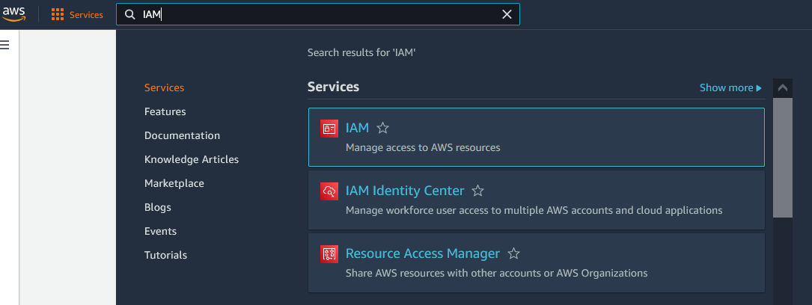

     Output 2:
     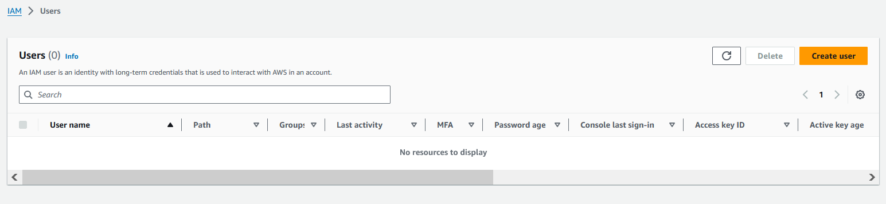

     Output 3:
     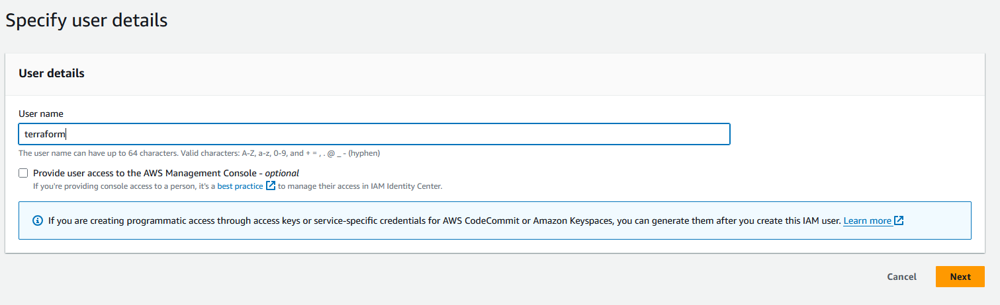

   - Assign AdministratorAccess permissions.
     
     Output 1:
     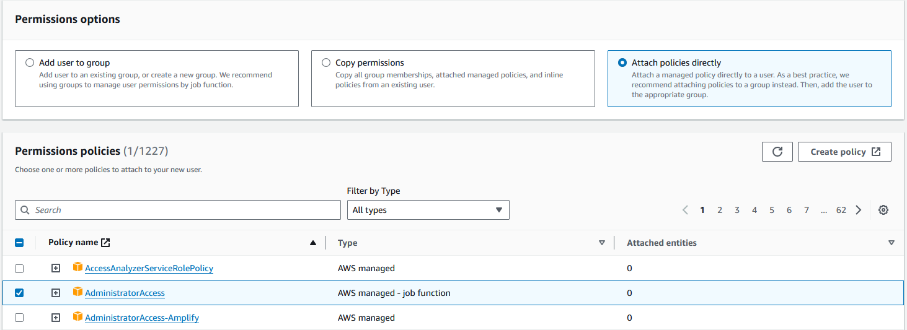

     Output 2:
     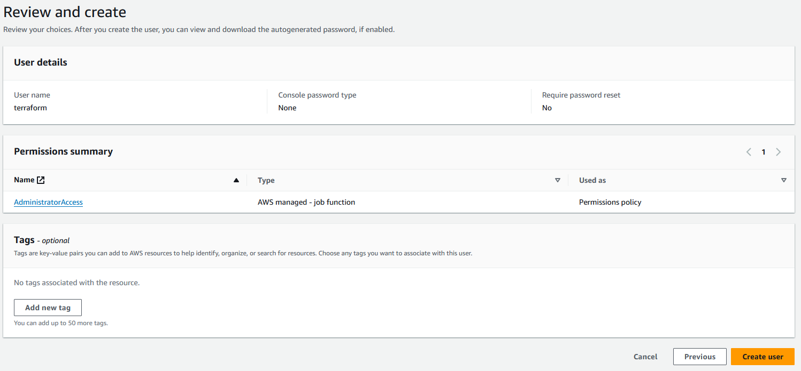

     Output 3:
     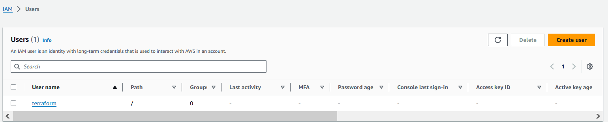

   - Create, Copy and Save the `secret access-key` and `access-key ID`.
     
     Output 1:
     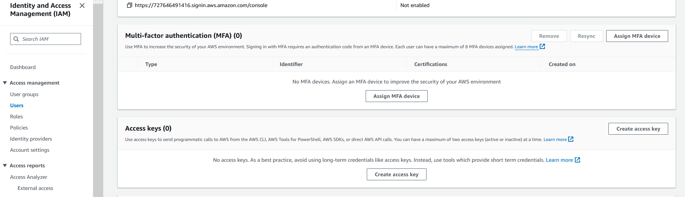

     Output 2:
     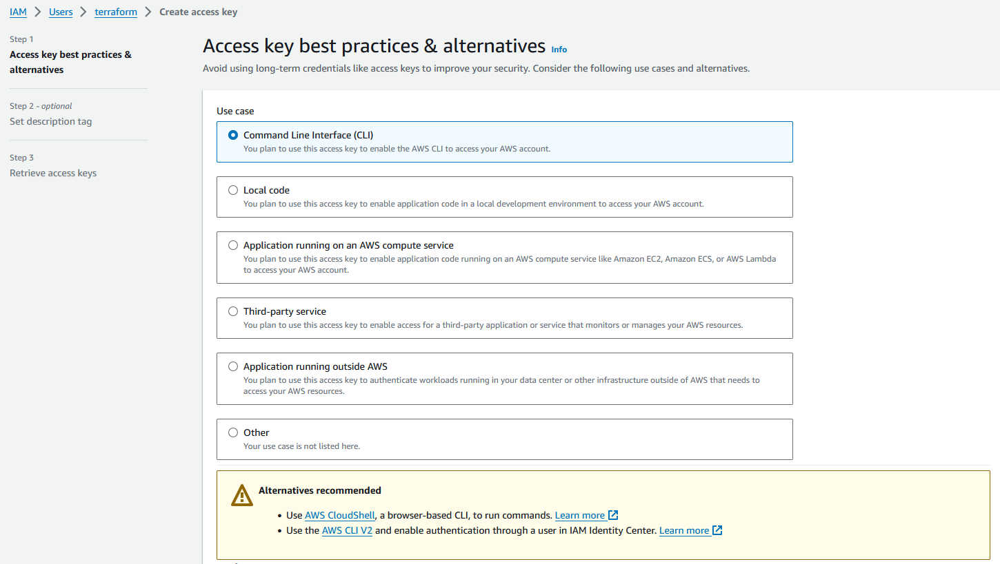

     Output 3:
     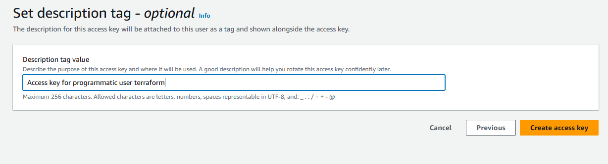

     Output 4:
     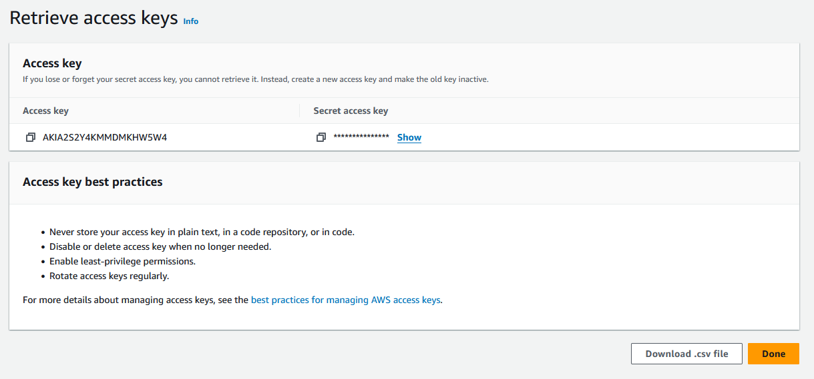

2. **Configure AWS CLI**
   - Use the AWS CLI to configure access with the keys:
     
     ```bash
     aws configure
     ```
     - Fill in the prompt
       ```
       AWS Access Key ID [****************Y6JW]: <Access Key ID>
       AWS Secret Access Key [****************YdPL]: <Secret Acess Key>
       Default region name [us-east-1]: us-east-1
       Default output format [json]: json
       ```

       ```
       cat ~/.aws/credentials

       # You will see the output below
       [default]
       aws_access_key_id = YOUR_ACCESS_KEY
       aws_secret_access_key = YOUR_SECRET_KEY
       ```

3. **Create an S3 Bucket**
   - Create an S3 bucket (e.g., `<yourname>-dev-terraform-bucket`) to store the Terraform state file.
     
     Output 1:
     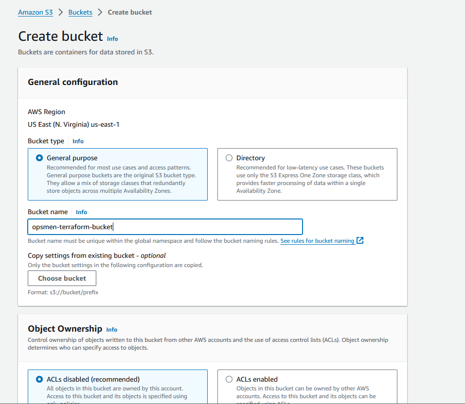

     Output 2:
     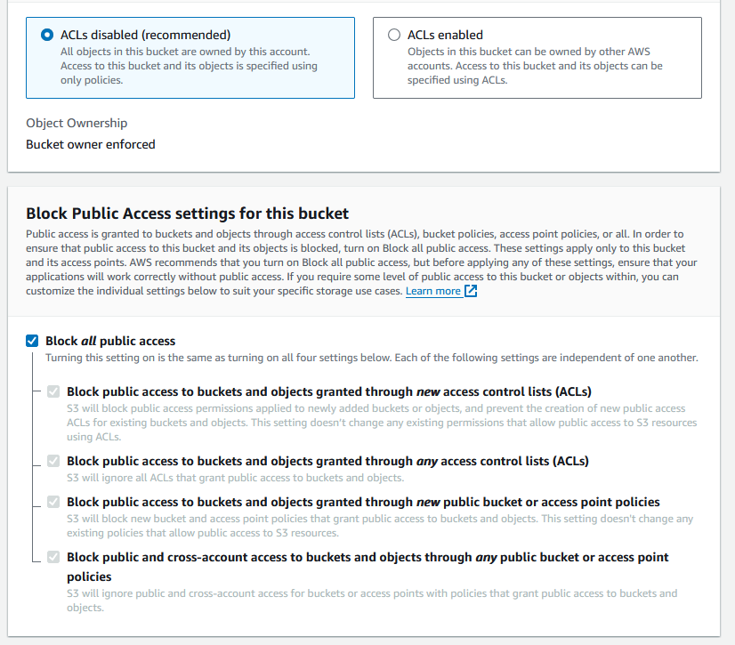

     Output 3:
     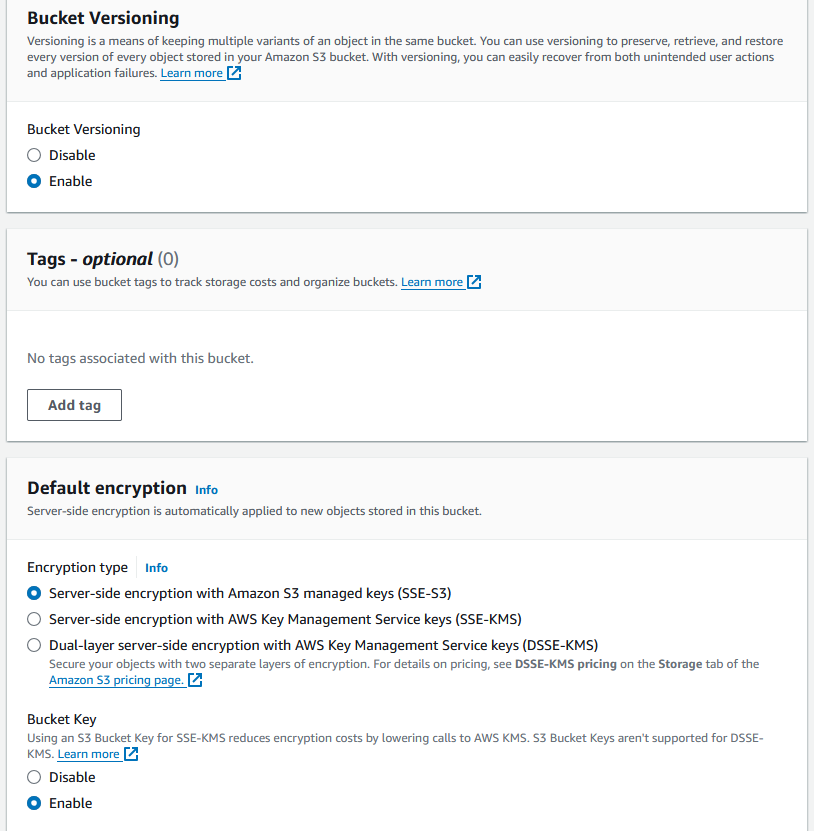

     Output 4:
     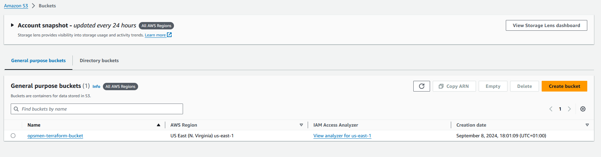


4. **Test Programmatic Access**
   - Install `boto3` and run the following Python code to verify access:
     
     ```
     pip install boto3
     ```

     Output 1:
     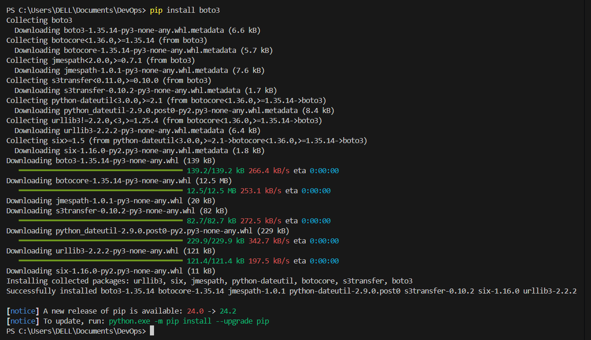

     > Note: Python 3.7 or higher should have been installed.

     ```python
     import boto3
     s3 = boto3.resource('s3')
     for bucket in s3.buckets.all():
         print(bucket.name)
     ```
     Output 2:
     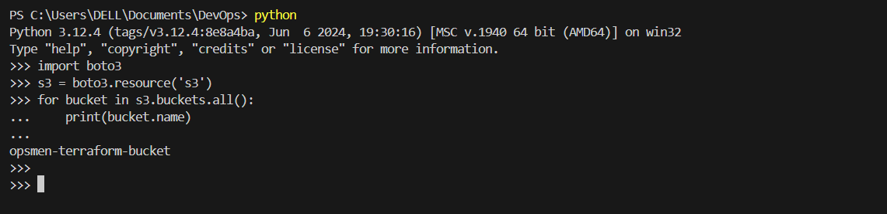
     

---

## VPC | Subnets | Security Groups

### Step 1: Create a Directory Structure

1. Open Visual Studio Code and create a folder named `PBL`.
2. Inside the folder, create a file named `main.tf`.
  
  Output:
  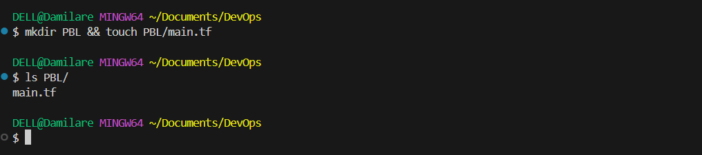

---

### Step 2: Provider and VPC Resource

1. Add AWS as a provider and define a VPC resource in the `main.tf` file.
   
   ```hcl
   terraform {
     required_providers {
       aws = {
         source  = "hashicorp/aws"
         version = "5.66.0"
       }
     }
   }

   provider "aws" {
   region = "us-east-1"
   }

   # Create VPC
   resource "aws_vpc" "main" {
     cidr_block                     = "172.16.0.0/16"
     enable_dns_support             = "true"
     enable_dns_hostnames           = "true"

     tags = {
       Name      = "opsmen-vps"
       Terraform = "true"
     }
   }
   ```
2. Initialize Terraform to download necessary plugins:
   
   ```bash
   terraform init
   ```

   Output:
   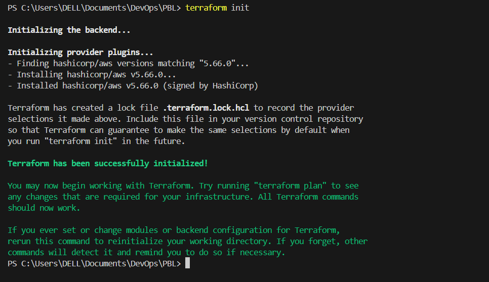

3. Run the following commands to plan and apply the changes:

   ```bash
   terraform plan
   terraform apply -auto-approve
   ```

   Output 1:
   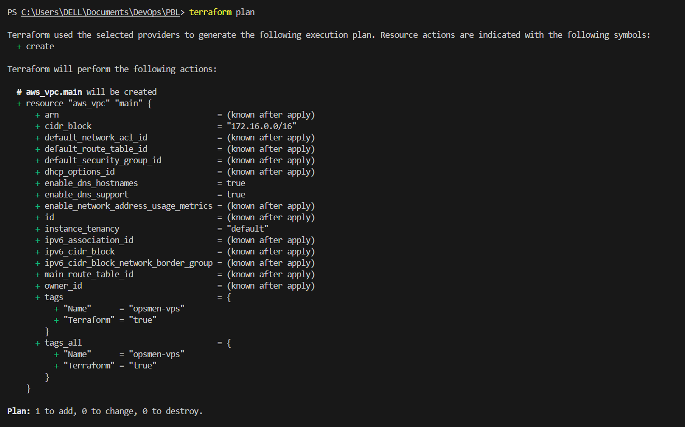

   Output 2:
   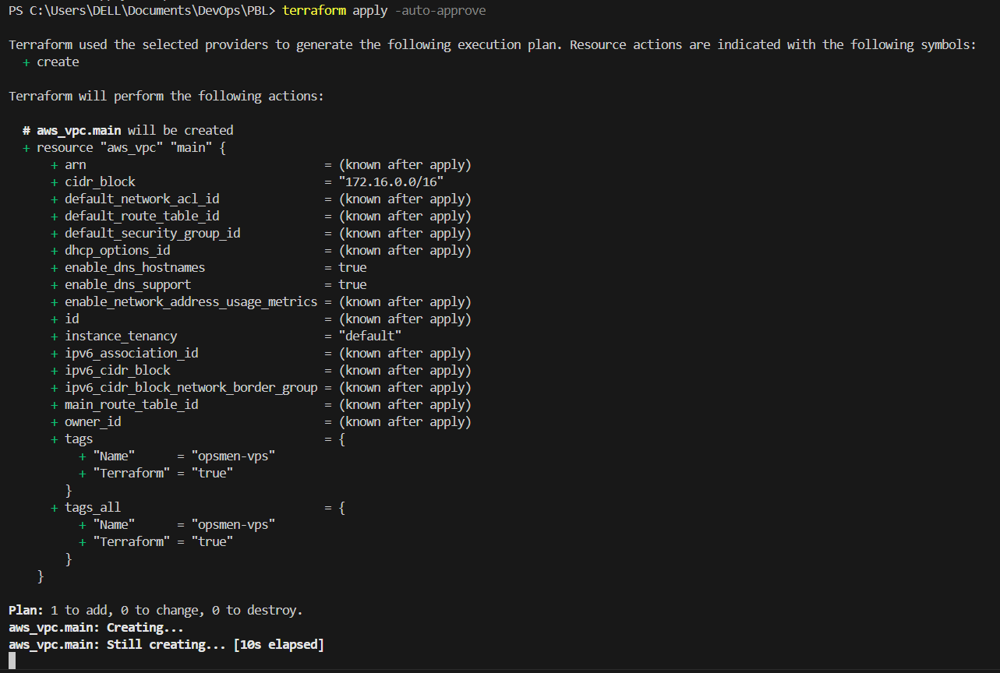

   Output 3:
   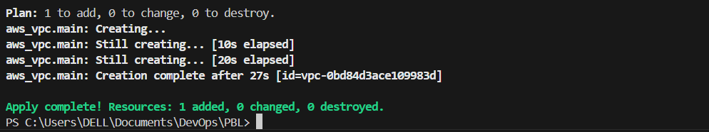

---

### Step 3: Define Subnets

- We will create 6 subnets:
  - 2 public.
  - 2 private for web servers.
  - 2 private for the data layer.

Add the following code to `main.tf` to create two public subnets:

```hcl
# Create public subnet1
resource "aws_subnet" "public1" {
    vpc_id                  = aws_vpc.main.id
    cidr_block              = "172.16.0.0/24"
    map_public_ip_on_launch = true
    availability_zone       = "us-east-1a"
}

# Create public subnet2
resource "aws_subnet" "public2" {
    vpc_id                  = aws_vpc.main.id
    cidr_block              = "172.16.1.0/24"
    map_public_ip_on_launch = true
    availability_zone       = "us-east-1b"
}
```

- Run `terraform plan` and `terraform apply`.

---

### Step 4: Refactor Code

1. Destroy the current infrastructure:
   
   ```bash
   terraform destroy -auto-approve
   ```
   
   Output:
   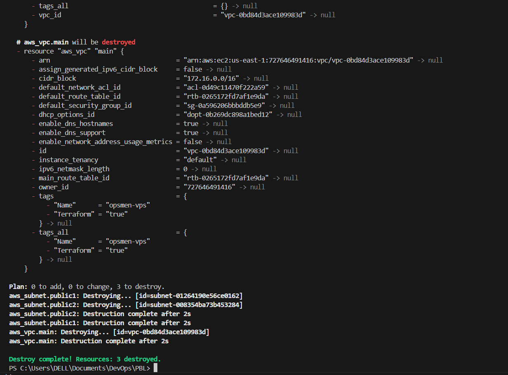

2. Refactor Provider and VPC Block:

    - Introduce variables:
      
      ```hcl
      variable "region" { 
        default = "us-east-1"
      }
      
      variable "vpc_cidr" {
        default = "172.16.0.0/16" 
      }

      variable "enable_dns_support" {
        default = "true"
      }

      variable "enable_dns_hostnames" {
        default ="true"
      }
      ```

      ```hcl
      provider "aws" { 
        region = var.region 
      }

      # Create VPC
      resource "aws_vpc" "main" {
        cidr_block = var.vpc_cidr
        enable_dns_support = var.enable_dns_support
        enable_dns_hostnames = var.enable_dns_hostname
      }
      ```

3. Refactor Subnets with Loops and Data Sources:
   - Fetch availability zones:
     
     ```hcl
     data "aws_availability_zones" "available" {
       state = "available"
     }
     ```

4. Update subnet creation to use dynamic values, example is a `count` argument in the subnet block:
   
   ```hcl
   resource "aws_subnet" "public" {
     count                   = 2
     vpc_id                  = aws_vpc.main.id
     cidr_block              = cidrsubnet(var.vpc_cidr, 4 , count.index)
     map_public_ip_on_launch = true
     availability_zone       = data.aws_availability_zones.available.names[count.index]
   }
   ```
   - Let us quickly understand what is going on here.

      - The `count` tells us that we need 2 subnets. Therefore, Terraform will invoke a loop to create 2 subnets.
      - The data resource will return a list object that contains a list of AZs. Internally, Terraform will receive the data like this.
        
        ```
        ["us-east-1a", "us-east-1b", "us-east-1c", "us-east-1d", "us-east-1e", "us-east-1f"]
        ```
   - A closer look at `cidrsubnet` - This function works like an algorithm to dynamically create a subnet CIDR per AZ. Regardless of the number of subnets created, it takes care of the cidr value per subnet.

     - Its parameters are (prefix, newbits, netnum).
       
       - The `prefix` parameter must be given in CIDR notation, same as for VPC.
       - The `newbits` parameter is the number of additional bits with which to extend the prefix. For example, if given a prefix ending with `/16` and a newbits value of `4`, the resulting subnet address will have length `/20`.
       - The `netnum` parameter is a whole number that can be represented as a binary integer with no more than `newbits` binary digits, which will be used to populate the additional bits added to the `prefix`.

5. Test the `cidrsubnet()` function in Terraform console:
    
    ```bash
    terraform console
    ```
    - type `cidrsubnet("172.16.0.0/16", 4, 0)`.
    - Hit `enter`.
    - See the output.
    - Keep change the numbers and see what happens.
    - To get out of the console, type `exit`.
      
      Output:
      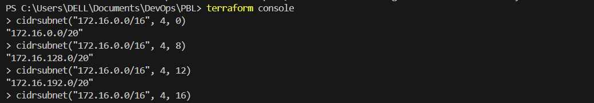
6. Since we cannot hard code a value we want, then we will need a way to dynamically provide the value based on some input. Since the data resource returns all the AZs within a region, it makes sense to count the number of AZs returned and pass that number to the `count` argument.

   - To do this, we can introuduce `length()` function, which basically determines the length of a given list, map, or string.
   - Since `data.aws_availability_zones.available.names` returns a list like `["us-east-1a", "us-east-1b", "us-east-1c"]` we can pass it into a `lenght` function and get number of the AZs.
   - Open up `terraform console` and try it.
     
     Output:
     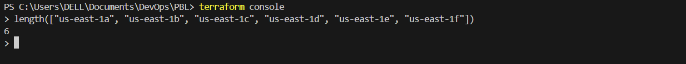

---

### Step 5: Dynamic Subnet Count

1. Introduce a variable to store the desired number of public subnets:
  
   ```hcl
   variable "preferred_number_of_public_subnets" { 
     default = 4 
   }
   ```

2. Update the count argument conditionally:
   
   ```hcl
   resource "aws_subnet" "public" {
     count                   = var.preferred_number_of_public_subnets == null ? length(data.aws_availability_zones.available.names) : var.preferred_number_of_public_subnets
     vpc_id                  = aws_vpc.main.id
     cidr_block              = cidrsubnet(var.vpc_cidr, 4 , count.index)
     map_public_ip_on_launch = true
     availability_zone       = data.aws_availability_zones.available.names[count.index]
   }
   ```
   - Lets break it down:

      - The first part `var.preferred_number_of_public_subnets == null` checks if the value of the variable is set to `null` or has some value defined.

      - The second part `?` and `length(data.aws_availability_zones.available.names)` means, if the first part is true, then use this. In other words, if preferred number of public subnets is `null` (Or not known) then set the value to the data returned by `lenght` function.

      - The third part `:` and `var.preferred_number_of_public_subnets` means, if the first condition is false, i.e preferred number of public subnets is `not null` then set the value to whatever is definied in `var.preferred_number_of_public_subnets`.

---

### Step 6: Organize Files

1. `main.tf`
   
    ```hcl
    terraform {
      required_providers {
        aws = {
          source  = "hashicorp/aws"
          version = "5.66.0"
        }
      }
    }

    provider "aws" {
      region = var.region
    }

    # Create VPC
    resource "aws_vpc" "main" {
      cidr_block           = var.vpc_cidr
      enable_dns_support   = var.enable_dns_support
      enable_dns_hostnames = var.enable_dns_hostnames

      tags = {
        Name      = "opsmen-vps"
        Terraform = "true"
      }
    }


    # Get list of availability zones
    data "aws_availability_zones" "available" {
      state = "available"
    }

    # Create Public Subnet
    resource "aws_subnet" "public" {
      count                   = var.preferred_number_of_public_subnets == null ? length(data.aws_availability_zones.available.names) : var.preferred_number_of_public_subnets
      vpc_id                  = aws_vpc.main.id
      cidr_block              = cidrsubnet(var.vpc_cidr, 4 , count.index)
      map_public_ip_on_launch = true
      availability_zone       = data.aws_availability_zones.available.names[count.index]
    }
    ```

2. `variables.tf`
    
    ```hcl
    variable "region" {
    type = string
    }

    variable "vpc_cidr" {
    type = string
    }

    variable "enable_dns_support" {
    type = bool
    }

    variable "enable_dns_hostnames" {
    type = bool
    }

    variable "preferred_number_of_public_subnets" {
    type = number
    }
    ```

3. `terraform.tfvars`
    
    ```hcl
    region = "us-east-1"

    vpc_cidr = "172.16.0.0/16"

    enable_dns_support = "true"

    enable_dns_hostnames = "true"

    preferred_number_of_public_subnets = 4
    ```

- Run `terraform plan` to verify the configuration.
  
  Output:
  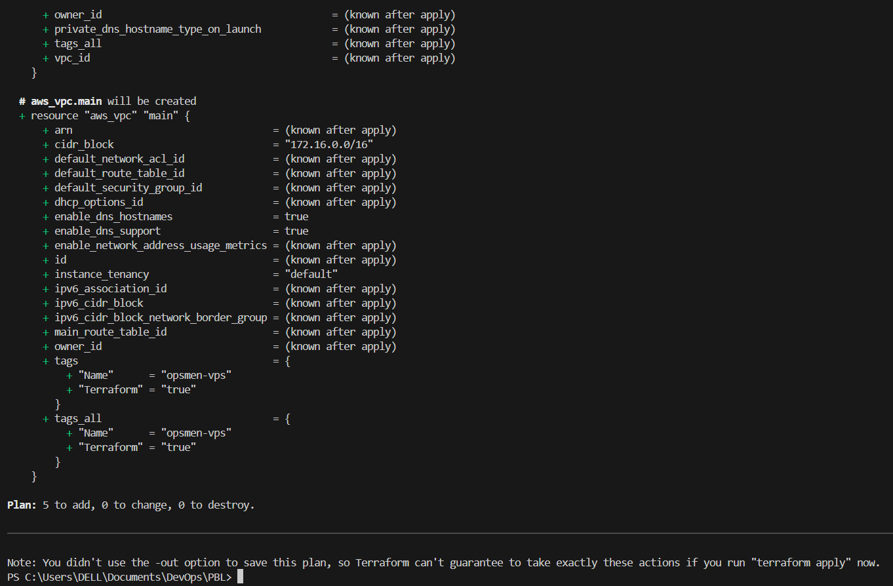

  > Notice: The Plan: 5 to add, 0 to change, 0 to destroy. This implies that 5 resources will be created: A VPC and 4 subnets (with index 0,1,2 and 3).

- Run `terraform apply -auto-approve` to create the resources.
  
  Output 1:
  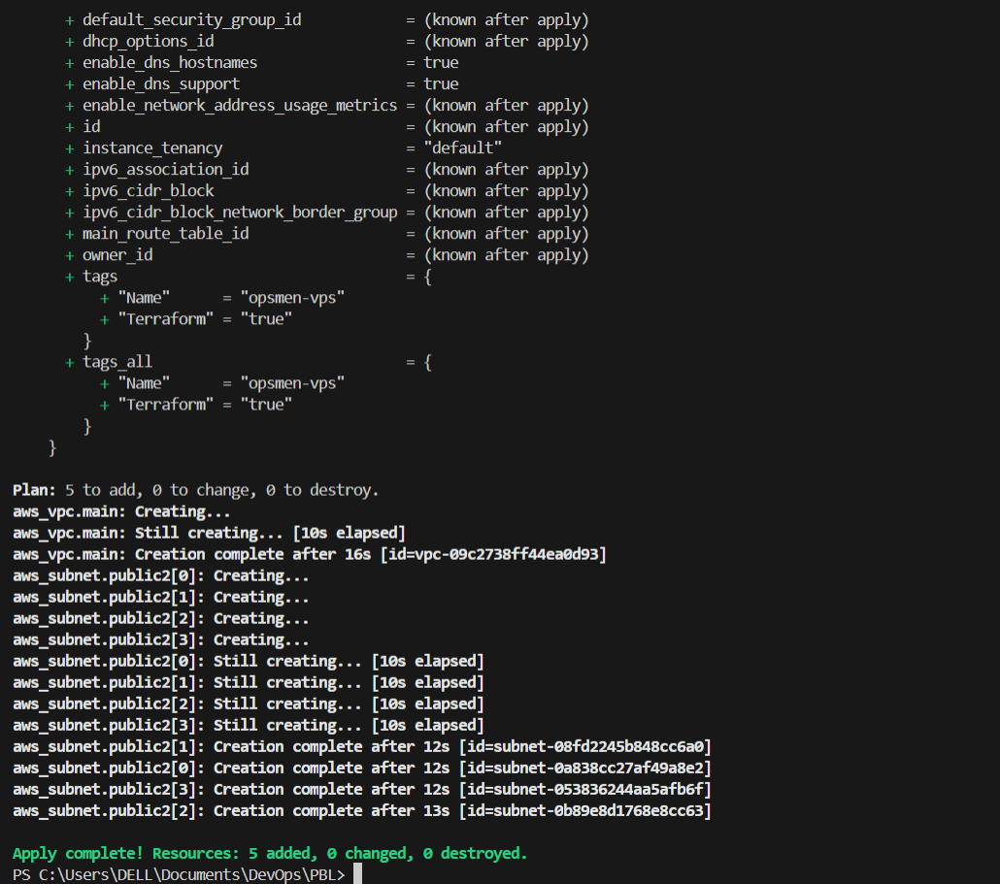

  Output 2:
  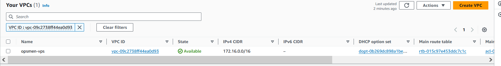

  Output 3:
  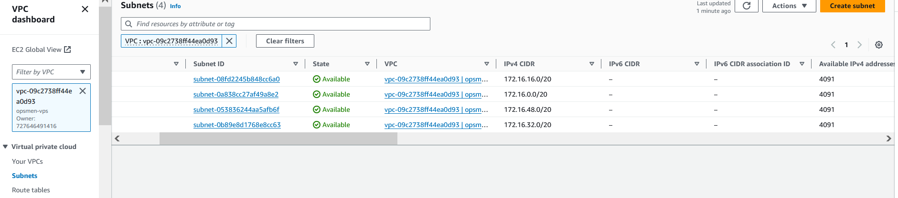

- Run `terraform destroy -auto-approve` to delete all resources created.
  
  Output:
  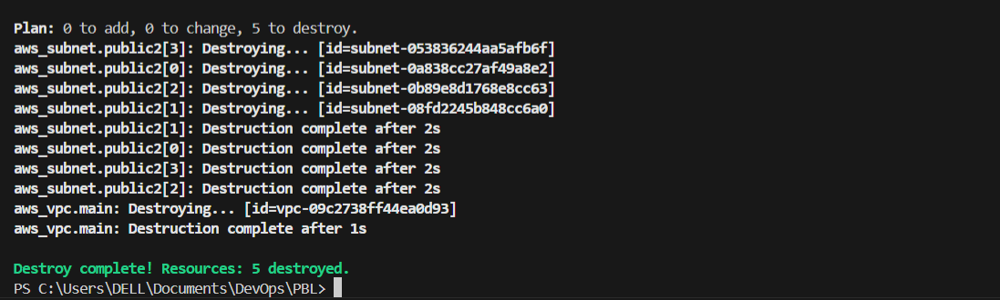

---

### Conclusion

You have now learned how to create and destroy AWS Network Infrastructure using Terraform.