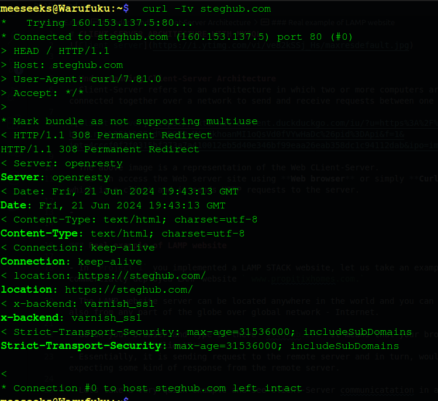
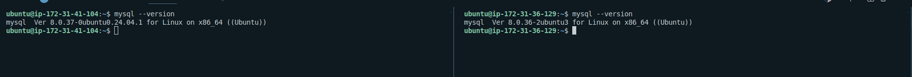
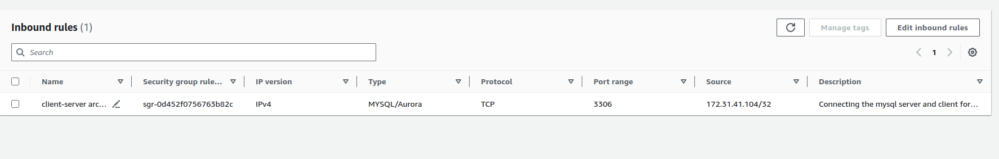
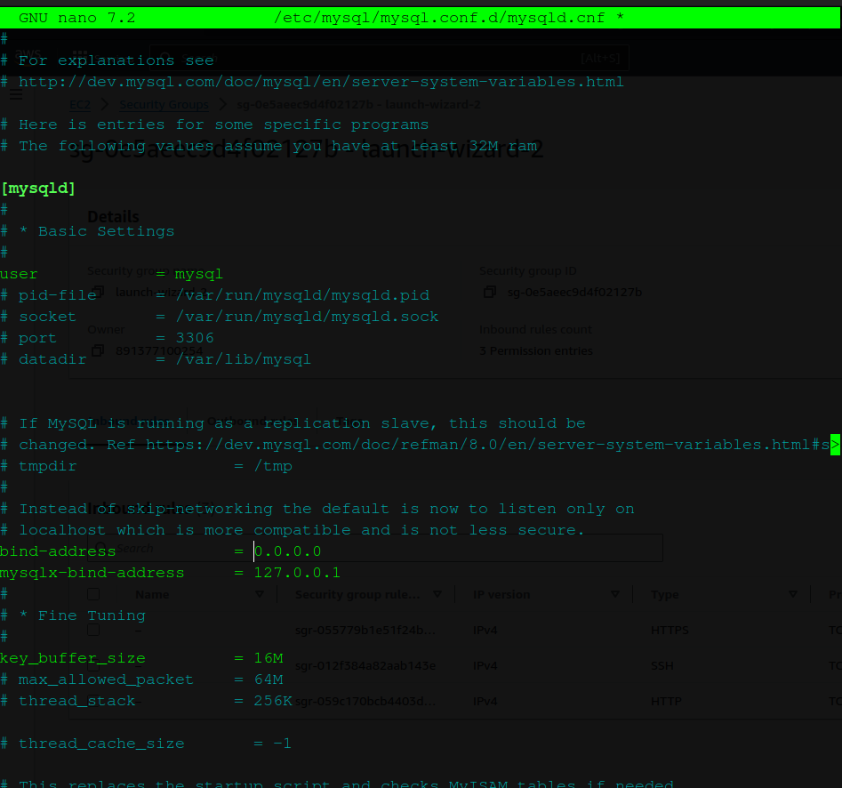
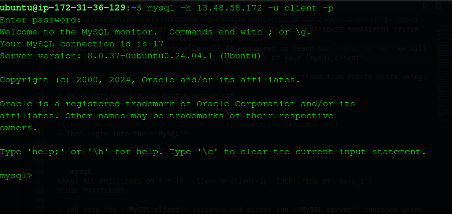
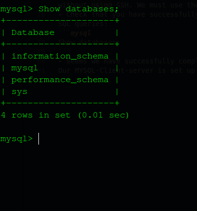
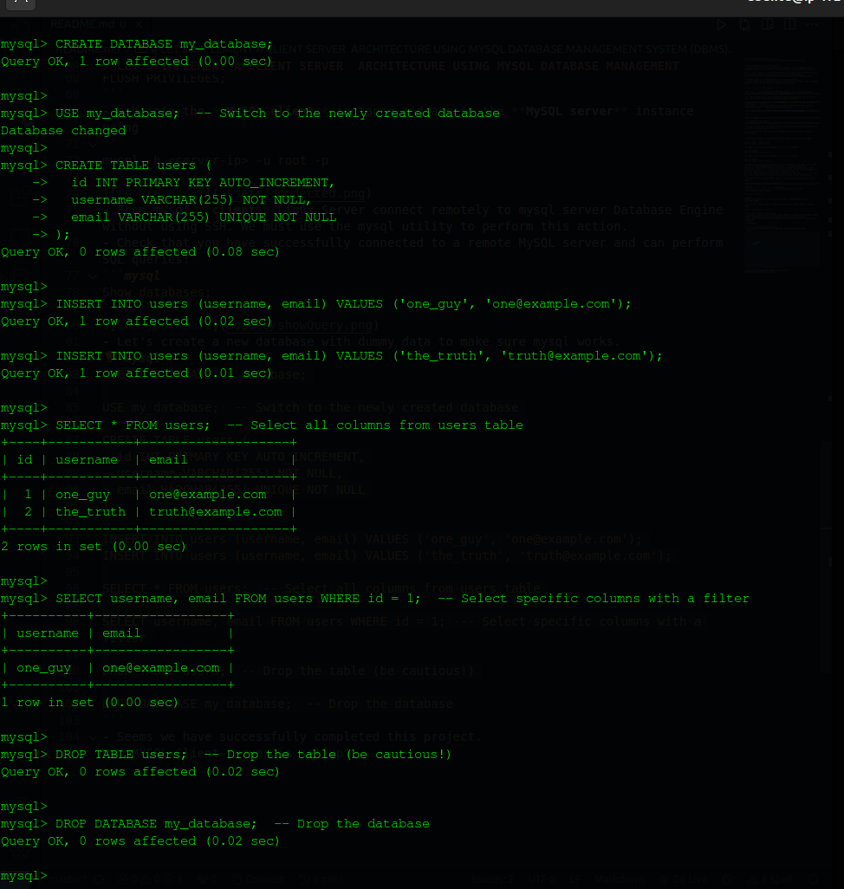

# CLIENT-SERVER ARCHITECTURE WITH MYSQL


# INTRODUCTION
# Understanding Client-Server Architecture
- Client-Server refers to an architecture in which two or more computers are connected together over a network to send and receive requests between one another.


- The above image is a representation of the Web CLient-Server.
- You can access the Web server site using **Web browser** or simply **Curl** command which is a client and it sends HTTP requests to the server.  


### Real example of LAMP website

- In `Project 1` we implemented a LAMP STACK website
- The LAMP website server can be located anywhere in the world and we can reach it also from any part of the globe over global network - Internet.

- If we go to our browser and type `steghub.com` It means that our browser is considered the **"Client"**.
- Essentially, it is sending request to the remote server and in turn, would be expecting some kind of response from the remote server.

- Let's see Client-Server communication in action.
- Run
```
curl -Iv steghub.com
```
- You should see this output  
   
- You can also see that the requests from the URL are being served by a computer with an IP address `160.153.133.153` on **port 80**.

# LET'S IMPLEMENT A CLIENT SERVER  ARCHITECTURE USING MYSQL DATABASE MANAGEMENT SYSTEM (DBMS).
- Now that we have a basic understanding of MySQL server let's begin

- Create and configure two Linux-based virtual servers (EC2 instances in AWS).
```
Server A name - `mysql server`
Server B name - `mysql client`
```
- On mysql server Linux Server install `MySQL Server` software.
```
sudo apt update
sudo apt install mysql-server -y
```
- On mysql client Linux Server install `MySQL Client` software.
```
sudo apt update
sudo apt install mysql-client -y
```

- By default, both of our EC2 virtual servers are located in the same local virtual network, so they can communicate to each other using local IP addresses.  
- We will use  mysql server's local IP address to connect from mysql client. 
MySQL server uses TCP port `3306` by default, so we will have to open it by creating a new entry in **Inbound rules** in **mysql server** Security Groups.  

For extra security,we did not allow all IP addresses to reach our `mysql server` 
- we will allow access only to the specific local IP address of your 'mysql client'.  
- You might need to configure MySQL server to allow connections from remote hosts using:
```
sudo vi /etc/mysql/mysql.conf.d/mysqld.cnf 
```
- Replace `127.0.0.1` to `0.0.0.0` like this:

- Then login into the **MySQL**
```
sudo mysql -u root -p
```
```mysql
GRANT ALL PRIVILEGES ON *.* TO 'client'@'client-ip' IDENTIFIED BY 'pass_1';
FLUSH PRIVILEGES;
```
- ssh into the **MySQL client** instance and access the **MySQL server** instance using
```
mysql -h <server-ip> -u root -p
``` 

- From mysql **client** Linux Server connect remotely to mysql server Database Engine without using SSH. We must use the mysql utility to perform this action.
- Check that you have successfully connected to a remote MySQL server and can perform SQL queries:
```mysql
Show databases;
```

- Let's create a new database with dummy data to make sure mysql works.
```mysql
CREATE DATABASE my_database;

USE my_database;  -- Switch to the newly created database

CREATE TABLE users (
  id INT PRIMARY KEY AUTO_INCREMENT,
  username VARCHAR(255) NOT NULL,
  email VARCHAR(255) UNIQUE NOT NULL
);

INSERT INTO users (username, email) VALUES ('one_guy', 'one@example.com');
INSERT INTO users (username, email) VALUES ('the_truth', 'truth@example.com');

SELECT * FROM users;  -- Select all columns from users table

SELECT username, email FROM users WHERE id = 1;  -- Select specific columns with a filter

DROP TABLE users;  -- Drop the table (be cautious!)

DROP DATABASE my_database;  -- Drop the database
```
  
The queries **create**, **drop**,**tables**,**insert** and **select** work  
- Seems we have successfully completed this project.  
Our MYSQL-Client-server is set up!


# CONCLUSION
Setting up the MySQL server-client was quite enjoyable  and I had fun throughout the process.  
It's satisfying to see everything working smoothly and to have a functional database environment ready for use.