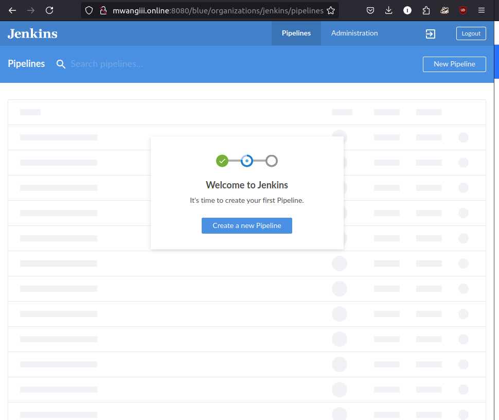

In this project, we’ll dive into the CI/CD process, focusing on packaging and deploying web applications more efficiently.
While we previously deployed code directly to `/var/www/html`, we’ll now learn to package code with dependencies.
We’ll work mainly with PHP, but future tasks will cover Java, Node.js, .NET, and Python, helping us understand CI/CD across various languages.

We’ll write and run unit tests locally before committing our code, and the CI server (e.g., Jenkins) will handle builds, testing, and packaging.
Automated tools will ensure code quality, and once tests are passed, the pipeline will guide us through deployment.
We’ll learn both Continuous Delivery (manual deployment) and Continuous Deployment (fully automated), mastering version control, testing, and deployment along the way.


### Why Track DevOps Metrics? – 13 Key Metrics for Success
DevOps is about delivering quality code quickly. To achieve this without breaking things, we need to monitor specific metrics that reveal our delivery speed and potential bottlenecks. Here are 13 metrics to watch:

1. **Deployment Frequency**: Track how often deployments happen. Aim for smaller, more frequent deployments to simplify testing and release.
   
2. **Lead Time**: Measure the time from starting a task to deploying it. This shows how fast you can ship new code.

3. **Customer Tickets**: Feedback from customers is a key indicator of application issues and quality.

4. **Passed Automated Tests**: Track how often automated tests pass to gauge the effectiveness of your testing process.

5. **Defect Escape Rate**: Measure how many defects are found in production versus QA, ensuring problems are caught early.

6. **Availability**: Monitor uptime and downtime to ensure your application stays online.

7. **Service Level Agreements (SLA)**: Track compliance with SLAs or non-functional requirements.

8. **Failed Deployments**: Keep an eye on how often deployments cause issues, and plan for quick recovery.

9. **Error Rates**: Monitor error rates within the application to catch quality and performance issues early.

10. **Application Traffic**: Check usage and traffic after deployment to spot any abnormalities like DDoS attacks or routing issues.

11. **Application Performance**: Use tools like DataDog or New Relic to monitor performance before and after deployment.

12. **Mean Time to Detection (MTTD)**: Track how quickly you can detect problems in the system.

13. **Mean Time to Recovery (MTTR)**: Measure how long it takes to recover from failures, aiming for fast recovery times.

Monitoring these metrics ensures we maintain a stable, fast, and high-quality CI/CD process.


# SIMULATING A TYPICAL CI/CD PIPELINE FOR A PHP BASED APPLICATION
As part of the ongoing infrastructure development with Ansible from Project 11, we will create a CI/CD pipeline as shown in the diagram below.
This pipeline will simulate continuous integration and delivery. 
Both the Tooling and TODO Web Applications use PHP, an interpreted language, meaning they can run directly on a server without compiling. 
However, this makes it challenging to package and version software for different releases. 
To address this, instead of pulling directly from Git, we will use the **Ansible URI module** for a more structured release process. 


## SETUP
We will use GCP instead, as our free tier is already filled up.
This project will require multiple servers to simulate various environments, from development/CI to production.
While this means a significant number of servers overall, we don’t need to create them all at once.
We will only provision the servers required for the environment we’re currently working on.
For example, during development deployments, there’s no need to create servers for **integration**, **pentesting**, or **production** just yet.
Let’s make sure to utilize our GCP credits as much as possible.
Please note that this project is not yet focused on cloud implementation. Our immediate requirement is to set up virtual machines that can be accessed via **SSH**.

To keep cloud server costs manageable, we don’t have to create all the servers at once. Instead, we can spin up a minimal server setup as we progress through the project and only add more as needed.

Initially, we will concentrate on the following environments:

- CI
- Dev
- Pentest

Both **SIT (System Integration Testing)** and **UAT (User Acceptance Testing)** don’t require extensive installation or configuration, as they primarily consist of web servers hosting our 
applications. However, for **Pentest (Penetration Testing)**, we will conduct security-related tests, which will necessitate additional tools and specific configurations. 
In some instances, this environment may also be used for performance and load testing, depending on our team's decisions.

What we want to achieve, is having Nginx to serve as a **reverse proxy** for our sites and tools. Each environment setup is represented in the below table and diagrams.


### CI-ENVIRONMENT 

### OTHER ENVIRONMENTS FROM LOWER TO HIGHER


## DNS REQUIREMENTS
Make DNS entries to create a subdomain for each environment. Assuming your main domain is total.com

You should have a subdomains list like this:


   | Server                 |                    Domain                    | Type  |
   | :--------------------- | :-------------------------------------------:| :----:|
   | Jenkins                |   https://ci.mwangiii.online                 | A     |
   | Sonarqube              |   https://sonar.mwangiii.online              | A     |
   | Artifactory            |   https://artifacts.mwangiii.online          | A     |
   | Production Tooling     |   https://tooling.mwangiii.online            | A     |
   | Pre-Prod Tooling       |   https://tooling.preprod.mwangiii.online    | A     |
   | Pentest Tooling        |   https://tooling.pentest.mwangiii.online    | A     |
   | UAT Tooling            |   https://tooling.uat.mwangiii.online        | A     |
   | SIT Tooling            |   https://tooling.sit.mwangiii.online        | A     | 
   | Dev Tooling            |   https://tooling.dev.mwangiii.online        | A     | 
   | Production TODO-WebApp |   https://todo.mwangiii.online               | A     | 
   | Pre-Prod TODO-WebApp   |   https://todo.preprod.mwangiii.online       | A     |
   | Pentest TODO-WebApp    |   https://todo.pentest.mwangiii.online       | A     | 
   | UAT TODO-WebApp        |   https://todo.uat.mwangiii.online           | A     | 
   | SIT TODO-WebApp        |   https://todo.sit.mwangiii.online           | A     | 
   | Dev TODO-WebApp        |   https://todo.dev.mwangiii.online           | A     | 


  

## Configure NGINX to Manage Subdomains
### Create NGINX Configuration Files
For each subdomain, create a configuration file in `/etc/nginx/sites-available`. Here’s a template:

```nginx
server {
    listen 80;
    server_name <subdomain>;

    location / {
        proxy_pass http://127.0.0.1:<port>; # Replace with the actual backend port
        proxy_set_header Host $host;
        proxy_set_header X-Real-IP $remote_addr;
        proxy_set_header X-Forwarded-For $proxy_add_x_forwarded_for;
        proxy_set_header X-Forwarded-Proto $scheme;
    }
}
```

- Replace `<subdomain>` with the actual domain (e.g., `ci.mwangiii.online`).  
- Replace `<port>` with the backend service’s port (e.g., Jenkins: `8080`, SonarQube: `9000`).

### Enable Configuration
- Symlink each file to `/etc/nginx/sites-enabled`:
```bash
sudo ln -s /etc/nginx/sites-available/<subdomain> /etc/nginx/sites-enabled/
```

### Reload NGINX  
- Test and reload the configuration:
```bash
sudo nginx -t
sudo systemctl reload nginx
```


Ansible Inventory should look like this

```
├── ci
├── dev
├── pentest
├── pre-prod
├── prod
├── sit
└── uat
```

_**ci**_ inventory file
```yml
[jenkins]
<Jenkins-Private-IP-Address>

[nginx]
<Nginx-Private-IP-Address>

[sonarqube]
<SonarQube-Private-IP-Address>

[artifact_repository]
<Artifact_repository-Private-IP-Address>
```
_**dev**_ Inventory file
```yml
[tooling]
<Tooling-Web-Server-Private-IP-Address>

[todo]
<Todo-Web-Server-Private-IP-Address>

[nginx]
<Nginx-Private-IP-Address>

[db:vars]
ansible_user=ec2-user
ansible_python_interpreter=/usr/bin/python

[db]
<DB-Server-Private-IP-Address>
```
_**pentest**_ inventory file

```yml
[pentest:children]
pentest-todo
pentest-tooling

[pentest-todo]
<Pentest-for-Todo-Private-IP-Address>

[pentest-tooling]
<Pentest-for-Tooling-Private-IP-Address>
```
**Observations:**

We will notice that in the pentest inventory file, we have introduced a new concept called `pentest:children`. 
This is because we want to create a group named `pentest`, which allows us to execute Ansible tasks against both `pentest-todo` and `pentest-tooling` simultaneously. 
At the same time, we want the flexibility to run specific Ansible tasks against an individual group.

The `db` group has a slightly different configuration, as it uses a RedHat/CentOS Linux distribution, while the others are based on Ubuntu (in this case, the user is `ubuntu`). 
Consequently, the required user for connectivity and the path to the Python interpreter differ. 
If our entire environment is based on Ubuntu, we may not need this kind of setup; it’s entirely up to us how we want to approach it. 
Whatever works best for us is perfectly fine in this scenario.

This brings us to another Ansible concept called `group_vars`. With `group_vars`, we can declare and set variables for each group of servers created in the inventory file. 
For example, if there are variables that we need to be common between both `pentest-todo` and `pentest-tooling`, instead of setting these variables in multiple places, we can simply use `group_vars` for `pentest`. 
Since it has been created as `pentest:children` in the inventory file, Ansible recognizes this and applies the variable to both children.


# ANSIBLE ROLES FOR CI ENVIRONMENT
- Add two more roles to ansible:  
  1.**SonarQube** -  an open-source platform developed by SonarSource for continuous inspection of code quality, it is used to perform automatic reviews with static analysis of code to detect bugs, code smells, and security vulnerabilities. 

  2.**Artifactory** -  a product by JFrog that serves as a binary repository manager. The binary repository is a natural extension to the source code repository, in that the outcome of your build process is stored. It can be used for certain other automation, but we will it strictly to manage our build artifacts.

- In previous projects, you have been launching Ansible commands manually from a CLI. Now, with Jenkins, we will start running Ansible from Jenkins UI.
- To do this,
  - Navigate to Jenkins URL
  - Install & Open Blue Ocean Jenkins Plugin
    - In the Jenkins dashboard, click on Manage Jenkins -> Manage plugins and search for `Blue Ocean` plugin. Install and open Blue Ocean plugin
    
  - Create a new pipeline 
    

  - Connect Jenkins with GitHub
  - Login to GitHub & Generate an Access Token
    - Note: Give your token a descriptive name, such as "My Personal Access Token".
    - Expiration: Choose the expiration date for your token. You can select "No expiration" if you want the token to never expire.
    - Select scopes: Choose the permissions you want to grant to your token. The specific scopes you need will depend on the actions you want to perform with the token. Common scopes include `repo` (for accessing private repositories),` gist`(for creating and managing gists), and user (for accessing your user profile).
  - Copy Access Token
  - Paste the token and connect
  
  - Create a new Pipeline

_N/B:At this point you may not have a Jenkinsfile in the Ansible repository, so Blue Ocean will attempt to give you some guidance to create one. But we do not need that. We will rather create one ourselves. So, click on Administration to exit the Blue Ocean console._
- Here is our newly created pipeline. It takes the name of your GitHub repository.
Let us create our Jenkinsfile

- Inside the Ansible project, create a new directory `deploy`and start a new file `Jenkinsfile` inside the directory.

```bash
  mkdir deploy
  touch deploy/Jenkinsfile
```
- Add the code snippet below to start building the Jenkinsfile gradually. This pipeline currently has just one stage called `Build` and the only thing we are doing is using the shell script `module` to echo Building Stage

```groovy
pipeline {
    agent any


  stages {
    stage('Build') {
      steps {
        script {
          sh 'echo "Building Stage"'
        }
      }
    }
    }
}
```
- Now go back into the Ansible pipeline in Jenkins, and select configure
- Scroll down to Build Configuration section and specify the location of the Jenkinsfile at `deploy/Jenkinsfile`
- Back to the pipeline again, this time click `"Build now"`

- This will trigger a build and you will be able to see the effect of our basic Jenkinsfile configuration by going through the console output of the build.

- To really appreciate and feel the difference of Cloud Blue UI, it is recommended to try triggering the build again from Blue Ocean interface.
    - Click on Blue Ocean 
    - Select your project
    - Click on the play button against the branch 

- Notice that this pipeline is a _multibranch_ one. 
- This means, if there were more than one branch in GitHub, Jenkins would have scanned the repository to discover them all and we would have been able to trigger a build for each branch.

- Let us see this in action.
- Create a new git branch and name it `feature/jenkinspipeline-stages`

```bash
  git checkout -b feature/jenkinspipeline-stages
```

- Currently we only have the `Build` stage. Let us add another stage called `Test`.
 Paste the code snippet below and push the new changes to GitHub.

```groovy
   pipeline {
    agent any

  stages {
    stage('Build') {
      steps {
        script {
          sh 'echo "Building Stage"'
        }
      }
    }

    stage('Test') {
      steps {
        script {
          sh 'echo "Testing Stage"'
        }
      }
    }
    }
}
```

- To make your new branch show up in Jenkins, we need to tell Jenkins to scan the repository.
- Click on the _**"Administration"**_ button 
- Navigate to the Ansible project and click on _**"Scan repository now" **_
- Refresh the page and both branches will start building automatically. You can go into Blue Ocean and see both branches there too. 
- In Blue Ocean, you can now see how the Jenkinsfile has caused a new step in the pipeline launch build for the new branch. 


#### A QUICK TASK FOR YOU

1. Create a pull request to merge the latest code into the `main branch`
2. After merging the `PR`, go back into your terminal and switch into the `main` branch.
3. Pull the latest change.

4. Create a new branch, add more stages into the Jenkins file to simulate below phases. (Just add an `echo` command like we have in `build` and `test` stages)
   1. Package 
   2. Deploy 
   3. Clean up

   ```groovy
    pipeline {
      agent any

    stages {
      stage('Build') {
        steps {
          script {
            sh 'echo "Building Stage"'
          }
        }
      }

      stage('Test') {
        steps {
          script {
            sh 'echo "Testing Stage"'
          }
        }
      }


      stage('Package') {
        steps {
          script {
            sh 'echo "Package Stage"'
          }
        }
      }


      stage('Deploy') {
        steps {
          script {
            sh 'echo "Deploy Stage"'
          }
        }
      }

      stage('Clean up') {
        steps {
          script {
            sh 'echo "Clean up Stage"'
          }
        }
      }
      } 
    }


5. Verify in Blue Ocean that all the stages are working, then merge your feature branch to the main branch
6. Eventually, your main branch should have a successful pipeline like this in blue ocean

# RUNNING ANSIBLE PLAYBOOK FROM JENKINS

Now that you have a broad overview of a typical Jenkins pipeline. Let us get the actual Ansible deployment to work by:
    1.Installing Ansible on Jenkins
    2.Installing Ansible plugin in Jenkins UI
    3.Creating Jenkinsfile from scratch. (Delete all you currently have in there and start all over to get Ansible to run successfully)

You can watch a 10 minutes video [here](https://www.youtube.com/watch?v=PRpEbFZi7nI) to guide you through the entire setup.

_**Note: Ensure that Ansible runs against the Dev environment successfully.**_
Possible errors to watch out for:
- Ensure that the git module in Jenkinsfile is checking out SCM to main branch instead of master
- Jenkins needs to export the ANSIBLE_CONFIG environment variable. You can put the .ansible.cfg file alongside Jenkinsfile in the deploy directory.
- This way, anyone can easily identify that everything in there relates to deployment.
- Then, using the Pipeline Syntax tool in Ansible, generate the syntax to create environment variables to set. 
```
https://wiki.jenkins.io/display/JENKINS/Building+a+software+project
```
Possible issues to watch out for when you implement this
- Remember that `ansible.cfg` must be exported to environment variable so that Ansible knows where to find Roles.
But because you will possibly run Jenkins from different git branches, the location of Ansible roles will change.
Therefore, you must handle this dynamically.
You can use Linux Stream Editor `sed` to update the section roles_path each time there is an execution.
You may not have this issue if you run only from the main branch.
- If you push new changes to Git so that Jenkins failure can be fixed. You might observe that your change may sometimes have no effect.
Even though your change is the actual fix required. This can be because Jenkins did not download the latest code from GitHub.
Ensure that you start the Jenkinsfile with a clean up step to always delete the previous workspace before running a new one.
Sometimes you might need to login to the Jenkins Linux server to verify the files in the workspace to confirm that what you are actually expecting is there.
Otherwise, you can spend hours trying to figure out why Jenkins is still failing, when you have pushed up possible changes to fix the error.
- Another possible reason for Jenkins failure sometimes, is because you have indicated in the Jenkinsfile to check out the main git branch, and you are running a pipeline from another branch.
So, always verify by logging onto the Jenkins box to check the workspace, and run git branch command to confirm that the branch you are expecting is there.

- If everything goes well for you, it means, the Dev environment has an up-to-date configuration. But what if we need to deploy to other environments?
- Are we going to manually update the Jenkinsfile to point inventory to those environments? such as sit, uat, pentest, etc.
- Or do we need a dedicated git branch for each environment, and have the inventory part hard coded there.

Think about those for a minute and try to work out which one sounds more like a better solution.

Manually updating the Jenkinsfile is definitely not an option. And that should be obvious to you at this point. Because we try to automate things as much as possible.

Well, unfortunately, we will not be doing any of the highlighted options. What we will be doing is to parameterise the deployment. So that at the point of execution, the appropriate values are applied.
Parameterizing Jenkinsfile For Ansible Deployment

To deploy to other environments, we will need to use parameters.

- Update sit inventory with new servers
```
[tooling]
<SIT-Tooling-Web-Server-Private-IP-Address>

[todo]
<SIT-Todo-Web-Server-Private-IP-Address>

[nginx]
<SIT-Nginx-Private-IP-Address>

[db:vars]
ansible_user=ec2-user
ansible_python_interpreter=/usr/bin/python

[db]
<SIT-DB-Server-Private-IP-Address>
```
We updated the Jenkinsfile to introduce parameterization. Below is just one parameter. It had a default value in case no value was specified at execution. It also had a description so that everyone was aware of its purpose.

```groovy
  pipeline {
    agent any

    parameters {
      string(name: 'inventory', defaultValue: 'dev',  description: 'This is the inventory file for the environment to deploy configuration')
    }
```

- In the Ansible execution section, we removed the hardcoded **inventory/dev** and replaced it with **${inventory}**.
- From that point on, each time we hit execute, it expected an input.
- The default value loaded up, but we could now specify which environment we wanted to deploy the configuration to. We simply typed `sit` and hit Run.

Next, we added another parameter. This time, we introduced tagging in Ansible. We limited the Ansible execution to a specific role or playbook desired. Therefore, we added an Ansible tag to run against the webserver only.

- We tested this locally first to gain experience. To validate our changes, we modified the playbooks to create an empty file.
 Once we understood this, we updated the Jenkinsfile and ran it from Jenkins..


## CI/CD PIPELINE FOR TODO APPLICATION
We already have tooling website as a part of deployment through Ansible. Here we will introduce another PHP application to add to the list of software products we are managing in our infrastructure. The good thing with this particular application is that it has unit tests, and it is an ideal application to show an end-to-end CI/CD pipeline for a particular application.

Our goal here is to deploy the application onto servers directly from `Artifactory` rather than from git. If you have not updated Ansible with an Artifactory role, simply use this guide to create an Ansible role for Artifactory (ignore the Nginx part). Configure Artifactory on Ubuntu 20.04
### Phase 1 - Prepare Jenkins
Fork the repository below into your GitHub account
```
  https://github.com/StegTechHub/php-todo.git
```
- On you Jenkins server, install PHP, its dependencies and Composer tool (Feel free to do this manually at first, then update your Ansible accordingly later)
```bash
    sudo apt install -y zip libapache2-mod-php phploc php-{xml,bcmath,bz2,intl,gd,mbstring,mysql,zip}
```
- Install Composer Globally
```
  sudo php composer-setup.php --install-dir=/usr/local/bin --filename=composer
```
- Remove the Installer
```
  php -r "unlink('composer-setup.php');"
```
- Verify Installation
```
 php -v
```
```
 composer -v
```


- Install Jenkins plugins
    - Plot plugin
    - Artifactory plugin
    
- We will use _plot plugin_ to display tests reports, and code coverage information.
- The _Artifactory plugin_ will be used to easily upload code artifacts into an Artifactory server.
- In Jenkins UI configure Artifactory
- Configure the server ID, URL and Credentials, run Test Connection.


### Phase 2 - Integrate Artifactory repository with Jenkins
- Create a dummy Jenkinsfile in the repository
- Using Blue Ocean, create a multibranch Jenkins pipeline
- On the database server, create database and user
```sql
Create database homestead;
CREATE USER 'homestead'@'%' IDENTIFIED BY 'sePret^i';
GRANT ALL PRIVILEGES ON * . * TO 'homestead'@'%';
```
- Update the database connectivity requirements in the file .env.sample
- Update Jenkinsfile with proper pipeline configuration
```groovy
pipeline {
    agent any

  stages {

     stage("Initial cleanup") {
          steps {
            dir("${WORKSPACE}") {
              deleteDir()
            }
          }
        }
  
    stage('Checkout SCM') {
      steps {
            git branch: 'main', url: 'https://github.com/StegTechHub/php-todo.git'
      }
    }

    stage('Prepare Dependencies') {
      steps {
             sh 'mv .env.sample .env'
             sh 'composer install'
             sh 'php artisan migrate'
             sh 'php artisan db:seed'
             sh 'php artisan key:generate'
      }
    }
  }
}
```

- Notice the _Prepare Dependencies_ section

    - The required file by PHP is **.env** so we are renaming **.env.sample** to    **.env**
    - Composer is used by PHP to install all the dependent libraries used by the application
    - _php artisan_ uses the **.env** file to setup the required database objects - (After successful run of this step, login to the database, run show tables and you will see the tables being created for you)
    

- Update the _Jenkinsfile_ to include Unit tests step
```groovy
  stage('Execute Unit Tests') {
    steps {
           sh './vendor/bin/phpunit'
    } 
  }
```

### Phase 3 - Code Quality Analysis
This is one of the areas where developers, architects and many stakeholders are mostly interested in as far as product development is concerned.
As a DevOps engineer, you also have a role to play. Especially when it comes to setting up the tools.

For PHP the most commonly tool used for code quality analysis is **phploc**.

The data produced by **phploc** can be ploted onto graphs in Jenkins.
1. Add the code analysis step in Jenkinsfile. The output of the data will be saved in `build/logs/phploc.csv` file.
```groovy
stage('Code Analysis') {
  steps {
        sh 'phploc app/ --log-csv build/logs/phploc.csv'

  }
}
```

2. Plot the data using plot Jenkins plugin.

This plugin provides generic plotting (or graphing) capabilities in Jenkins. It will plot one or more single values variations across builds in one or more plots. Plots for a particular job (or project) are configured in the job configuration screen, where each field has additional help information. Each plot can have one or more lines (called data series). After each build completes the plots' data series latest values are pulled from the CSV file generated by phploc.
```groovy
  stage('Plot Code Coverage Report') {
    steps {

          plot csvFileName: 'plot-396c4a6b-b573-41e5-85d8-73613b2ffffb.csv', csvSeries: [[displayTableFlag: false, exclusionValues: 'Lines of Code (LOC),Comment Lines of Code (CLOC),Non-Comment Lines of Code (NCLOC),Logical Lines of Code (LLOC)                          ', file: 'build/logs/phploc.csv', inclusionFlag: 'INCLUDE_BY_STRING', url: '']], group: 'phploc', numBuilds: '100', style: 'line', title: 'A - Lines of code', yaxis: 'Lines of Code'
          plot csvFileName: 'plot-396c4a6b-b573-41e5-85d8-73613b2ffffb.csv', csvSeries: [[displayTableFlag: false, exclusionValues: 'Directories,Files,Namespaces', file: 'build/logs/phploc.csv', inclusionFlag: 'INCLUDE_BY_STRING', url: '']], group: 'phploc', numBuilds: '100', style: 'line', title: 'B - Structures Containers', yaxis: 'Count'
          plot csvFileName: 'plot-396c4a6b-b573-41e5-85d8-73613b2ffffb.csv', csvSeries: [[displayTableFlag: false, exclusionValues: 'Average Class Length (LLOC),Average Method Length (LLOC),Average Function Length (LLOC)', file: 'build/logs/phploc.csv', inclusionFlag: 'INCLUDE_BY_STRING', url: '']], group: 'phploc', numBuilds: '100', style: 'line', title: 'C - Average Length', yaxis: 'Average Lines of Code'
          plot csvFileName: 'plot-396c4a6b-b573-41e5-85d8-73613b2ffffb.csv', csvSeries: [[displayTableFlag: false, exclusionValues: 'Cyclomatic Complexity / Lines of Code,Cyclomatic Complexity / Number of Methods ', file: 'build/logs/phploc.csv', inclusionFlag: 'INCLUDE_BY_STRING', url: '']], group: 'phploc', numBuilds: '100', style: 'line', title: 'D - Relative Cyclomatic Complexity', yaxis: 'Cyclomatic Complexity by Structure'      
          plot csvFileName: 'plot-396c4a6b-b573-41e5-85d8-73613b2ffffb.csv', csvSeries: [[displayTableFlag: false, exclusionValues: 'Classes,Abstract Classes,Concrete Classes', file: 'build/logs/phploc.csv', inclusionFlag: 'INCLUDE_BY_STRING', url: '']], group: 'phploc', numBuilds: '100', style: 'line', title: 'E - Types of Classes', yaxis: 'Count'
          plot csvFileName: 'plot-396c4a6b-b573-41e5-85d8-73613b2ffffb.csv', csvSeries: [[displayTableFlag: false, exclusionValues: 'Methods,Non-Static Methods,Static Methods,Public Methods,Non-Public Methods', file: 'build/logs/phploc.csv', inclusionFlag: 'INCLUDE_BY_STRING', url: '']], group: 'phploc', numBuilds: '100', style: 'line', title: 'F - Types of Methods', yaxis: 'Count'
          plot csvFileName: 'plot-396c4a6b-b573-41e5-85d8-73613b2ffffb.csv', csvSeries: [[displayTableFlag: false, exclusionValues: 'Constants,Global Constants,Class Constants', file: 'build/logs/phploc.csv', inclusionFlag: 'INCLUDE_BY_STRING', url: '']], group: 'phploc', numBuilds: '100', style: 'line', title: 'G - Types of Constants', yaxis: 'Count'
          plot csvFileName: 'plot-396c4a6b-b573-41e5-85d8-73613b2ffffb.csv', csvSeries: [[displayTableFlag: false, exclusionValues: 'Test Classes,Test Methods', file: 'build/logs/phploc.csv', inclusionFlag: 'INCLUDE_BY_STRING', url: '']], group: 'phploc', numBuilds: '100', style: 'line', title: 'I - Testing', yaxis: 'Count'
          plot csvFileName: 'plot-396c4a6b-b573-41e5-85d8-73613b2ffffb.csv', csvSeries: [[displayTableFlag: false, exclusionValues: 'Logical Lines of Code (LLOC),Classes Length (LLOC),Functions Length (LLOC),LLOC outside functions or classes ', file: 'build/logs/phploc.csv', inclusionFlag: 'INCLUDE_BY_STRING', url: '']], group: 'phploc', numBuilds: '100', style: 'line', title: 'AB - Code Structure by Logical Lines of Code', yaxis: 'Logical Lines of Code'
          plot csvFileName: 'plot-396c4a6b-b573-41e5-85d8-73613b2ffffb.csv', csvSeries: [[displayTableFlag: false, exclusionValues: 'Functions,Named Functions,Anonymous Functions', file: 'build/logs/phploc.csv', inclusionFlag: 'INCLUDE_BY_STRING', url: '']], group: 'phploc', numBuilds: '100', style: 'line', title: 'H - Types of Functions', yaxis: 'Count'
          plot csvFileName: 'plot-396c4a6b-b573-41e5-85d8-73613b2ffffb.csv', csvSeries: [[displayTableFlag: false, exclusionValues: 'Interfaces,Traits,Classes,Methods,Functions,Constants', file: 'build/logs/phploc.csv', inclusionFlag: 'INCLUDE_BY_STRING', url: '']], group: 'phploc', numBuilds: '100', style: 'line', title: 'BB - Structure Objects', yaxis: 'Count'


    }
  }
```


- You should now see a Plot menu item on the left menu.
- Click on it to see the charts. (The analytics may not mean much to you as it is meant to be read by developers. So, you need not worry much about it - this is just to give you an idea of the real-world implementation).

3. Bundle the application code for into an artifact (archived package) upload to Artifactory
```groovy
stage ('Package Artifact') {
    steps {
            sh 'zip -qr php-todo.zip ${WORKSPACE}/*'
     }
    }
```


4. Publish the resulted artifact into Artifactory
```groovy
stage ('Upload Artifact to Artifactory') {
          steps {
            script { 
                 def server = Artifactory.server 'artifactory-server'                 
                 def uploadSpec = """{
                    "files": [
                      {
                       "pattern": "php-todo.zip",
                       "target": "<name-of-artifact-repository>/php-todo",
                       "props": "type=zip;status=ready"

                       }
                    ]
                 }""" 

                 server.upload spec: uploadSpec
               }
            }
  
        }
```


5. Deploy the application to the dev environment by launching Ansible pipeline
```groovy
stage ('Deploy to Dev Environment') {
    steps {
    build job: 'ansible-project/main', parameters: [[$class: 'StringParameterValue', name: 'env', value: 'dev']], propagate: false, wait: true
    }
  }
```
The build job used in this step tells Jenkins to start another job. In this case it is the ansible-project job, and we are targeting the main branch. Hence, we have ansible-project/main. Since the Ansible project requires parameters to be passed in, we have included this by specifying the parameters section. The name of the parameter is env and its value is dev. Meaning, deploy to the Development environment.

But how are we certain that the code being deployed has the quality that meets corporate and customer requirements? Even though we have implemented Unit Tests and Code Coverage Analysis with phpunit and phploc, we still need to implement Quality Gate to ensure that ONLY code with the required code coverage, and other quality standards make it through to the environments.

To achieve this, we need to configure SonarQube - An open-source platform developed by SonarSource for continuous inspection of code quality to perform automatic reviews with static analysis of code to detect bugs, code smells, and security vulnerabilities.


## SONARQUBE INSTALLATION
Before we start getting hands on with `SonarQube` configuration, it is incredibly important to understand a few concepts:
    - _Software Quality_ - The degree to which a software component, system or process meets specified requirements based on user needs and expectations.
    -_Software Quality Gates_ - Quality gates are basically acceptance criteria which are usually presented as a set of predefined quality criteria that a software development project must meet in order to proceed from one stage of its lifecycle to the next one.

`SonarQube` is a tool that can be used to create quality gates for software projects, and the ultimate goal is to be able to ship only quality software code.

Despite that DevOps CI/CD pipeline helps with fast software delivery, it is of the same importance to ensure the quality of such delivery. Hence, we will need SonarQube to set up Quality gates. In this project we will use predefined Quality Gates (also known as The Sonar Way).  
Software testers and developers would normally work with project leads and architects 
to create custom quality gates.

### Install SonarQube on Ubuntu 20.04 With PostgreSQL as Backend Database
Here is a manual approach to installation.
Ensure that you can to automate the same with Ansible.

Below is a step by step guide how to install `SonarQube` 7.9.3 version.  
It has a strong prerequisite to have Java installed since the tool is Java-based. MySQL support for SonarQube is deprecated, therefore we will be using `PostgreSQL`.

We will make some Linux Kernel configuration changes to ensure optimal performance of the tool - we will increase `vm.max_map_count`, `file discriptor` and `ulimit`
### Tune Linux Kernel
This can be achieved by making session changes which does not persist beyond the current session terminal.
```bash
sudo sysctl -w vm.max_map_count=262144
sudo sysctl -w fs.file-max=65536
ulimit -n 65536
ulimit -u 4096
```
- To make a permanent change, edit the file `/etc/security/limits.conf` and append the below
```
sonarqube   -   nofile   65536
sonarqube   -   nproc    4096
```
- Before installing, let us update and upgrade system packages:
```bash
sudo apt-get update
sudo apt-get upgrade
```
- Install wget and unzip packages
```bash
sudo apt-get install wget unzip -y
```
- Install OpenJDK and Java Runtime Environment (JRE) 11
```bash
 sudo apt-get install openjdk-11-jdk -y
 sudo apt-get install openjdk-11-jre -y
```
- Set default JDK - To set default JDK or switch to OpenJDK enter below command:
```bash
 sudo update-alternatives --config java
```
- If you have multiple versions of Java installed, you should see a list like below:
```
Selection    Path                                            Priority   Status

------------------------------------------------------------

  0            /usr/lib/jvm/java-11-openjdk-amd64/bin/java      1111      auto mode

  1            /usr/lib/jvm/java-11-openjdk-amd64/bin/java      1111      manual mode

  2            /usr/lib/jvm/java-8-openjdk-amd64/jre/bin/java   1081      manual mode

* 3            /usr/lib/jvm/java-8-oracle/jre/bin/java          1081      manual mode
```
Type "1" to switch OpenJDK 11

- Verify the set JAVA Version:
```bash
java -version
```
- Output
```
java -version

openjdk version "11.0.7" 2020-04-14

OpenJDK Runtime Environment (build 11.0.7+10-post-Ubuntu-3ubuntu1)

OpenJDK 64-Bit Server VM (build 11.0.7+10-post-Ubuntu-3ubuntu1, mixed mode, sharing)
```
### Install and Setup PostgreSQL 10 Database for SonarQube
- The command below will add PostgreSQL repo to the repo list:
```bash
sudo sh -c 'echo "deb http://apt.postgresql.org/pub/repos/apt/ `lsb_release -cs`-pgdg main" >> /etc/apt/sources.list.d/pgdg.list'
```
- Download PostgreSQL software
```bash
wget -q https://www.postgresql.org/media/keys/ACCC4CF8.asc -O - | sudo apt-key add -
```
- Install PostgreSQL Database Server
```bash
sudo apt-get -y install postgresql postgresql-contrib
```
- Start PostgreSQL Database Server
```bash
sudo systemctl start postgresql
```
- Enable it to start automatically at boot time
```bash
sudo systemctl enable postgresql
```
- Change the password for default postgres user (Pass in the password you intend to use, and remember to save it somewhere)
```bash
sudo passwd postgres
```
- Switch to the postgres user
```bash
su - postgres
```
- Create a new user by typing
```sql
create user sonar
```

- Switch to the PostgreSQL shell
```sql
psql
```
- Set a password for the newly created user for SonarQube database
```sql
ALTER USER sonar WITH ENCRYPTED password 'sonar';
```
- Create a new database for PostgreSQL database by running:
```sql
CREATE DATABASE sonarqube OWNER sonar;
```
- Grant all privileges to sonar user on sonarqube Database.
```sql
grant all privileges on DATABASE sonarqube to sonar;
```
- Exit from the psql shell:
```sql
\q
```
- Switch back to the sudo user by running the exit command.
```sql
exit
```
### Install SonarQube on Ubuntu 20.04 LTS
- Navigate to the tmp directory to temporarily download the installation files
```bash
cd /tmp && sudo wget https://binaries.sonarsource.com/Distribution/sonarqube/sonarqube-7.9.3.zip
```
- Unzip the archive setup to /opt directory
```bash
sudo unzip sonarqube-7.9.3.zip -d /opt
```
- Move extracted setup to /opt/sonarqube directory
```bash
sudo mv /opt/sonarqube-7.9.3 /opt/sonarqube
```
### Configure SonarQube
We cannot run SonarQube as a root user, if you run using root user it will stop automatically. The ideal approach will be to create a separate group and a user to run SonarQube
- Create a group sonar
```bash
sudo groupadd sonar
```
- Now add a user with control over the /opt/sonarqube directory
```bash
 sudo useradd -c "user to run SonarQube" -d /opt/sonarqube -g sonar sonar 
 sudo chown sonar:sonar /opt/sonarqube -R
```
- Open SonarQube configuration file using your favourite text editor (e.g., nano or vim)
```bash
sudo nano /opt/sonarqube/conf/sonar.properties
```
- Find the following lines:
```
#sonar.jdbc.username=
#sonar.jdbc.password=
```
- Uncomment them and provide the values of PostgreSQL Database username and password:
```
#--------------------------------------------------------------------------------------------------

# DATABASE

#

# IMPORTANT:

# - The embedded H2 database is used by default. It is recommended for tests but not for

#   production use. Supported databases are Oracle, PostgreSQL and Microsoft SQLServer.

# - Changes to database connection URL (sonar.jdbc.url) can affect SonarSource licensed products.

# User credentials.

# Permissions to create tables, indices and triggers must be granted to JDBC user.

# The schema must be created first.

sonar.jdbc.username=sonar
sonar.jdbc.password=sonar
sonar.jdbc.url=jdbc:postgresql://localhost:5432/sonarqube
```
- Edit the sonar script file and set RUN_AS_USER
```bash
sudo nano /opt/sonarqube/bin/linux-x86-64/sonar.sh
```
```
# If specified, the Wrapper will be run as the specified user.

# IMPORTANT - Make sure that the user has the required privileges to write

#  the PID file and wrapper.log files.  Failure to be able to write the log

#  file will cause the Wrapper to exit without any way to write out an error

#  message.

# NOTE - This will set the user which is used to run the Wrapper as well as

#  the JVM and is not useful in situations where a privileged resource or

#  port needs to be allocated prior to the user being changed.

RUN_AS_USER=sonar
```
### _Now, to start SonarQube we need to do following:_

- Switch to sonar user
```bash
sudo su sonar
```
- Move to the script directory
```bash
cd /opt/sonarqube/bin/linux-x86-64/
```
- Run the script to start SonarQube
```bash
./sonar.sh start
```
- Expected output shall be as:
```
Starting SonarQube...

Started SonarQube
```
- Check SonarQube running status:
```bash
./sonar.sh status
```
Sample Output below:
```
$./sonar.sh status

SonarQube is running (176483).
```
- To check SonarQube logs, navigate to /opt/sonarqube/logs/sonar.log directory
```bash
tail /opt/sonarqube/logs/sonar.log
```
- Output
```
INFO  app[][o.s.a.ProcessLauncherImpl] Launch process[[key='ce', ipcIndex=3, logFilenamePrefix=ce]] from [/opt/sonarqube]: /usr/lib/jvm/java-11-openjdk-amd64/bin/java -Djava.awt.headless=true -Dfile.encoding=UTF-8 -Djava.io.tmpdir=/opt/sonarqube/temp --add-opens=java.base/java.util=ALL-UNNAMED -Xmx512m -Xms128m -XX:+HeapDumpOnOutOfMemoryError -Dhttp.nonProxyHosts=localhost|127.*|[::1] -cp ./lib/common/*:/opt/sonarqube/lib/jdbc/h2/h2-1.3.176.jar org.sonar.ce.app.CeServer /opt/sonarqube/temp/sq-process15059956114837198848properties

 INFO  app[][o.s.a.SchedulerImpl] Process[ce] is up

 INFO  app[][o.s.a.SchedulerImpl] SonarQube is up
```
You can see that SonarQube is up and running

### Configure SonarQube to run as a systemd service

- Stop the currently running SonarQube service
```bash
 cd /opt/sonarqube/bin/linux-x86-64/
```
- Run the script to start SonarQube
```bash
./sonar.sh stop
```
- Create a systemd service file for SonarQube to run as System Startup.
```bash
 sudo nano /etc/systemd/system/sonar.service
```
- Add the configuration below for systemd to determine how to start, stop, check status, or restart the SonarQube service.
```
[Unit]
Description=SonarQube service
After=syslog.target network.target

[Service]
Type=forking

ExecStart=/opt/sonarqube/bin/linux-x86-64/sonar.sh start
ExecStop=/opt/sonarqube/bin/linux-x86-64/sonar.sh stop

User=sonar
Group=sonar
Restart=always

LimitNOFILE=65536
LimitNPROC=4096

[Install]
WantedBy=multi-user.target
```
- Save the file and control the service with systemctl
```bash
sudo systemctl start sonar
sudo systemctl enable sonar
sudo systemctl status sonar
```

### Access SonarQube
- To access SonarQube using browser, type server's IP address followed by port 9000
```http
http://server_IP:9000 OR http://localhost:9000
```
- but in our case since we are using nginx as a reverse proxy
```http
http://sonar.mwangiii.online/
```

- Login to SonarQube with default administrator username and password - _admin_

_**Now, when SonarQube is up and running, it is time to setup our Quality gate in Jenkins.**_
## Configure SonarQube and Jenkins For Quality Gate
- In Jenkins, install SonarScanner plugin
- Navigate to configure system in Jenkins. Add SonarQube server as shown below:
_**Manage Jenkins > Configure System**_
- Generate authentication token in SonarQube
```
 User > My Account > Security > Generate Tokens
```
- Configure Quality Gate Jenkins Webhook in SonarQube 
- The URL should point to your Jenkins server _**http://{JENKINS_HOST}/sonarqube-webhook/**_
```
  Administration > Configuration > Webhooks > Create
```
### Update Jenkins Pipeline to include SonarQube scanning and Quality Gate
Below is the snippet for a **Quality Gate** stage in Jenkinsfile.
```groovy
    stage('SonarQube Quality Gate') {
        environment {
            scannerHome = tool 'SonarQubeScanner'
        }
        steps {
            withSonarQubeEnv('sonarqube') {
                sh "${scannerHome}/bin/sonar-scanner"
            }

        }
    }
```
_**NOTE: The above step will fail because we have not updated `sonar-scanner.properties**_
- Configure sonar-scanner.properties - From the step above, Jenkins will install the scanner tool on the Linux server. You will need to go into the tools directory on the server to configure the properties file in which SonarQube will require to function during pipeline execution.
```bash
cd /var/lib/jenkins/tools/hudson.plugins.sonar.SonarRunnerInstallation/SonarQubeScanner/conf/
```
- Open sonar-scanner.properties file
```bash
sudo nano sonar-scanner.properties
```
- Add configuration related to php-todo project
```
sonar.host.url=http://<SonarQube-Server-IP-address>:9000
sonar.projectKey=php-todo
#----- Default source code encoding
sonar.sourceEncoding=UTF-8
sonar.php.exclusions=**/vendor/**
sonar.php.coverage.reportPaths=build/logs/clover.xml
sonar.php.tests.reportPath=build/logs/junit.xml
```
__**HINT: To know what exactly to put inside the sonar-scanner.properties file, SonarQube has a configurations page where you can get some directions.**__

- A brief explanation of what is going on the the stage - set the environment variable for the scannerHome use the same name used when you configured SonarQube Scanner from Jenkins Global Tool Configuration. If you remember, the name was SonarQubeScanner. Then, within the steps use shell to run the scanner from bin directory.

- To further examine the configuration of the scanner tool on the Jenkins server - navigate into the tools directory
```bash
cd /var/lib/jenkins/tools/hudson.plugins.sonar.SonarRunnerInstallation/SonarQubeScanner/bin
```
List the content to see the scanner tool sonar-scanner. That is what we are calling in the pipeline script.
```bash
 ls -latr
```
```
ubuntu@ip-172-31-16-176:/var/lib/jenkins/tools/hudson.plugins.sonar.SonarRunnerInstallation/SonarQubeScanner/bin$ ls -latr
total 24
-rwxr-xr-x 1 jenkins jenkins 2550 Oct  2 12:42 sonar-scanner.bat
-rwxr-xr-x 1 jenkins jenkins  586 Oct  2 12:42 sonar-scanner-debug.bat
-rwxr-xr-x 1 jenkins jenkins  662 Oct  2 12:42 sonar-scanner-debug
-rwxr-xr-x 1 jenkins jenkins 1823 Oct  2 12:42 sonar-scanner
drwxr-xr-x 2 jenkins jenkins 4096 Dec 26 18:42 .
```
So far you have been given code snippets on each of the stages within the Jenkinsfile. But, you should also be able to generate Jenkins configuration code yourself.
- To generate Jenkins code, navigate to the dashboard for the php-todo pipeline and click on the **Pipeline Syntax** menu item
```
Dashboard > php-todo > Pipeline Syntax 
```
- Click on Steps and select **withSonarQubeEnv** - This appears in the list because of the previous SonarQube configurations you have done in Jenkins. Otherwise, it would not be there.

Within the generated block, you will use the sh command to run shell on the server. For more advanced usage in other projects, you can add to bookmarks this SonarQube documentation page in your browser.
### End-to-End Pipeline Overview
- Indeed, this has been one of the longest projects from Project 1, and if everything has worked out for you so far, you should have a view like below:

But we are not completely done yet!

- The quality gate we just included has no effect. Why? Well, because if you go to the SonarQube UI, you will realise that we just pushed a poor-quality code onto the development environment.
- Navigate to php-todo project in SonarQube

There are bugs, and there is 0.0% code coverage. (code coverage is a percentage of unit tests added by developers to test functions and objects in the code)

- If you click on php-todo project for further analysis, you will see that there is 6 hours' worth of technical debt, code smells and security issues in the code.

In the development environment, this is acceptable as developers will need to keep iterating over their code towards perfection. But as a DevOps engineer working on the pipeline, we must ensure that the quality gate step causes the pipeline to fail if the conditions for quality are not met.
### Conditionally deploy to higher environments
In the real world, developers will work on feature branch in a repository (e.g., GitHub or GitLab). There are other branches that will be used differently to control how software releases are done. You will see such branches as:
  
  - Develop
  - Master or Main (The * is a place holder for a version number, Jira Ticket name or some description. It can be something like Release-1.0.0)
  - Feature/*
  - Release/*
  - Hotfix/*
etc.

There is a very wide discussion around release strategy, and git branching strategies which in recent years are considered under what is known as GitFlow (Have a read and keep as a bookmark - it is a possible candidate for an interview discussion, so take it seriously!)

Assuming a basic gitflow implementation restricts only the develop branch to deploy code to Integration environment like sit.

Let us update our __Jenkinsfile__ to implement this:

- First, we will include a When condition to run Quality Gate whenever the running branch is either develop, hotfix, release, main, or master
```groovy
    when { branch pattern: "^develop*|^hotfix*|^release*|^main*", comparator: "REGEXP"}
```
- Then we add a timeout step to wait for SonarQube to complete analysis and successfully finish the pipeline only when code quality is acceptable.
```groovy
    timeout(time: 1, unit: 'MINUTES') {
        waitForQualityGate abortPipeline: true
    }
```
- The complete stage will now look like this:
```groovy
    stage('SonarQube Quality Gate') {
      when { branch pattern: "^develop*|^hotfix*|^release*|^main*", comparator: "REGEXP"}
        environment {
            scannerHome = tool 'SonarQubeScanner'
        }
        steps {
            withSonarQubeEnv('sonarqube') {
                sh "${scannerHome}/bin/sonar-scanner -Dproject.settings=sonar-project.properties"
            }
            timeout(time: 1, unit: 'MINUTES') {
                waitForQualityGate abortPipeline: true
            }
        }
    }
```
To test, create different branches and push to GitHub. You will realise that only branches other than develop, hotfix, release, main, or master will be able to deploy the code.

If everything goes well, you should be able to see something like this:

Notice that with the current state of the code, it cannot be deployed to Integration environments due to its quality. In the real world, DevOps engineers will push this back to developers to work on the code further, based on SonarQube quality report. Once everything is good with code quality, the pipeline will pass and proceed with sipping the codes further to a higher environment.


Complete the following tasks to finish Project 14

Introduce Jenkins agents/slaves - Add 2 more servers to be used as Jenkins slave. Configure Jenkins to run its pipeline jobs randomly on any available slave nodes.
Configure webhook between Jenkins and GitHub to automatically run the pipeline when there is a code push.
Deploy the application to all the environments
Optional - Experience pentesting in pentest environment by configuring Wireshark there and just explore for information sake only. Watch Wireshark Tutorial here

Ansible Role for Wireshark:
    https://github.com/ymajik/ansible-role-wireshark (Ubuntu)
    https://github.com/wtanaka/ansible-role-wireshark (RedHat)

Congratulations! You have just experienced one of the most interesting and complex projects in your Project Based Learning journey so far. The vast experience and knowledge you have acquired here will set the stage for the next 6 projects to come. You should be ready to start applying for DevOps jobs after completing Project 20.