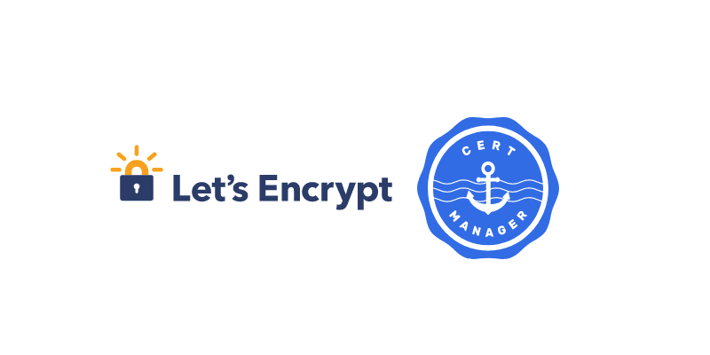

# IMPLEMENTING SECURE HTTPS WITH CERT-MANAGER AND LET’S ENCRYPT 101




In this project, we'll enhance the security of our Artifactory deployment by implementing HTTPS using [Cert-Manager](https://cert-manager.io) to request and manage TLS certificates from Let's Encrypt automatically. Cert-manager creates TLS certificates for workloads in your Kubernetes cluster and renews the certificates before they expire. This will provide a trusted HTTPS URL for our application.

#### Prerequisites:

  - EKS Kubernetes cluster with Nginx Ingress Controller installed
  - Helm 3.x installed
  - Kubectl configured to interact with your cluster
  - Domain name configured with DNS pointing to your Ingress Controller's load balancer
  - Nginx Ingress Controller installed (from the previous project)

## STEP 1: INSTALL CERT-MANAGER

1. Add the Jetstack Helm repository:

```bash
  helm repo add jetstack https://charts.jetstack.io
```

2. Update your local Helm chart repository cache:

```bash
  helm repo update
```

3. Follow the URL below to set up an EKS IAM role for a service account for cert-manager: https://cert-manager.io/docs/configuration/acme/dns01/route53/#eks-iam-role-for-service-accounts-irsa

### Please make sure to do the following:

  - Create an IAM Service Account Role for the cert-manager with the IAM policy.
  - Set up a _serviceAccount_ resource to be used by the Cert-manager. cert-manager ServiceAccount:

    ```
      apiVersion: v1
      automountServiceAccountToken: true
      kind: ServiceAccount
      metadata:
        annotations:
          eks.amazonaws.com/role-arn: arn:aws:iam::312973238800:role/cert_manager_role
        name: cert-manager
        namespace: cert-manager
      ...
    ```
  - Modify Cert-manager Deployment with correct file system permissions. This will allow the pod to read the _ServiceAccount_ token.

    ```
    spec:
      template:
        securityContext:
          fsGroup: 1001
    ```
   - Configure RBAC for the Cert-manager serviceAccount.

 _N/B:_ _You can automate the deployment and configuration of Cert-manager using Terraform to create the IAM role and Cert-manager in your EKS cluster. Then, update the values file for your Helm deployment._

   - Add role AWS to your Kubernetes Service Account annotation.

4. Install Cert-Manager using Helm:

    ```bash
    helm install cert-manager jetstack/cert-manager 
      --namespace cert-manager 
      --create-namespace 
      --version v1.15.3 
      --set crds.enabled=true
    ```

5. Verify the Cert-Manager installation:

    ```bash
    kubectl get pods --namespace cert-manager
    ```

    Expected output:

      ```
        NAME                                       READY   STATUS    RESTARTS   AGE
        cert-manager-9647b459d-dfr6s               1/1     Running   0          51s
        cert-manager-cainjector-5d8798687c-mlt8f   1/1     Running   0          51s
        cert-manager-webhook-c77744d75-6d7dj       1/1     Running   0          51s
      ```


This diagram illustrates the main components of Cert-Manager:

  - Cert-Manager Controller: Manages the certificate lifecycle
  - Webhook: Validates and mutates resources
  - CA Injector: Injects CA bundles into resources
  - Custom Resource Definitions (CRDs): Define custom resources like Certificate, Issuer, and ClusterIssuer


### STEP 2: CONFIGURE LET'S ENCRYPT ISSUER

    Create a file named lets-encrypt-issuer.yaml and add the following content:

apiVersion: cert-manager.io/v1
kind: ClusterIssuer
metadata:
  name: letsencrypt-prod
spec:
  acme:
    server: https://acme-v02.api.letsencrypt.org/directory
    email: devops@steghub.com
    privateKeySecretRef:
      name: letsencrypt-prod
    solvers:
    - selector:
        dnsZones:
          - "steghub.com"
      dns01:
        route53:
          region: us-east-1
          role: "arn:aws:iam::123456789012:role/cert_manager_role" # This must be set so cert-manager what role to attempt to authenticate with
          auth:
            kubernetes:
              serviceAccountRef:
                name: "cert-manager" # The name of the service account created

Replace devops@steghub.com with your actual email addres and the role ARN to you one you created. Update serviceAccount name if necessary.

This ClusterIssuer is set up to use Let's Encrypt for SSL/TLS certificates, solving ACME challenges using DNS-01 with Amazon Route 53, and authenticating via a Kubernetes service account.

    Apply the ClusterIssuer:

kubectl apply -f letsencrypt-issuer.yaml

    Verify the ClusterIssuer:

kubectl get clusterissuer

Expected output:

NAME               READY   AGE
letsencrypt-prod   True    14s

Step 3: Update Ingress for Artifactory

    Update your Artifactory Ingress to include TLS configuration:

apiVersion: networking.k8s.io/v1
kind: Ingress
metadata:
  name: artifactory-ingress
  namespace: tools
  annotations:
    nginx.ingress.kubernetes.io/proxy-body-size: 500m
    service.beta.kubernetes.io/aws-load-balancer-scheme: internet-facing
    service.beta.kubernetes.io/aws-load-balancer-type: nlb
    service.beta.kubernetes.io/aws-load-balancer-backend-protocol: ssl
    service.beta.kubernetes.io/aws-load-balancer-ssl-ports: "443"
    cert-manager.io/cluster-issuer: letsencrypt-prod
    cert-manager.io/private-key-rotation-policy: Always
  labels:
    name: artifactory
spec:
  ingressClassName: nginx
  tls:
  - hosts:
    - tooling.artifactory.steghub.com
    secretName: tooling.artifactory.steghub.com
  rules:
  - host: tooling.artifactory.steghub.com
    http:
      paths:
      - path: /
        pathType: Prefix
        backend:
          service:
            name: artifactory
            port:
              number: 8082

Please make a note of the following information:

    metadata.annotations: We have a cert-manager cluster issuer annotation, which points to the ClusterIssuer we previously created. If Cert-Manager observes an Ingress with annotations described in the Supported Annotations section, it will ensure that a Certificate resource with the name provided in the tls.secretName field and configured as described on the Ingress exists in the namespace.
    spec.tls: We added the tls block, which determines what ends up in the cert's configuration. The tls.hosts will be added to the cert's subjectAltNames.
    proxy-body-size: This is used to set the maximum size of a file we want to allow in our Artifactory. The initial value is lower, so you won't be able to upload a larger size artifact unless you add this annotation. A 413 error will be returned when the size in a request exceeds the maximum allowed size of the client request body.

    Apply the updated Ingress:

kubectl apply -f artifactory-ingress.yaml -n tools


Step 4: Verify Certificate Issuance

    Check the status of the Certificate:

kubectl get certificate -n tools

    Describe the Certificate for more details:

kubectl describe certificate artifactory-tls -n tools

Look for the "Status" section to confirm that the certificate was successfully issued. When you check it first, you should see something like this:

NAME                                                          READY   SECRET                            AGE
certificate.cert-manager.io/tooling.artifactory.steghub.com   False   tooling.artifactory.steghub.com   86s

Which will later change to Ready after your certificate requests has been validated:

NAME                                                          READY   SECRET                            AGE
certificate.cert-manager.io/tooling.artifactory.steghub.com   True    tooling.artifactory.steghub.com   10m

Step 5: Test HTTPS Access

    Open a web browser and navigate to https://tooling.artifactory.steghub.com
    Verify that the connection is secure and the certificate is valid.

    Click on the padlock icon in the address bar

    View the certificate details

    Confirm that Let's Encrypt issues it

This diagram illustrates the flow of HTTPS traffic and certificate issuance:

    User sends an HTTPS request to the Ingress Controller
    Cert-Manager requests a certificate from Let's Encrypt
    Let's Encrypt validates the request and issues the certificate
    Cert-Manager configures the Ingress Controller with the new certificate
    Ingress Controller serves HTTPS traffic to the user
    Requests are routed to the Artifactory service

Conclusion: In this project, we've successfully implemented HTTPS for our Artifactory deployment with a trusted SSL/TLS certificate from Let's Encrypt using Cert-Manager. This setup provides automatic certificate management and renewal, ensuring our application remains secure with minimal manual intervention.

Additional Task:

    Automate the entire process you performed using Terraform with the Helm Provider and Kubernetes Provider.
    Implement SSL/TLS certificates for the previously deployed DevOps tools.

Next Steps:

    You will write custom Helm charts
    Integrate Secrets management using Hashicorp Vault
    Integrate Logging with ELK
    Integrate monitoring with Prometheus and Grafana

By completing this project, you've gained valuable experience implementing secure communication for Kubernetes-deployed applications using industry-standard tools and practices.
