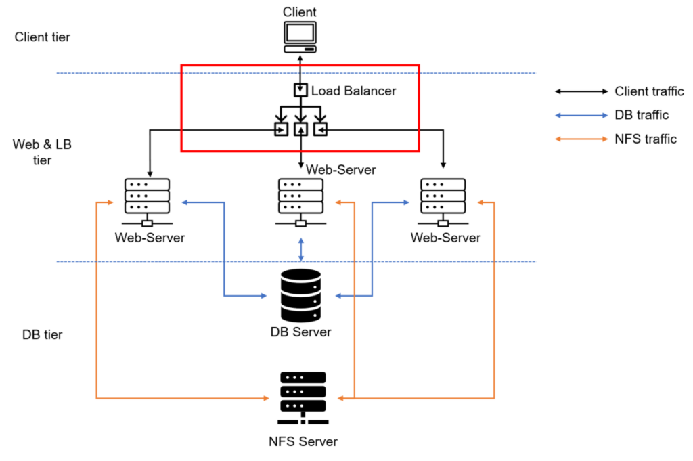
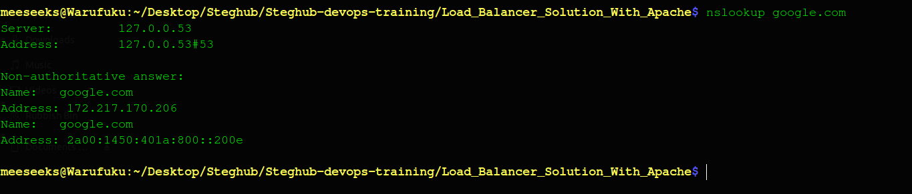
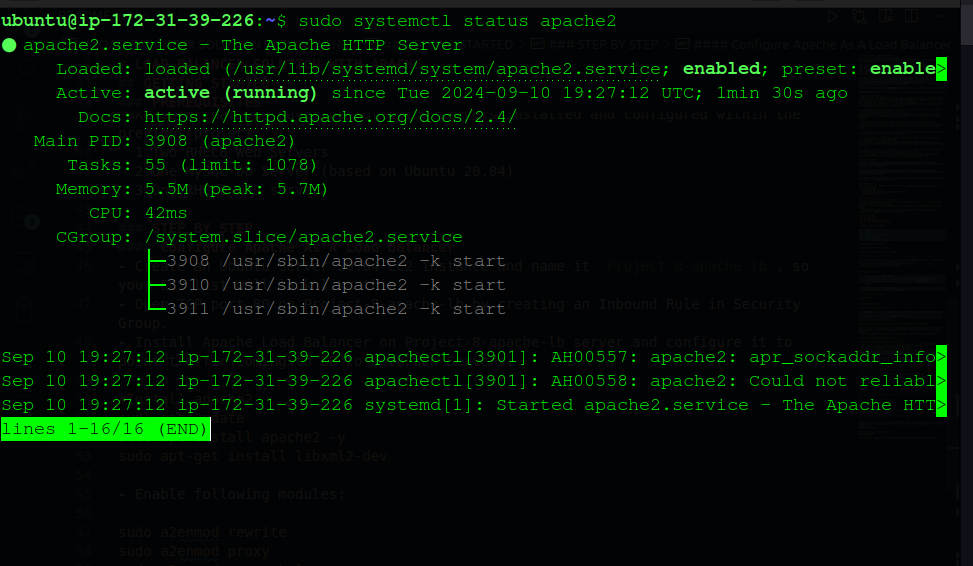

# LOAD BALANCER SOLUTION WITH APACHE

You might be wondering what is the point of having 3 different servers doing exactly the same thing.  

When we access a website in the Internet we use an **_URL_**  and we do not really know how many servers are out there serving our requests, this complexity is hidden from a regular user, but in case of websites that are being visited by millions of users per day (like Google or Reddit) it is impossible to serve all the users from a single Web Server.

Each URL contains a _domain name_ part, which is translated (resolved) to IP address of a target server that will serve requests when open a website in the Internet.
Translation (resolution) of domain names is perormed by DNS servers  
The most commonly used one has a public IP address   **_8.8.8.8_**   and belongs to Google.  
You can try to query it with nslookup command:
```
nslookup google.com
```  

- When you have just one Web server and load increases - you want to serve more and more customers, you can add more CPU and RAM or completely replace the server with a more powerful one - this is called **_"vertical scaling"_**.   
This approach has limitations - at some point you reach the maximum capacity of CPU and RAM that can be installed into your server.

- Another approach used to cater for increased traffic is **_"horizontal scaling"_** - distributing load across multiple Web servers.   
This approach is much more common and can be applied almost seamlessly and almost infinitely (you can imagine how many server Google has to serve billions of search requests).  

- Horizontal scaling allows to adapt to current load by adding (scale out) or removing (scale in) Web servers. Adjustment of number of servers can be done manually or automatically (for example, based on some monitored metrics like CPU and Memory load).

- Property of a system (in our case it is Web tier) to be able to handle growing load by adding resources, is called **_"Scalability"_**.

- In our set up in **Project-7** we had 3 Web Servers and each of them had its own public IP address and public DNS name.
- A client has to access them by using different URLs, which is not a nice user experience to remember addresses/names of even 3 server, let alone millions of Google servers.

- In order to hide all this complexity and to have a single point of access with a single public IP address/name, a Load Balancer can be used.
- A **_Load Balancer (LB)_** distributes clients' requests among underlying Web Servers and makes sure that the load is distributed in an optimal way.

## GETTING STARTED
In this project we will enhance our Tooling Website solution by adding a Load Balancer to disctribute traffic between Web Servers and allow users to access our website using a single URL.
### TASK
Deploy and configure an Apache Load Balancer for Tooling Website solution on a separate Ubuntu EC2 intance. Make sure that users can be served by Web servers through the Load Balancer.

To simplify, let us implement this solution with 2 Web Servers, the approach will be the same for 3 and more Web Servers.

### PREREQUISITES
Make sure that you have the following servers installed and configured within the previous project:  
  1.Two RHEL8 Web Servers  
  2.One MySQL DB Server (based on Ubuntu 20.04)  
  3.One RHEL8 NFS server

### STEP BY STEP 
#### Configure Apache As A Load Balancer
- Create an Ubuntu Server 20.04 EC2 instance and name it `Project-8-apache-lb`, so your EC2 list will look like this:
- Open TCP port 80 on Project-8-apache-lb by creating an Inbound Rule in Security Group.
- Install Apache Load Balancer on Project-8-apache-lb server and configure it to point traffic coming to LB to both Web Servers:
```
#Install apache2
sudo apt update
sudo apt install apache2 -y
sudo apt-get install libxml2-dev
```
- Enable following modules:
```
sudo a2enmod rewrite
sudo a2enmod proxy
sudo a2enmod proxy_balancer
sudo a2enmod proxy_http
sudo a2enmod headers
sudo a2enmod lbmethod_bytraffic
```
- Restart apache2 service
```
sudo systemctl restart apache2
```
- Make sure apache2 is up and running
```
sudo systemctl status apache2
```

- To configure the load balancer, we will update the 000-default.conf configuration file in the **_/etc/apache2/sites-available/_** directory.
- We need to add the following configuration into the `<VirtualHost>` block:
- Add this configuration into this section 
```

<VirtualHost *:80>
    
    <Proxy "balancer://mycluster">
        BalancerMember http://<webserver-1-priate-ip>:80 loadfactor=5 timeout=1
        BalancerMember http://<webserver-2-priate-ip>:80 loadfactor=5 timeout=1
        BalancerMember http://<webserver-3-priate-ip>:80 loadfactor=5 timeout=1
    </Proxy>

    ProxyPass / balancer://mycluster/
    ProxyPassReverse / balancer://mycluster/

    ProxyPreserveHost On

</VirtualHost>

```
- Restart apache server
```
sudo systemctl restart apache2
```
- currently our server looks like this

- **_bytraffic_**  balancing method will distribute incoming load between your Web Servers according to current traffic load. We can control in which proportion the traffic must be distributed by loadfactor parameter.
- Verify that our configuration works - try to access your LB's public IP address or Public DNS name from your browser:
```
http://<Load-Balancer-Public-IP-Address-or-Public-DNS-Name>/index.php
```

  
_NB: If in the previous project, you mounted /var/log/httpd/ from your Web Servers to the NFS server - unmount them and make sure that each Web Server has its own log directory._
- Open two ssh/Putty consoles for both Web Servers and run following command:
```
sudo tail -f /var/log/httpd/access_log
```
- Try to refresh your browser page `http://<Load-Balancer-Public-IP-Address-or-Public-DNS-Name>/index.php` several times   

- If you have configured everything correctly your users will not even notice that their requests are served by more than one server.


# Conclusion
In this project, I implemented a load-balancing layer for our web infrastructure using Apache. Load balancing is an essential component of a scalable and fault-tolerant web infrastructure. It helps distribute the load across multiple servers, improving performance and reliability. Apache is a popular choice for load balancing because it is easy to configure and has a lot of features that make it a good choice for load balancing. I hope you found this project helpful and that you now have a better understanding of load balancing with Apache.