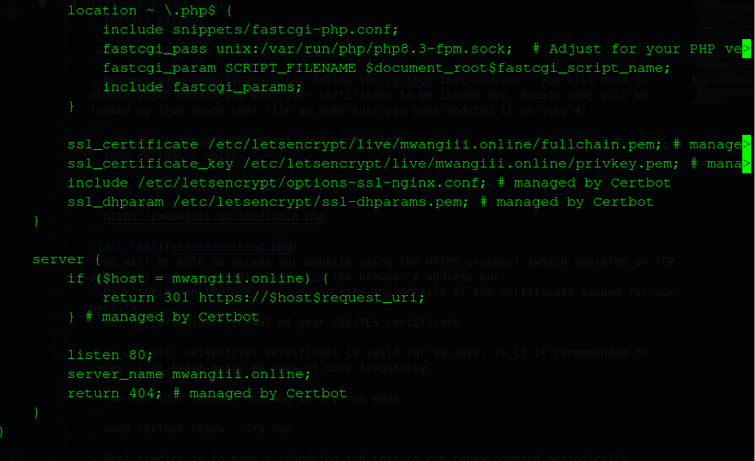

# Load Balancer Solution With Nginx and SSL/TLS


By now, we’ve learned the purpose of Load Balancing and configured a solution using Apache. However, as DevOps engineers, it’s essential to be versatile and explore alternative solutions for similar tasks. In this project, we’ll set up a Load Balancer using Nginx.

It’s equally important for us to secure connections to our web applications by encrypting data in transit.  
We’ll also cover secure HTTP (HTTPS), its importance, and how to implement it.

When data is transmitted between a _**client**_ (browser) and a _**web server**_ over the Internet, it passes through multiple network devices.   
If it’s not encrypted, this data can be easily intercepted by someone with access to these intermediary devices—a threat known as a **_Man-In-The-Middle_** (MITM) attack.

This threat is real: when we transmit sensitive information (such as bank details or social media credentials) over unsecured channels, we risk having our data compromised and exploited by cybercriminals.

_**SSL**_ and its newer version, **_TSL_** - is a security technology that protects connection from _**MITM**_ attacks by creating an encrypted session between browser and Web server.  
Here we will refer this family of _**cryptographic**_ protocols as SSL/TLS - even though SSL was replaced by TLS, the term is still being widely used.

_**SSL/TLS**_ uses digital certificates to identify and validate a Website. A browser reads the certificate issued by a Certificate Authority (CA) to make sure that the website is registered in the CA so it can be trusted to establish a secured connection.

In this project, we will register our website with the Let's Encrypt Certificate Authority. To automate the certificate issuance process, we’ll use Certbot, a shell client recommended by Let's Encrypt.

# TASKS
This project consists of two parts:
- Configure Nginx as a Load Balancer
- Register a new domain name and configure secured connection using SSL/TLS certificates


## STEPS
### Configure Nginx As A Load Balancer
- create a fresh installation of Linux for Nginx.
    - Create an EC2 VM based on Ubuntu Server 20.04 LTS and name it Nginx LB (do not forget to open TCP `port 80` for HTTP connections, also open TCP `port 443` - this port is used for secured HTTPS connections)
    - Update /etc/hosts file for local DNS with Web Servers' names (e.g. Web1 and Web2) and their local IP addresses
    - Install and configure Nginx as a load balancer to point traffic to the resolvable DNS names of the webservers

- Update the instance and Install Nginx Install Nginx
  ```
  sudo apt update
  sudo apt install nginx -y
  ```
- Configure Nginx LB using Web Servers' names defined in `/etc/hosts`

**_NB: Read this [blog](https://linuxize.com/post/how-to-edit-your-hosts-file/) to read about /etc/host_**
- Open the default nginx configuration file
```
  sudo nano /etc/nginx/nginx.conf
```
```
  #insert following configuration into http section

  upstream myproject {
      server Web1 weight=5;
      server Web2 weight=5;
    }

  server {
      listen 80;
      server_name www.domain.com;
      location / {
        proxy_pass http://myproject;
      }
    }

  #comment out this line
  #       include /etc/nginx/sites-enabled/*;
```
- Restart Nginx and make sure the service is up and running
```
  sudo systemctl restart nginx
  sudo systemctl status nginx
```


### Register a new domain name and configure secured connection using SSL/TLS certificates
Let us make the necessary configurations to secure connections to our Tooling Web Solution.

I chose [GoDaddy.com](https://www.godaddy.com/en-ph) for registering my domain and managing DNS due to its reputation as a trusted and user-friendly registrar. Obtaining a valid SSL certificate required a registered domain, and GoDaddy’s streamlined process made it straightforward. While other registrars like Domain.com and Bluehost.com are available, GoDaddy’s competitive pricing and reliable customer support influenced my decision.

After registering my domain, I assigned an Elastic IP to my Nginx load balancer server. Since the public IP changes each time an EC2 instance restarts or is stopped, having a static IP is crucial for ensuring that my domain consistently points to the correct server. Elastic IP resolves this issue, allowing the domain to maintain access even after a reboot. I updated the A record in GoDaddy to point to my Nginx load balancer using the Elastic IP, ensuring uninterrupted access to my website.

For anyone managing an EC2 instance, it’s important to note that a new public IP is assigned each time the instance restarts. Associating a static Elastic IP to the instance prevents this inconvenience. You can learn how to allocate and associate an Elastic IP with an EC2 server [on this page](https://docs.aws.amazon.com/AWSEC2/latest/UserGuide/elastic-ip-addresses-eip.html). Be sure to update the A record in your registrar to point to your Nginx load balancer using the Elastic IP.
- Check that your Web Servers can be reached from your browser using new domain name using HTTP protocol - 
```
    https://mwangiii.online
```

- Configure Nginx to recognize your new domain name

- Update your nginx.conf with server_name  `www.<your-domain-name.com>` instead of server_name `www.domain.com`

- Install certbot and request for an SSL/TLS certificate
- Make sure snapd service is active and running
```
 sudo systemctl status snapd
```

- Install certbot
```
 sudo snap install --classic certbot
```
- Request your certificate (just follow the certbot instructions - you will need to choose which domain you want your certificate to be issued for, domain name will be looked up from nginx.conf file so make sure you have updated it on step 4).
```
  sudo ln -s /snap/bin/certbot /usr/bin/certbot
  sudo certbot --nginx
```
- Test secured access to our Web Solution by trying to reach 
```
  https://mwangiii.online/login.php
```

- We will be able to access our website using the HTTPS protocol (which operates on TCP port 443) and see a padlock icon in the browser’s address bar. 
- By clicking on the padlock, we can view the details of the certificate issued for our website.
- Set up periodical renewal of your SSL/TLS certificate

- By default, LetsEncrypt certificate is valid for 90 days, so it is recommended to renew it at least every 60 days or more frequently.

- You can test renewal command in dry-run mode
```
  sudo certbot renew --dry-run
```
- Best pracice is to have a scheduled job that to run renew command periodically. 
- Let us configure a cronjob to run the command twice a day.

- To do so, lets edit the crontab file with the following command:
```
  crontab -e
```
- Add following line:
```
  * */12 * * *   root /usr/bin/certbot renew > /dev/null 2>&1
```

- We can always change the interval of this cronjob if twice a day is too often by adjusting schedule expression.


we have just implemented an Nginx Load Balancing Web Solution with secured HTTPS connection with periodically updated SSL/TLS certificates.  
##### Here's a visual representation of our server setup:


## KEYWORDS
- **_Man-In-The-Middle_** (MITM) - A type of attack where a hacker intercepts and potentially alters communication between two parties.
- _**SSL**_ and **_TSL_** -  Protocols for encrypting data between a web server and a browser. TLS is the more secure, modern version of SSL.

- _**Elastic IP**_ -  A static public IP address in cloud platforms (like AWS) that remains consistent, even if the server changes.

- _**cron configuration**_  -  A method for scheduling tasks in Unix-like systems, using a configuration file to automate commands at specific times.
- _**Domain name registrar**_ - A domain name registrar is a company that manages the registration and renewal of internet domain names, ensuring they are unique and linked to specific IP addresses. They often offer additional services like web hosting and DNS management.

# CONCLUSION
In this project, I guided you through setting up a secure communication channel between clients and web servers using the HTTPS protocol. We used Nginx as our load balancer and obtained a free SSL certificate from Let's Encrypt via Certbot. We also configured a domain name for our web infrastructure and scheduled a cron job to automatically renew the SSL certificate. As a result, our web infrastructure is now more secure and efficient in handling client traffic.

I hope you found this project valuable.   
If you have any questions or feedback, feel free to reach out. I'd be happy to assist.  
Thank you for your time.