# MIGRATION TO THE CLOUD WITH CONTAINERIZATION (DOCKER & DOCKER COMPOSE)1 -101
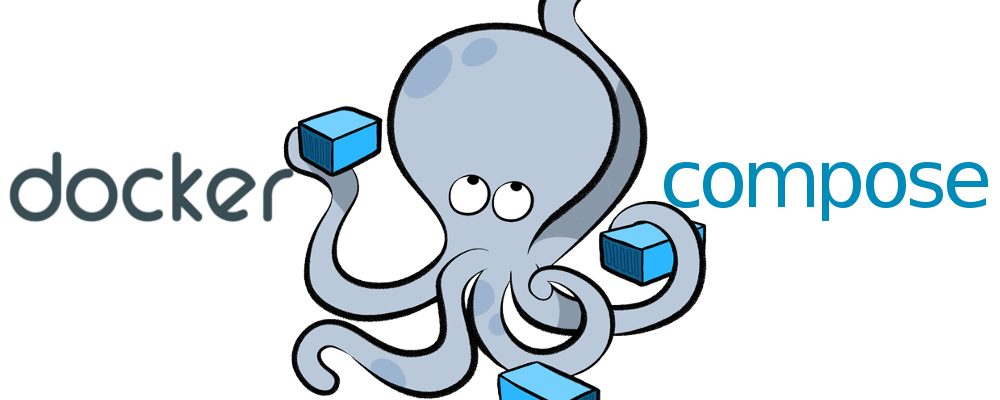
Until now, you have been using VMs (AWS EC2) in Amazon Virtual Private Cloud (AWS VPC) to deploy your web solutions,
and it works well in many cases. You have learned how easy to spin up and configure a new EC2 manually or with such tools as Terraform and Ansible to automate provisioning and configuration.
You have also deployed two different websites on the same VM; this approach is scalable, but to some extent;
imagine what if you need to deploy many small applications (it can be web front-end, web-backend, processing jobs, monitoring, logging solutions, etc.)
and some of the applications will require various OS and runtimes of different versions and conflicting dependencies - in such case you would need to spin up serves for each group of applications with the exact OS/runtime/dependencies requirements.
When it scales out to tens/hundreds and even thousands of applications (e.g., when we talk of microservice architecture), this approach becomes very tedious and challenging to maintain.  

In this project, we will learn how to solve this problem and begin to practice the technology that revolutionized application distribution and deployment back in 2013!
We are talking of Containers and imply Docker. Even though there are other application containerization technologies,
Docker is the standard and the default choice for shipping your app in a container!

Once you have finished the Docker course, you can proceed with this practical project!
## INSTALL DOCKER AND PREPARE FOR MIGRATION TO THE CLOUD
First, we need to install Docker Engine, which is a client-server application that contains:
- A server with a long-running daemon process `dockerd`.
- APIs that specify interfaces that programs can use to talk to and instruct the Docker daemon.
- A command-line interface (CLI) client docker.

You can learn how to install Docker Engine on your PC [here](https://docs.docker.com/engine/)

Before we proceed further, let us understand why we even need to move from VM to Docker.

As you have already learned - unlike a VM, Docker allocated not the whole guest OS for your application,
but only isolated minimal part of it - this isolated container has all that your application needs and at the same time is lighter, faster, and can be shipped as a Docker image to multiple physical or virtual environments,
as long as this environment can run Docker engine.
This approach also solves the environment incompatibility issue.
It is a well-known problem when a developer sends his application to you, you try to deploy it, deployment fails,
and the developer replies, _"- It works on my machine!"_.
With Docker - if the application is shipped as a container,
it has its own environment isolated from the rest of the world, and it will always work the same way on any server that has Docker engine.

```
      ¯\_(ﭣ)_/¯
 IT WORKS ON MY MACHINE
```
Now, when we understand the benefits we can get by using Docker containerization, let us learn what needs to be done to migrate to Docker. 

As a part of this project, you will use a CI tool that is already well-known by you `Jenkins` - **for Continous Integration (CI).** 
So, when it is time to write `Jenkinsfile`, update your Terraform code to spin up an EC2 instance for Jenkins and run Ansible to install & configure it.

To begin our migration project from VM based workload, we need to implement a Proof of Concept (POC).
In many cases, it is good to start with a small-scale project with minimal functionality to prove that technology can fulfill specific requirements.
So, this project will be a precursor before you can move on to deploy enterprise-grade microservice solutions with Docker.
And so, Project 21 through to 30 will gradually introduce concepts and technologies as we move from POC onto enterprise level deployments.

You can start with your own workstation or spin up an EC2 instance to install Docker engine that will host your Docker containers.

Remember our Tooling website? It is a PHP-based web solution backed by a MySQL database - all technologies you are already familiar with and which you shall be comfortable using by now.

So, let us migrate the Tooling Web Application from a VM-based solution into a containerized one.


## MYSQL IN CONTAINER 
Let us start assembling our application from the Database layer - we will use a pre-built MySQL database container, configure it, and make sure it is ready to receive requests from our PHP application.

### STEP 1: PULL MYSQL DOCKER IMAGE FROM DOCKER HUB REGISTRY 
Start by pulling the appropriate Docker image for MySQL. You can download a specific version or opt for the latest release, as seen in the following command:
```bash
sudo docker pull mysql/mysql-server:latest
```


If you are interested in a particular version of MySQL, replace latest with the version number. Visit Docker Hub to check other tags here

List the images to check that you have downloaded them successfully:
```bash
docker image ls
```


### STEP 2:DEPLOY THE MYSQL CONTAINER TO YOUR DOCKER ENGINE
1. Once you have the image, move on to deploying a new MySQL container with:
```bash
docker run --name <container_name> -e MYSQL_ROOT_PASSWORD=<my-secret-pw> -d mysql/mysql-server:latest
```
- Replace <container_name> with the name of your choice. If you do not provide a name, Docker will generate a random one
- The -d option instructs Docker to run the container as a service in the background
- Replace <my-secret-pw> with your chosen password
- In the command above, we used the latest version tag. This tag may differ according to the image you downloaded

2. Then, check to see if the MySQL container is running: Assuming the container name specified is mysql-server

```bash
docker ps -a
```


```
CONTAINER ID   IMAGE                                COMMAND                  CREATED          STATUS                             PORTS                       NAMES
7141da183562   mysql/mysql-server:latest            "/entrypoint.sh mysq…"   12 seconds ago   Up 11 seconds (health: starting)   3306/tcp, 33060-33061/tcp   mysql-server
```
You should see the newly created container listed in the output. It includes container details, one being the status of this virtual environment. The status changes from health: starting to healthy, once the setup is complete.

### STEP 3: CONNECTING TO THE MYSQL DOCKER CONTAINER
We can either connect directly to the container running the MySQL server or use a second container as a MySQL client. Let us see what the first option looks like.

#### APPROACH ONE 
Connecting directly to the container running the MySQL server:
```bash
  docker exec -it <container_name> mysql -uroot -p
```
Provide the root password when prompted. With that, you have connected the MySQL client to the server.  
Finally, change the server root password to protect your database.

#### APPROACH TWO
First, create a network:
```bash
docker network create --subnet=172.18.0.0/24 tooling_app_network 
```
Creating a custom network is not necessary because even if we do not create a network, Docker will use the default network for all the containers you run. By default, the network we created above is of DRIVER Bridge. So, also, it is the default network. You can verify this by running the docker network ls command.

But there are use cases where this is necessary. For example, if there is a requirement to control the cidr range of the containers running the entire application stack. This will be an ideal situation to create a network and specify the --subnet

For clarity's sake, we will create a network with a subnet dedicated for our project and use it for both MySQL and the application so that they can connect.

Run the MySQL Server container using the created network.

First, let us create an environment variable to store the root password:
```sql
export MYSQL_PW=<root-secret-password>
```

Then, pull the image and run the container, all in one command like below:
```bash
docker run --network tooling_app_network -h mysqlserverhost --name=mysql-server -e MYSQL_ROOT_PASSWORD=$MYSQL_PW  -d mysql/mysql-server:latest 
```
Flags used
- -d runs the container in detached mode
- --network connects a container to a network
- -h specifies a hostname


If the image is not found locally, it will be downloaded from the registry.

Verify the container is running:
```bash
docker ps -a
```
```
CONTAINER ID   IMAGE                                COMMAND                  CREATED          STATUS                             PORTS                       NAMES
7141da183562   mysql/mysql-server:latest            "/entrypoint.sh mysq…"   12 seconds ago   Up 11 seconds (health: starting)   3306/tcp, 33060-33061/tcp   mysql-server
```


As you already know, it is best practice not to connect to the MySQL server remotely using the root user.
Therefore, we will create an SQL script that will create a user we can use to connect remotely.

Create a file and name it `create_user.sql` and add the below code in the file:
```sql
CREATE USER '<user>'@'%' IDENTIFIED BY '<client-secret-password>';
GRANT ALL PRIVILEGES ON * . * TO '<user>'@'%';
```
Run the script:
```bash
docker exec -i mysql-server mysql -uroot -p$MYSQL_PW < ./create_user.sql
```


If you see a warning like below, it is acceptable to ignore:
```
mysql: [Warning] Using a password on the command line interface can be insecure.
```

## CONNECTING TO THE MYSQL SEVER FROM A SECOND CONTAINER RUNNING THE MYSQL CLIENT UTILITY
The good thing about this approach is that you do not have to install any client tool on your laptop, and you do not need to connect directly to the container running the MySQL server.

Run the MySQL Client Container:
```bash
docker run --network tooling_app_network --name mysql-client -it --rm mysql mysql -h mysqlserverhost -u <user-created-from-the-SQL-script> -p
```


Flags used:
- --name gives the container a name
- -it runs in interactive mode and Allocate a pseudo-TTY
- --rm automatically removes the container when it exits
- --network connects a container to a network
- -h a MySQL flag specifying the MySQL server Container hostname
- -u user created from the SQL script
- -p password specified for the user created from the SQL script

### PREPAER DATABASE SCHEME
Now you need to prepare a database schema so that the Tooling application can connect to it.
1. Clone the Tooling-app repository from here
```bash
  git clone https://github.com/StegTechHub/tooling-02.git
```


2. On your terminal, export the location of the SQL file
```bash
  export tooling_db_schema=<path-to-tooling-schema-tile>/tooling_db_schema.sql
```
You can find the `tooling_db_schema.sql` in the html folder of cloned repo.
3. Use the SQL script to create the database and prepare the schema.
With the `docker exec` command, you can execute a command in a running container.
```bash
  docker exec -i mysql-server mysql -uroot -p$MYSQL_PW < $tooling_db_schema
```
4. Update the `db_conn.php` file with connection details to the database
```php
$servername = "mysqlserverhost";
$username = "<user>";
$password = "<client-secret-password>";
$dbname = "toolingdb";
```
5. Run the Tooling App
Containerization of an application starts with creation of a file with a special name - 'Dockerfile' _(without any extensions)_.
This can be considered as a 'recipe' or 'instruction' that tells Docker how to pack your application into a container.
In this project, you will build your container from a pre-created Dockerfile, but as a DevOps, you must also be able to write Dockerfiles.

You can watch this [video](https://www.youtube.com/watch?v=hnxI-K10auY) to get an idea how to create your Dockerfile and build a container from it.

And on this page, you can find official Docker best practices for writing `Dockerfiles`.

So, let us **containerize** our Tooling application; here is the plan:

- Make sure you have checked out your Tooling repo to your machine with Docker engine
- First, we need to build the Docker image the tooling app will use. The Tooling repo you cloned above has a Dockerfile for this purpose. Explore it and make sure you understand the code inside it.
- Run docker build command
- Launch the container with docker run
- Try to access your application via port exposed from a container

Let us begin:
Ensure you are inside the folder that has the Dockerfile and build your container:
```bash
docker build -t tooling:0.0.1 .
```
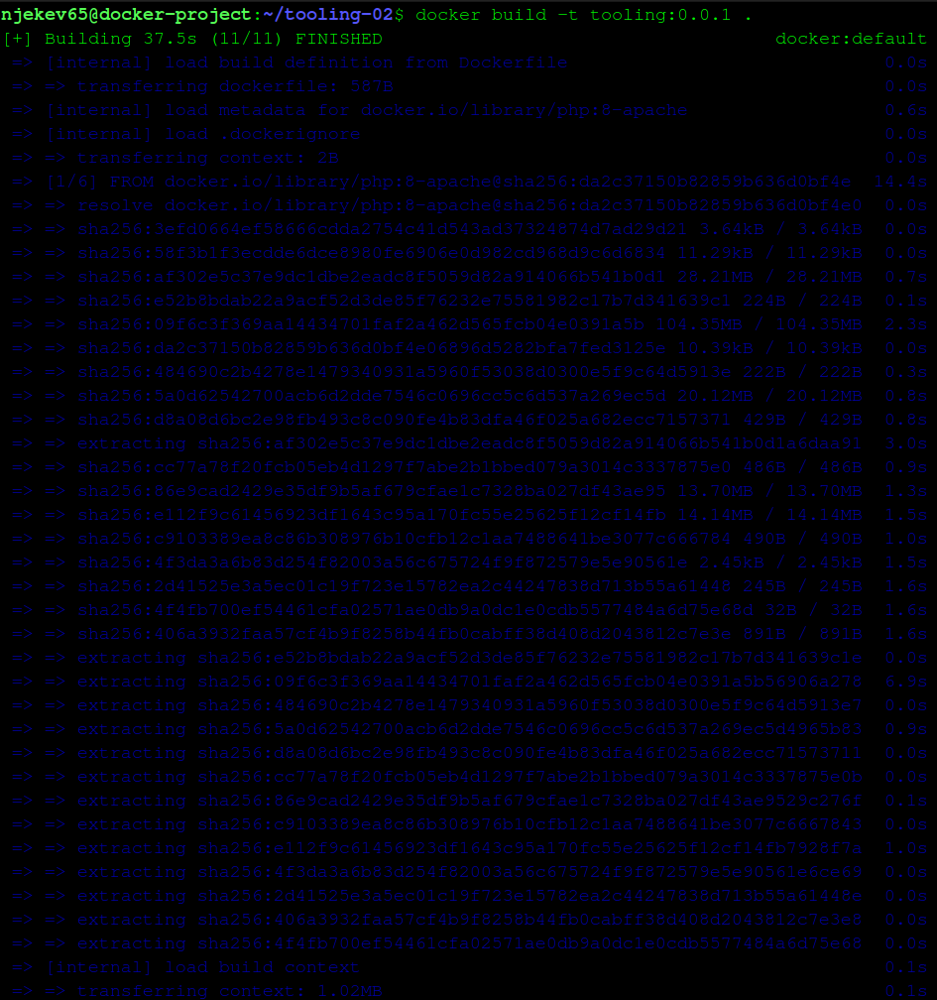

In the above command, we specify a parameter -t, so that the image can be tagged tooling"0.0.1
Also, you have to notice the `.` at the end.
This is important as that tells Docker to locate the Dockerfile in the current directory you are running the command.
Otherwise, you would need to specify the absolute path to the Dockerfile.

6. Run the container:
```bash
docker run --network tooling_app_network -p 8085:80 -it tooling:0.0.1
```


_Let us observe those flags in the command._
- We need to specify the --network flag so that both the Tooling app and the database can easily connect on the same virtual network we created earlier.
- The -p flag is used to map the container port with the host port. Within the container, apache is the webserver running and, by default, it listens on port 80. You can confirm this with the CMD ["start-apache"] section of the Dockerfile. But we cannot directly use port 80 on our host machine because it is already in use. The workaround is to use another port that is not used by the host machine. In our case, port 8085 is free, so we can map that to port 80 running in the container.

**Note:** _You will get an error. But you must troubleshoot this error and fix it. Below is your error message._
```
AH00558: apache2: Could not reliably determine the server's fully qualified domain name, using 172.18.0.3. Set the 'ServerName' directive globally to suppress this message
```
**Hint:** _You must have faced this error in some of the past projects. It is time to begin to put your skills to good use. Simply do a google search of the error message, and figure out where to update the configuration file to get the error out of your way._
If everything works, you can open the browser and type 
```http
http://localhost:8085
```


You will see the login page.  
The default email is test@gmail.com, the password is 12345 or you can check users' credentials stored in the toolingdb.user table.
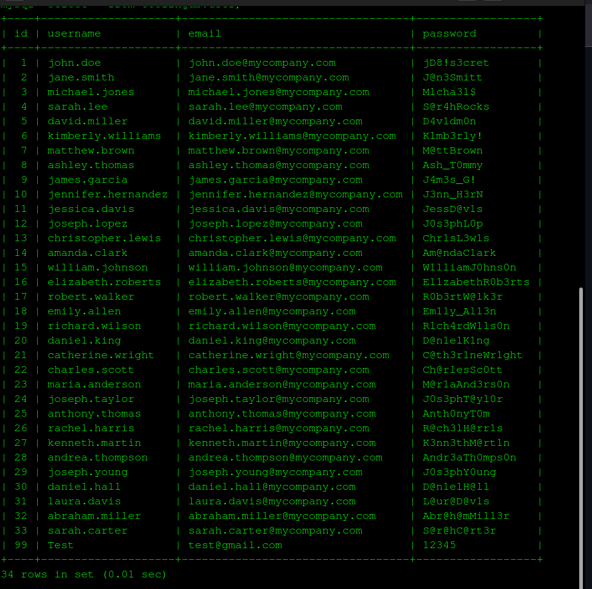


## PRACTICE TASK №1 - IMPLEMENT A POC TO MIGRATE THE PHP-TODO APP INTO A CONTAINERIZED APPLICATION.

Download php-todo repository from [here](https://github.com/StegTechHub/php-todo)


The project below will challenge you a little bit, but the experience there is very valuable for future projects.
### PART 1
- Write a Dockerfile for the TODO app
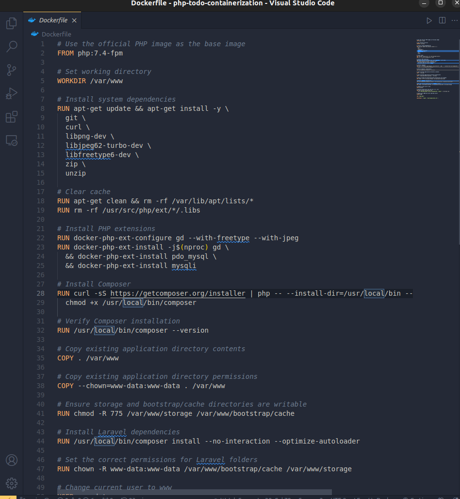
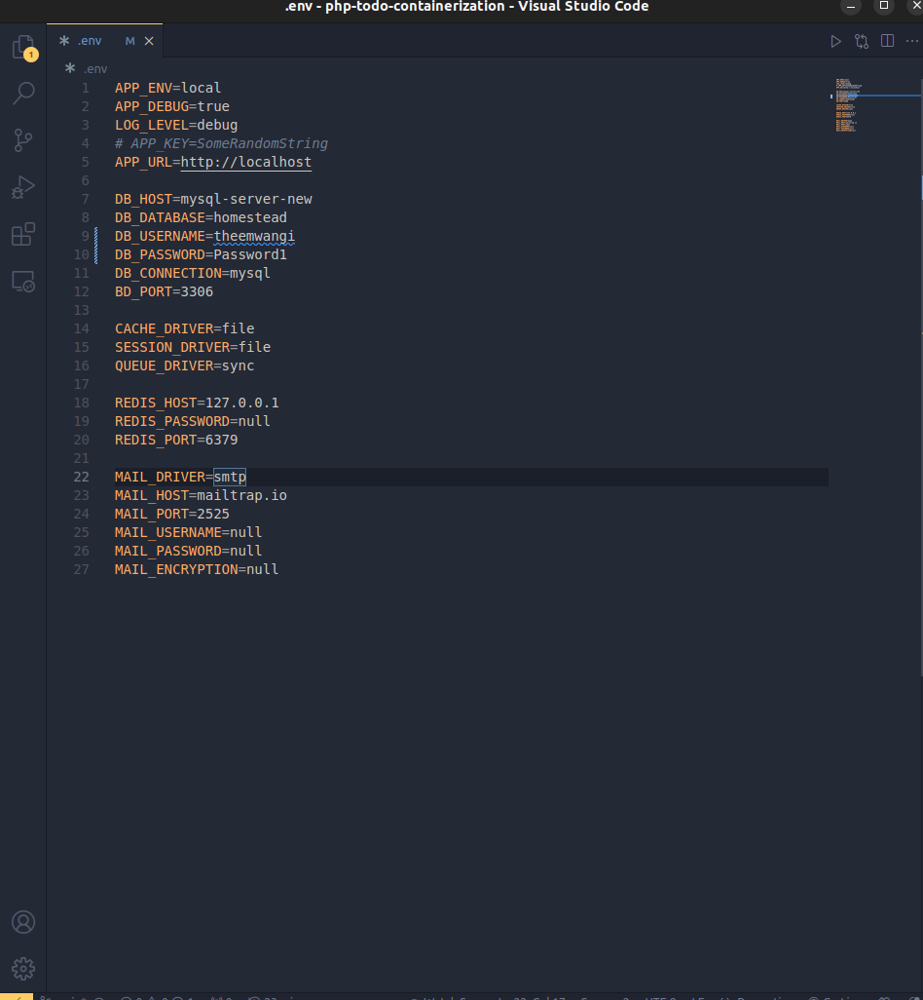
- Run both database and app on your laptop Docker Engine
```bash
docker run --network tooling_app_network -h mysqlserverhost --name=mysql-server -e MYSQL_ROOT_PASSWORD=$MYSQL_PW  -d mysql/mysql-server:latest
```
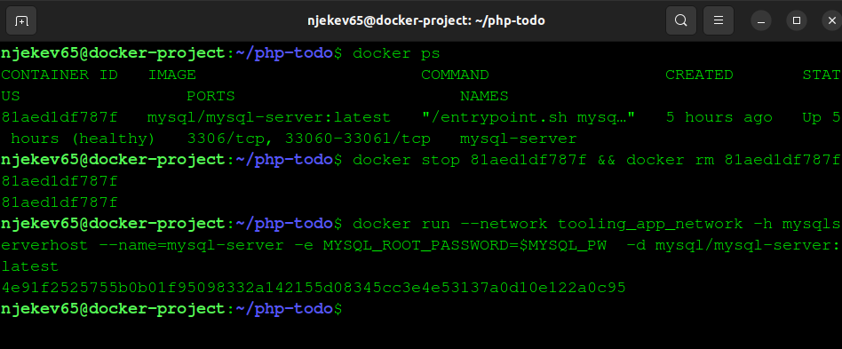

- Create database and user using the script
```bash
docker exec -i mysql-server mysql -uroot -p$MYSQL_PW < ./create_user.sql
```


- Run todo app
- Build the todo app
```bash
docker build -t php-todo:0.0.1 .
```
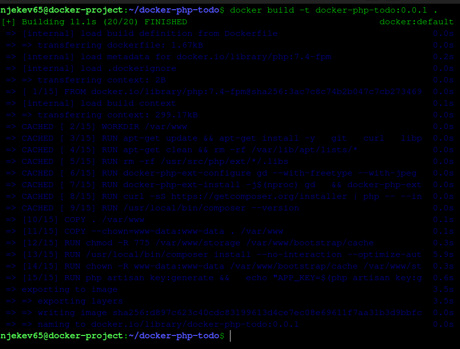

```bash
docker run --network tooling_app_network --rm --name php-todo --env-file .env -p 8090:8000 -it php-todo:0.0.1
```


- Migration has taken place in the previous run 
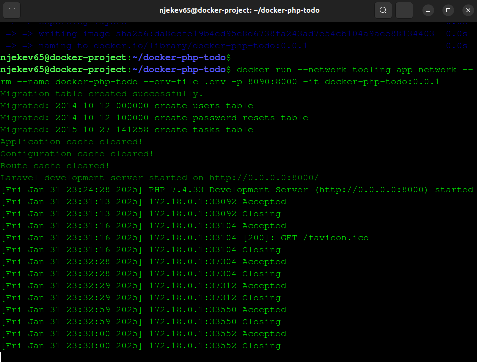

- Access the application from the browser
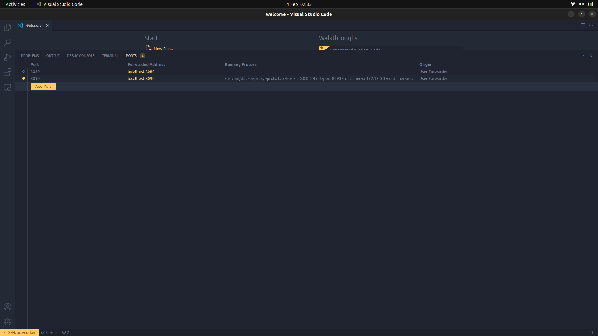

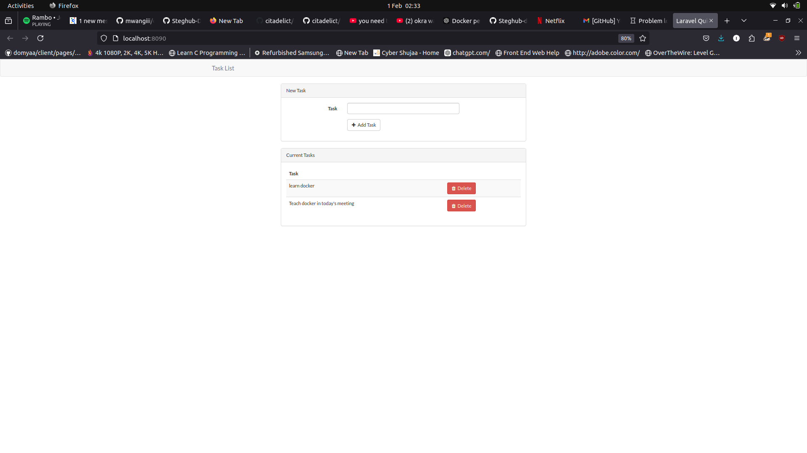

### PART 2
- Create an account in [Docker Hub](https://hub.docker.com/)


- Create a new Docker Hub repository
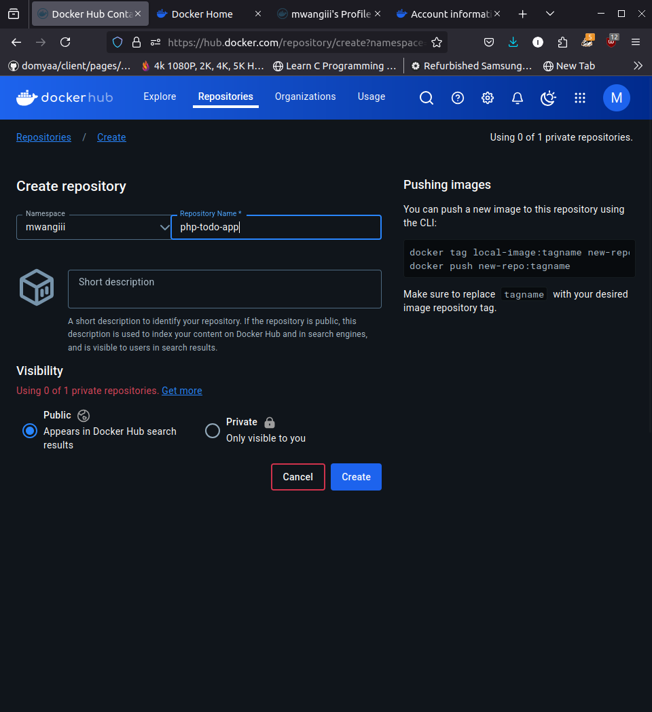
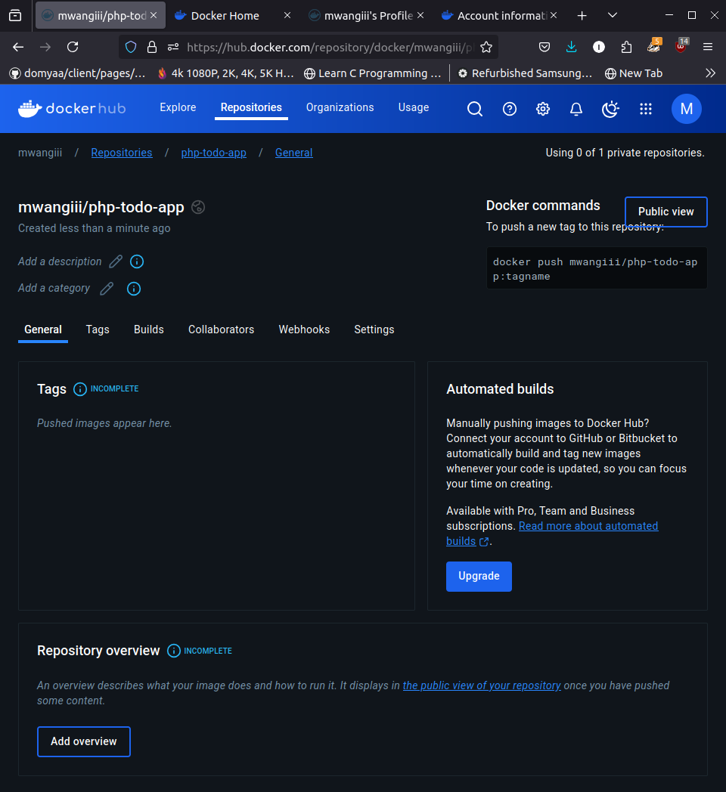
- Sign in to docker and tag the docker image
```bash
docker login
```
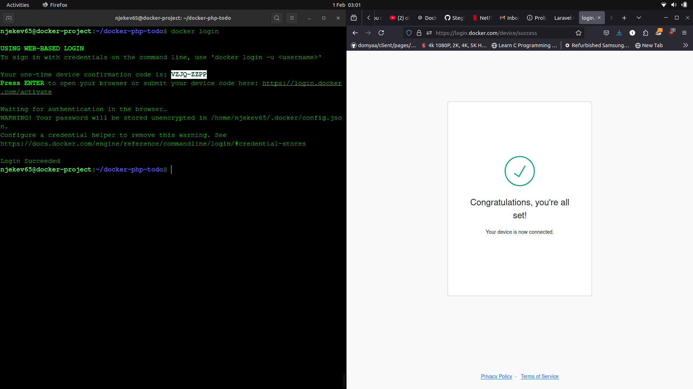

- Push the docker image to the repository created
```bash
docker tag php-todo:0.0.1 mwangiii/php-todo-app:0.0.1
docker push mwangiii/php-todo-app:0.0.1
```
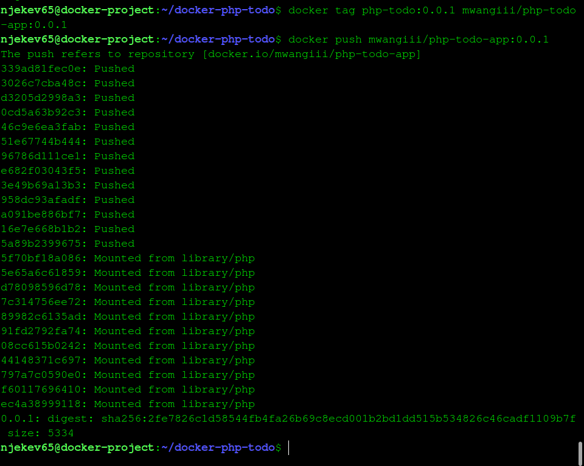
- Push the docker images from your PC to the repository


### PART 3
- Write a Jenkinsfile that will simulate a Docker Build and a Docker Push to the registry
```yml
pipeline {
    agent any

    environment {
        DOCKER_REGISTRY = "docker.io"
        DOCKER_IMAGE = "mwasone/php-todo-app"
    }

    parameters {
        string(name: 'BRANCH_NAME', defaultValue: 'main', description: 'Git branch to build')
    }

    stages {
        stage('Initial cleanup') {
            steps {
                dir("${WORKSPACE}") {
                    deleteDir()
                }
            }
        }

        stage('Checkout') {
            steps {
                script {
                    checkout([
                        $class: 'GitSCM',
                        branches: [[name: "${params.BRANCH_NAME}"]],
                        userRemoteConfigs: [[url: 'https://github.com/mwangiii/docker-php-todo.git']]
                    ])
                }
            }
        }

        stage('Build Docker Image') {
            steps {
                script {
                    def branchName = params.BRANCH_NAME
                    env.TAG_NAME = branchName == 'main' ? 'latest' : "${branchName}-0.0.${env.BUILD_NUMBER}"
                    
                    sh """
                    docker build -t ${DOCKER_REGISTRY}/${DOCKER_IMAGE}:${env.TAG_NAME} .
                    """
                }
            }
        }

        stage('Push Docker Image') {
            steps {
                script {
                    withCredentials([usernamePassword(credentialsId: 'docker-logins', usernameVariable: 'USERNAME', passwordVariable: 'PASSWORD')]) {
                        sh """
                        echo ${PASSWORD} | docker login -u ${USERNAME} --password-stdin ${DOCKER_REGISTRY}
                        docker push ${DOCKER_REGISTRY}/${DOCKER_IMAGE}:${env.TAG_NAME}
                        """
                    }
                }
            }
        }

        stage('Cleanup Docker Images') {
            steps {
                script {
                    sh """
                    docker rmi ${DOCKER_REGISTRY}/${DOCKER_IMAGE}:${env.TAG_NAME} || true
                    """
                }
            }
        }
    }

    post {
        always {
            script {
                sh 'docker logout'
            }
        }
    }
}

```

- Launch ec2 instance for jenkins
- Install docker on jenkins server

```bash
# Add Docker's official GPG key:
sudo apt-get update

sudo apt-get install ca-certificates curl

sudo install -m 0755 -d /etc/apt/keyrings

sudo curl -fsSL https://download.docker.com/linux/ubuntu/gpg -o /etc/apt/keyrings/docker.asc

sudo chmod a+r /etc/apt/keyrings/docker.asc

# Add the repository to Apt sources:
echo \
  "deb [arch=$(dpkg --print-architecture) signed-by=/etc/apt/keyrings/docker.asc] https://download.docker.com/linux/ubuntu \
  $(. /etc/os-release && echo "$VERSION_CODENAME") stable" | \
  sudo tee /etc/apt/sources.list.d/docker.list > /dev/null

sudo apt-get update

sudo systemctl start docker
sudo systemctl enable docker
```
- Install the Docker packages. To install the latest version, run:
```bash
sudo apt-get install docker-ce docker-ce-cli containerd.io docker-buildx-plugin docker-compose-plugin
```
- Ensure Jenkins Has Permission to Run Docker
- Add Jenkins User to Docker Group
```bash
sudo usermod -aG docker jenkins
sudo systemctl restart jenkins
```
- Install docker plugins
- Go to `Manage Jenkins` > `Manage Plugins` > `Available`.
- Search for `Docker Pipeline` and install it.
- Docker Tool Configuration:
- Check the path to Docker executable (Installed docker) by running
- which docker
- Go to `Manage Jenkins` > `Tools`, Scroll to Docker installations

- Add Docker credentials to Jenkins.

- Go to Jenkins Dashboard > Manage Jenkins > Credentials. Add your Docker username and password and the credential ID (from jenkinsfile) there.

2. Connect your repo to Jenkins
- Add a webhook to the github repo
- Install Blue Ocean plugin and Open it from dashboard
- Select create New pipeline
- Select Github and your Github account
- Select the repo for the pipeline
- Select create pipeline

3. Create a multi-branch pipeline
4. Simulate a CI pipeline from a feature and master branch using previously created Jenkinsfile

5. Ensure that the tagged images from your Jenkinsfile have a prefix that suggests which branch the image was pushed from. For example, feature-0.0.1.
6. Verify that the images pushed from the CI can be found at the registry.


## DEPLOYMENT WITH DOCKER COMPOSE

All we have done until now required quite a lot of effort to create an image and launch an application inside it. We should not have to always run Docker commands on the terminal to get our applications up and running. There are solutions that make it easy to write declarative code in YAML, and get all the applications and dependencies up and running with minimal effort by launching a single command.

In this section, we will refactor the Tooling app POC so that we can leverage the power of Docker Compose.

1. First, install Docker Compose on your workstation from here
2. Create a file, name it tooling.yaml
3. Begin to write the Docker Compose definitions with YAML syntax. The YAML file is used for defining services, networks, and volumes:
```yml
version: "3.9"
services:
  tooling_frontend:
    build: .
    ports:
      - "5000:80"
    volumes:
      - tooling_frontend:/var/www/html
```
The YAML file has declarative fields, and it is vital to understand what they are used for.
- version: Is used to specify the version of Docker Compose API that the Docker Compose engine will connect to. This field is optional from docker compose version v1.27.0. You can verify your installed version with:
```bash
docker-compose --version
docker-compose version 1.28.5, build c4eb3a1f
```
- service: A service definition contains a configuration that is applied to each container started for that service. In the snippet above, the only service listed there is tooling_frontend. So, every other field under the tooling_frontend service will execute some commands that relate only to that service. Therefore, all the below-listed fields relate to the tooling_frontend service.
- build
- port
- volumes
- links

You can visit the site here to find all the fields and read about each one that currently matters to you -> https://www.balena.io/docs/reference/supervisor/docker-compose/

You may also go directly to the official documentation site to read about each field here -> https://docs.docker.com/compose/compose-file/compose-file-v3/

Let us fill up the entire file and test our application:
```yml
version: "3.9"
services:
  tooling_frontend:
    build: .
    ports:
      - "5000:80"
    volumes:
      - tooling_frontend:/var/www/html
    links:
      - db
  db:
    image: mysql:5.7
    restart: always
    environment:
      MYSQL_DATABASE: <The database name required by Tooling app >
      MYSQL_USER: <The user required by Tooling app >
      MYSQL_PASSWORD: <The password required by Tooling app >
      MYSQL_RANDOM_ROOT_PASSWORD: '1'
    volumes:
      - db:/var/lib/mysql
volumes:
  tooling_frontend:
  db:
```
Run the command to start the containers
```bash
docker-compose -f tooling.yaml  up -d 
```
Verify that the compose is in the running status:
```bash
docker compose ls
```
## PRACTICE TASK №2 - COMPLETE CONTINOUS INTEGRATION WITH A TEST STAGE
- Document your understanding of all the fields specified in the Docker Compose file tooling.yaml
- Update your Jenkinsfile with a test stage before pushing the image to the registry.
- What you will be testing here is to ensure that the tooling site http endpoint is able to return status code 200. Any other code will be determined a stage failure.
- Implement a similar pipeline for the PHP-todo app.
- Ensure that both pipelines have a clean-up stage where all the images are deleted on the Jenkins server.

# CONGRATULATIONS!
You have started your journey into migrating an application running on virtual machines into the Cloud with containerization.  
Now you know how to prepare a Dockerfile, build an image with Docker build and deploy it with Docker Compose!  
In the next project, we will expand your skills further into more advanced use cases and technologies.

### <p align="center">WE MOVE ON TO THE NEXT PROJECT!</p>
