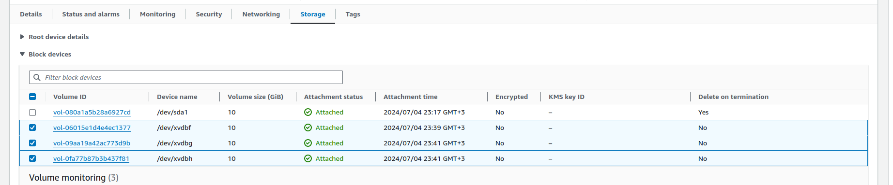

#  WEB SOLUTION WITH WORDPRESS

  
In this project we will prepare a storage infrastructure on two linux servers and implement a basic web solution using **wordpress**.  
Wordpress is a free open-source content management system written in **PHP** and paired with **MYSQL** or **MariaDB** as its backend.

- The project has 2 parts
  1.Configuring storage subsystem for Web and DataBase servers based on Linux Os.
  2.Install wordpress and connect to remote MYSQL database server.

#### THREE-TIER ARCHITECTURE
- Web and mobile solutions are implemented based on **Three-tier Architecture** 
- This is a client-server software pattern that comprises of 3 separate layers
  
   1.**Presentation Layer (PL)**: This is the user interface such as the client server or browser on your laptop.  
  2.**Business Layer (BL)**: This is the backend program that implements business logic. Application or Webserver  
  3.**Data Access or Management Layer (DAL)**: This is the layer for computer data storage and data access. Database Server or File System Server such as FTP server, or NFS Server
- We will be using **Redhat OS** for this project

# PROCEDURE
## PREPARE THE WEB SERVER

- Let's launch  the EC2 instances 
  
- In the **Web Server** create 3 volumes in the same AZ as your Web Server EC2, each of 10 GiB.  
 Learn How to Add EBS Volume to an EC2 instance [here](https://www.youtube.com/watch?v=HPXnXkBzIHw)  
- Attach all three volumes one by one to your Web Server EC2 instance

-  inspect what block devices are attached to the server. 
```
  lsblk
```

- The names of our newly created devices are shown.
-  All devices in Linux reside in **/dev/** directory. 
-  make sure all 3 newly created block devices there
```
 ls /dev/ 
 ```
-  see all mounts and free space on your server
```
 df -h
```
- Use gdisk utility to create a single partition on each of the 3 disks

```
 sudo gdisk /dev/nvme1n1
```

- follow the steps below to create a partition
```?
 GPT fdisk (gdisk) version 1.0.3

Partition table scan:
  MBR: not present
  BSD: not present
  APM: not present
  GPT: not present

Creating new GPT entries.

Command (? for help branch segun-edits: p
Disk /dev/xvdf: 20971520 sectors, 10.0 GiB
Sector size (logical/physical): 512/512 bytes
Disk identifier (GUID): D936A35E-CE80-41A1-B87E-54D2044D160B
Partition table holds up to 128 entries
Main partition table begins at sector 2 and ends at sector 33
First usable sector is 34, last usable sector is 20971486
Partitions will be aligned on 2048-sector boundaries
Total free space is 2014 sectors (1007.0 KiB))
Number  Start (sector)    End (sector)  Size       Code  Name
   1            2048        20971486   10.0 GiB    8E00  Linux LVM

Command (? for help): w

Final checks complete. About to write GPT data. THIS WILL OVERWRITE EXISTING
PARTITIONS!!

Do you want to proceed? (Y/N): yes
OK; writing new GUID partition table (GPT) to /dev/xvdf.
The operation has completed successfully.
Now,  your changes has been configured succesfuly, exit out of the gdisk console and do the same for the remaining disks.
```

- view the newly configured partition on each of the 3 disks.
```
lsblk
```
- Install lvm2 package using 
```
sudo yum install lvm2
```
- check for available partitions.
```
sudo lvmdiskscan
``` 

**Note**: _Previously, in Ubuntu we used **apt** command to install packages, in RedHat we shall use **yum** command instead._

- Use pvcreate utility to mark each of 3 disks as physical volumes (PVs) to be used by LVM
```
sudo pvcreate /dev/nvme1n1p1
sudo pvcreate /dev/nvme2n1p1
sudo pvcreate /dev/nvme3n1p1
```

- Verify that your Physical volume has been created successfully by running 
```
sudo pvs
```
- We will use vgcreate utility to add all 3 PVs to a volume group (VG) called **VG webdata-vg**
```
sudo vgcreate webdata-vg /dev/nvme1n1p1 /dev/nvme2n1p1 /dev/nvme3n1p1
```
- Verify that your VG has been created successfully by running
```
 sudo vgs
```

- I used **lvcreate** utility to create 2 logical volumes. 
    1.apps-lv (Use half of the PV size)
    2.logs-lv Use the remaining space of the PV size. 
    
**NOTE**: _**apps-lv** will be used to store data for the Website while, logs-lv will be used to store data for logs._

```
sudo lvcreate -n apps-lv -L 14G webdata-vg
sudo lvcreate -n logs-lv -L 14G webdata-vg
```
- Verify our Logical Volume has been created successfully by running 
```
sudo lvs
```

- Verify the entire setup
```
sudo vgdisplay -v #view complete setup - VG, PV, and LV
```
```
sudo lsblk 
```
- I used mkfs.ext4 to format the logical volumes with ext4 filesystem
```
sudo mkfs -t ext4 /dev/webdata-vg/apps-lv
sudo mkfs -t ext4 /dev/webdata-vg/logs-lv
```
- Run this to create a directory to store website files and another directory to store backup of log data 

```
sudo mkdir -p /var/www/html
sudo mkdir -p /home/recovery/logs
```
- Mount  logical volume
```
sudo mount /dev/webdata-vg/apps-lv /var/www/html/
```
- Use rsync utility to backup all the files in the log directory  
(This is required before mounting the file system)
```
sudo rsync -av /var/log/ /home/recovery/logs/
```
- Mount logical volume.   
(Note that all the existing data on /var/log will be deleted. That is why step 15 above is very important)
```
sudo mount /dev/webdata-vg/logs-lv /var/log
```
- Restore log files back into /var/log directory
```
sudo rsync -av /home/recovery/logs/ /var/log
```
- I updated the **/etc/fstab** file so that the mount configuration will persist after restart of the server.
- The UUID of the device will be used to update the /etc/fstab file;
```
sudo blkid
```
```
sudo nano /etc/fstab
```
- I update **/etc/fstab** in this format using your own **UUID** and remember to remove the leading and ending quotes.
- The **UUID** looks like this:
```
UUID=051e7fdd-7a9e-4c64-b867-fc4ccb7582c4 /var/www/html ext4 defaults 0 0
UUID=051e7fdd-7a9e-4c64-b867-fc4ccb7582c4 /var/log ext4 defaults 0 0
```
- Let's test the configuration and reload the daemon
```
sudo mount -a
sudo systemctl daemon-reload
```
- Verify the setup by running
```
df -h
```
- All three EBS volumes partitioned and set up with physical volumes, volume groups, and logical volumes. The logical volumes have been formatted and mounted to the appropriate directories.  
Our web server now has the necessary storage resources to host the WordPress site. Next, we will prepare the database server to store data for the WordPress site.

## PREPARE THE DATABASE SERVER 
- Let's launch  a second RedHat EC2 instance that will have a role - **'DB Server'**  
_Repeat the same steps as for the Web Server, but instead of apps-lv create db-lv and mount it to /db directory instead of /var/www/html/._
 - Since its the same steps just refer to the above steps

## INSTALL WORDPRESS ON WEB SERVER EC2
- Update the repository
```
sudo yum -y update
```
- Install wget, Apache and it's dependencies
```
sudo yum -y install wget httpd php php-mysqlnd php-fpm php-json
```
- Start Apache
```
sudo systemctl enable httpd sudo systemctl start httpd
```
- To install PHP and it's dependencies
```
sudo yum install -y https://dl.fedoraproject.org/pub/epel/epel-release-latest-8.noarch.rpm
sudo yum install -y https://rpms.remirepo.net/enterprise/remi-release-8.rpm
sudo yum install -y yum-utils
sudo yum module list php 
sudo yum module reset php
sudo yum module enable php:remi-7.4
sudo yum install -y php php-common php-opcache php-cli php-gd php-curl php-mysqlnd

```
- Restart Apache
```
sudo systemctl restart httpd
```
- Download wordpress and copy wordpress to /var/www/htmlmkdir wordpress cd wordpress
```
sudo wget http://wordpress.org/latest.tar.gz sudo tar xzvf latest.tar.gz
sudo rm -rf latest.tar.gz cp wordpress/wp-config-sample.php wordpress/wp-config.php
cp -R wordpress /var/www/html/
```
- Configure SELinux Policies
```
sudo chown -R apache:apache /var/www/html/wordpress
sudo chcon -t httpd_sys_rw_content_t /var/www/html/wordpress -R
sudo setsebool -P httpd_can_network_connect=1
```
## INSTALL MYSQL ON DB SERVER EC2
```
sudo yum update
sudo yum install mysql-server
```
- Verify that the service is up and running by using 
```
sudo systemctl status mysqld
```
-  If it is not running, restart the service and enable it so it will be running even after reboot:
```
sudo systemctl restart mysqld
sudo systemctl enable mysqld
```

## CONFIGURE DB TO WORK WITH WORDPRESS
```
sudo mysql
```
- Create a database and a user for the WordPress site.
```mysql
CREATE DATABASE wordpress;
CREATE USER `myuser`@`<Web-Server-Private-IP-Address>` IDENTIFIED BY 'mypass';
GRANT ALL ON wordpress.* TO 'myuser'@'<Web-Server-Private-IP-Address>';
FLUSH PRIVILEGES;
SHOW DATABASES;
exit
```
- Replace `private_ip_of_webserver` with the private IP of the web server instance and password with a secure password.
- We will update the MySQL configuration file to listen on port 3306 for only the web server through a private IP.
```
sudo vi /etc/my.cnf
```
Add the following lines to the configuration file:
```
   [mysqld]
   bind-address=private_ip_of_webserver
   port=3306
```
Replace `private_ip_of_webserver` with the private IP of the web server instance.
**Hint**:_Do not forget to open MySQL port 3306 on DB Server EC2. For extra security, you shall allow access to the DB server ONLY from your Web Server's IP address, so in the Inbound Rule configuration specify source as /32_  

## CONFIGURE WORDPRESS TO CONNECT TO REMOTE DB

- Install MySQL client and test that you can connect from your Web Server to your DB server by using **mysql-client**
```
sudo yum install mysql
sudo mysql -u admin -p -h <DB-Server-Private-IP-address>
```
- Verify if you can successfully execute SHOW DATABASES; command and see a list of existing databases.
- Change permissions and configuration so Apache could use WordPress:
- Enable TCP port 80 in Inbound Rules configuration for your Web Server EC2  
(enable from everywhere 0.0.0.0/0 or from your workstation's IP)


##  CONFIGURE WORDPRESS 
- Try to access from your browser the link to your WordPress
```
 http://<Web-Server-Public-IP-Address>/wordpress/
```

- Fill out your DB credentials:  

If you see this message - it means your WordPress has successfully connected to your remote MySQL database
