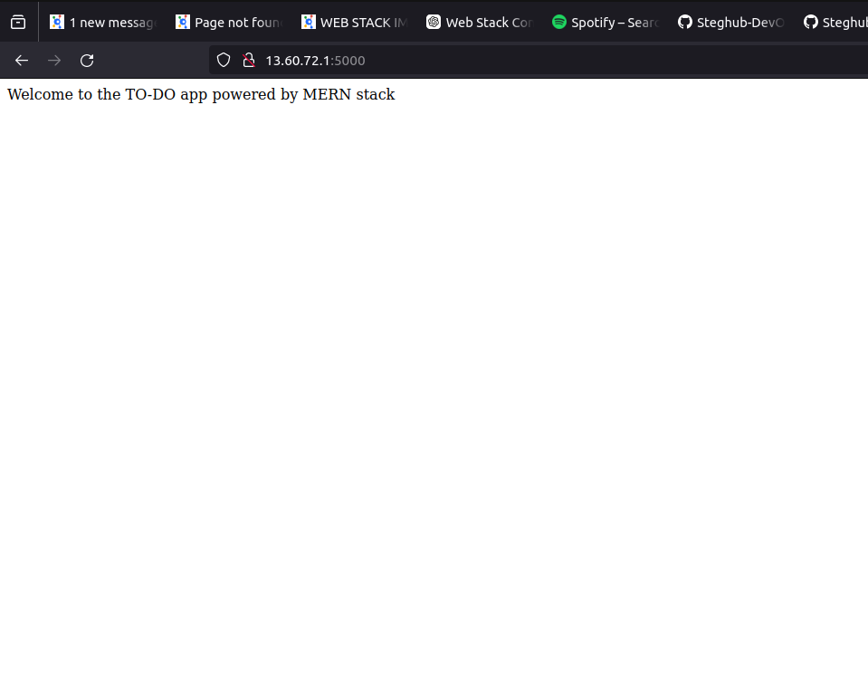

# MERN_WEB_STACK_101
In this project we create a web solution using __MERN__ (MongoDB, ExpressJS, ReactJS, NodeJS)stack in AWS cloud  

# TOPICS COVERED 
- AWS account creation  
- Basic understanding of Javascript.
- Basic understanding of Node js and React.
- Basic understanding of MongoDB
- How to Install Nodejs and NPM
- How to Install Express.js
# STEPS TAKEN
## BACKEND CONFIGURATION
 - Update ubuntu packages 
 ```
 sudo apt update
 ```
 - Upgrade Ubuntu 
 ```
sudo apt upgrade 
```
- Get the location of Node.js software from [Ubuntu repositories](https://github.com/nodesource/distributions#deb)
```
curl -fsSL https://deb.nodesource.com/setup_18.x | sudo -E bash - 
```
- Install Node.js on the server
```
sudo apt-get install -y nodejs
```
The  above command installs both *Nodejs* and *NPM*.  
NPM is a package manager for node like *apt* for Ubuntu.  
- Verify if node is installed using
```
node -v
```
- Verify if NPM is installed using
```
npm -v
```


- Create a new directory for the To-Do project then navigate into it:
```
mkdir -p Todo && cd Todo
```
__'-p' flag creates the directory if it does not exist__
- Verify that the Todo directory is created using the ls command:

- Initialize the project with npm init to create the package.json file.  
This file contains information about the application's dependencies.  
Press *ENTER* to accept the default values, then type yes to write out the package.json file.
- Check if the `package.json`  is present using:
```
ls
```
- Check the contents of package.json using nano:
```
nano package.json
```


## INSTALLING EXPRESS.JS
- Express is a framework for Node.js  
It helps to define routes for an application based on HTTP methods and URLs.

- To use express install it using npm:
```
npm install express
```
- Now create a file `index.js` with the command below
```
touch index.js
```
- Run the  __ls__ to confirm that index.js file is successfully created:  
```
ls
```
- Install the __dotenv__  
```
npm install dotenv
```
- Open the `index.js` with the command:
```
nano index.js
```
- Copy the code below inside the file
```js
const express = require('express');
require('dotenv').config();

const app = express();
// get the port from the environment variable or use port 5000
const PORT = process.env.PORT || 5000;

// define the index route
app.use((req, res, next) => {
    res.header("Access-Control-Allow-Origin", "\*");
    res.header("Access-Control-Allow-Headers", "Origin, X-Requested-With, Content-Type, Accept");
    next();
});

app.use((req, res, next) => {
    res.send('Welcome to the TO-DO app powered by MERN stack');
});

// start the server
app.listen(PORT, () => {
    console.log(`Server running on port ${PORT}`);
});
```
Use `Ctrl + o` and `Ctrl + x` to save and exit nano

- To start the server run 
```
node index.js
```

- Everything is running well.  
You can see the terminal running on __Server running on port 500__ in your terminal


- Refer to [Project 1](https://github.com/mwangiii/Steghub-devops-training/tree/master/Webstack_implementation_lemp) to learn how to install the Nginx Web server  
- To change the default port from **port 80**:  
    1.Open to the default file 
    ```
    sudo nano /etc/nginx/sites-available/default
    ```
    2.Change the listen directive from **80** to **5000**
    ```nginx
    server {
        listen 5000;
        server_name projectLEMP www.projectLEMP;
        root /var/www/projectLEMP;

        index index.html index.htm index.php;

    location / {
        try_files $uri $uri/ =404;
    }

    location ~ \.php$ {
        include snippets/fastcgi-php.conf;
        fastcgi_pass unix:/var/run/php/php8.3-fpm.sock;
    }

    location ~ /\.ht {
        deny all;
        }
    }

    ```
    3.Test the configuration using 
    ```
    sudo nginx -t
    ```
    4.Change the ec2 to listen to port 5000  
    I had a little bit of a hick up here so I used a [youtube tutorial](https://www.youtube.com/watch?v=j9oDMb7S6iw)  
    I finally did it
     

- Open up your browser and try access your server's public IP or Public DNS name followed by port 5000:
``` 
 http://13.60.72.1:5000
 ```
 

* Quick reminder how to get your server's Public IP and public DNS name:
 1. You can find it in your AWS web console in EC2  details.
 2. Run  
(for public IP)
``` 
curl -s http://169.254.169.254/latest/meta-data/public-ipv4
``` 
__OR__

(for Public DNS name)
``` 
curl -s http://169.254.169.254/latest/meta-data/public-hostname
``` 
## ROUTES 
- There are three actions that our To-DO applications needs to be able to do:  
  1.Create a new task.  
  2.Display list of all tasks  
  3.Delete a completed task  

- Each task will be associated with some particular endpoint and will use different standard [HTTP Request Methods](https://developer.mozilla.org/en-US/docs/Web/HTTP/Methods)  
**POST**, **GET**, **DELETE**.

- For each task,we need to create routes that will define various endpoints that the `To-do` app.  
- Create the folder routes 
```
mkdir routes -p && cd routes
```
You need multiple shells to connect to the same EC2
- Now create a file *api.js*
```
touch api.js
```
- Open the file with the command below
```
nano api.js
```
- Copy the command below
```js
const express = require('express'); 
const router = express.Router();

// Define the routes for the TO-DO app

// Route for getting the list of todos
router.get('/todos', (req, res, next) => {
    res.send('GET: list of todos [feature coming soon]');
});

// Route for adding a new todo
router.post('/todos', (req, res, next) => {
    res.send('POST: add a new todo [feature coming soon]');
});

// Route for updating an existing todo by ID
router.put('/todos/:id', (req, res, next) => {
    res.send('PUT: update a todo [feature coming soon]');
});

// Route for deleting a todo by ID
router.delete('/todos/:id', (req, res, next) => {
    res.send('DELETE: remove an embarrassing todo item [feature coming soon]');
});

module.exports = router;

```
## MODELS
- Mongodb is a nosql database so we need to create a model
- Install Mongoose in the Todo folder
```
npm install mong0ose
```
- create new folder models and then create a file named *todo.js*
```
mkdir -p models && touch models/todo.js
```
- Open the file todo.js
```
cd models && nano todo.js
```
- Copy the code:
```js
const mongoose = require('mongoose');
const Schema = mongoose.Schema;

// define the TO-DO schema
const TodoSchema = new Schema({
    action: {
        type: String,
        required: true
    },
    description: {
        type: String,
        required: true
    },
    status: {
        type: String,
        required: true
    },
    created_at: {
        type: Date,
        default: Date.now
    },
    updated_at: {
        type: Date,
        default: Date.now
    }
});

// create the TO-DO model
const Todo = mongoose.model('Todo', TodoSchema);

module.exports = Todo;
```
- In the `Routes` directory opn the file `api.js` and copy the code:
```js
const express = require('express');
const router = express.Router();
const Todo = require('../models/todo');

// define the routes for the TO-DO app

// Retrieve all TO-DO items
router.get('/todos', (req, res, next) => {
    Todo.find({}, 'action')
        .then(data => res.json(data))
        .catch(next)
});

// add a new TO-DO item
router.post('/todos', (req, res, next) => {
    if(req.body.action){
        Todo.create(req.body)
            .then(data => res.json(data))
            .catch(next)
    }else{
        res.json({
            error: "The input field is empty"
        })
    }
});
// update todo item by id
router.put('/todos/:id', (req, res, next) => {
    Todo.findByIdAndUpdate({_id: req.params.id}, req.body)
        .then(() => {
            Todo.findOne({_id: req.params.id})
                .then(data => res.json(data))
        })
        .catch(next)

});

// delete todo item by id
router.delete('/todos/:id', (req, res, next) => {
    Todo.findByIdAndDelete({_id: req.params.id})
        .then(data => res.json(data))
        .catch(next)
});

module.exports = router;
```

## MONGOBD DATABASE
- For the db we will use mLab which is ideal for our case
# KEYWORDS
- Port number
- CRUD functions 
- NoSQL
- Model