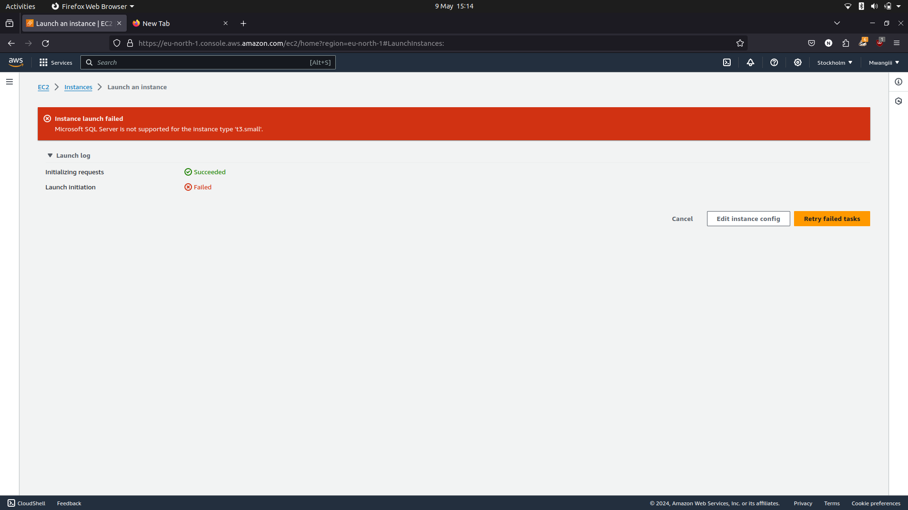

# Project Documentation: LAMP Stack Implementation in AWS

## Overview
I deployed a real-life project implementing the LAMP stack on AWS.  
The LAMP stack consists of Linux (Ubuntu 20.04), Apache HTTP server, MySQL and PHP.

## TOPICS COVERED 
- AWS Account Creation
- Installing Apache and Updating Firewall
- Installing MySQL
- Installing PHP
- Creating a Virtual Host with Apache

## STEPS TAKEN 
1. **Registering a New AWS Account**:
   - Followed the step-by-step guide provided by AWS: [AWS Account Creation Guide](https://repost.aws/knowledge-center/create-and-activate-aws-account)
   - I got an error **Microsoft SQL Server is not supported for the instance type t3 micro.**  

      

    - To solve the error I changed the instance type to t3 large


2. **Installing Apache and Updating the Firewall**:
   - I started the process by connecting to  __EC2 to SSH__ using the terminal  
   ``` ssh -i <private-key-name>.pem ubuntu@<public-IP-address>```
   - To make the process a bit easier I created a bash script ```ssh-steghub.sh``` to ease the process
   - The next step was to change the permission of the private-key.pem  
   ```sudo chmod 0400 <private-key-name>.pem```
   - Install Apache using Ubuntu's package manager __'apt'__
``` bash
  #update a list of packages in package manager  
   sudo apt update  
  #run apache2 package installation  
   sudo apt install apache2
```
 - To verify that apache is working  
 ``` sudo systemctl status apache2```  

   
 - I checked if it can be accessed locally using curl  
 ```curl http://localhost:80```  
 or  
 ```curl http://127.0.0.1:80```  
 N/B __second once uses ip address while the first DNS__

 - I checked if the APACHE HTTP can respond to requests from the internet        
 ``` http://<Public-ip-Address>:80```  

     

3. **Installing MySQL**:
   - Configuring MySQL server and databases for the project.
   - Again I used apt to install MySQL  
   ``` sudo apt install mysql-server```  
   -To get into the sever I ran  
   ```sudo mysql```
   -I removed pre-installed security scripts using  
   ```ALTER USER 'root'@'localhost' IDENTIFIED WITH mysql_native_password BY 'Password.1';
   ```
   - I then started the interactive script using  
   ``` sudo mysql_secure_installation```
   - I then logged into mysql using  
   ```sudo mysql -p```  

      

   - To exit the sever type 'exit' the console  
   ``` mysql> exit```

4. **Installing PHP**:
   - I started by installing 3 packages at once  
   ``` sudo apt install php libapache2-mod-php php-mysql```
   - once done I checked the version using  
   ```php -v```

      

5. **Creating a Virtual Host for the Website Using Apache**:
   - Assigned the project domain "projectlamp" to the virtual host.
   - I added my own directory next to the  **/var/www/html** which is the default directory.
   ```sudo mkdir /var/www/projectlamp```
   -The next thing was assign ownership to a user  
   ```sudo chown -R $USER:$USER /var/www/projectlamp```  
   - Utilized Emacs for editing configuration files instead of the required Vim.
   - I created a new configuration file in APache's **sites-available** directory  
   ```sudo emacs -nw /etc/apache2/sites-available/projectlamp.conf```  
   then I pasted the text
``` 
  <VirtualHost *:80>
        ServerName projectlamp
        ServerAlias www.projectlamp
        ServerAdmin webmaster@localhost
        DocumentRoot /var/www/projectlamp
        ErrorLog ${APACHE_LOG_DIR}/error.log
        CustomLog ${APACHE_LOG_DIR}/access.log combined
    </VirtualHost>
```


- I then used a2ensite command to enable the new virtual host  
```sudo a2ensite projectlamp```  
 To check if the configuration site had any errors I used  
 ``` sudo apache2ctl configtest```  
 Finally to make sure the changes are effective  
 ```sudo systemctl reload apache2```  
 - Since the web root was still empty.I created an index.html to test it  
 ```sudo echo 'HELLO LAMP from hostname' $(curl -s http://169.254.169.254/latest/meta-data/public-hostname) 'with public IP' $(curl -s http://169.254.169.254/latest/meta-data/public-ipv4) > /var/www/projectlamp/index.html```
 
 


 - For enabling PHP on the website 
 I started by editing the **/etc/apache2/mods-enabled/dir.conf** to change the order of **index.php file within **DirectoryIndex**  
 ```sudo emacs -nw /etc/apache2/mods-enabled/dir.conf```
 then 
```
   <IfModule mod_dir.c>
      #Change this:
      #DirectoryIndex index.html index.cgi index.pl index.php index.xhtml index.htm
      #To this:
      DirectoryIndex index.php index.html index.cgi index.pl index.xhtml index.htm
   </IfModule>
```

 Finally to make sure the changes are effective  
 ```sudo systemctl reload apache2```  

 - I created a new file named index.php in the web root folder  
 ```sudo emacs -nw /var/www/projectlamp/index.php```  
 which opened a black file that I added 
 ``` php
 <?php
 phpinfo();
 ```
 

- Remove the index.php because it contains info about php environment  
```sudo rm /var/www/projectlamp/index.php```

## FEEDBACK AND REVIEWS
[Link to the Word document containing the GitHub link for submission.]

## KEYWORDS
- TCP(Transmission Control Protocol) : TCP is a communication protocol used for transmitting data reliably and accurately across networks.  
It ensures that data packets arrive in the correct order and without errors by establishing a connection between sender and receiver and managing data flow.
- UDP(User Datagram Protocol) : UDP is another communication protocol used for transmitting data across networks. Unlike TCP, UDP is connectionless and does not guarantee delivery or order of data packets.  
It is often used for applications where speed and efficiency are prioritized over reliability, such as real-time streaming or online gaming.
- DBMS : A DBMS is software that manages databases, providing an interface for users and applications to interact with data stored in the database.  
It handles tasks like data organization, storage, retrieval, and security, allowing multiple users to access and manipulate data concurrently.
- SSH  (Secure Shell): SSH is a protocol used for securely accessing and managing remote systems over a network.  
 It provides encrypted communication between the client and server, allowing users to securely log in to a remote machine, execute commands, transfer files, and perform administrative tasks.
- DNS(Domain Name System): DNS is a system used to translate domain names (e.g., example.com) into IP addresses (e.g., 192.168.1.1) that computers can understand.   
It acts as a distributed database that maps domain names to their corresponding IP addresses, facilitating the routing of network traffic on the internet.
- IP (Internet Protocol): IP is a fundamental protocol used for routing and addressing data packets across networks.  
 It assigns unique IP addresses to devices on a network, allowing them to communicate with each other. IP is part of the TCP/IP protocol suite and is essential for internet communication.
- SDLC (Software Development Life Cycle): It is a structured approach to developing software applications, encompassing a set of phases or stages that guide the entire software development process.  
The SDLC provides a framework for planning, designing, building, testing, deploying, and maintaining software systems.