# PROJECT DOCUMENTATION :WEBSTACK  IMPLEMENTATION

## OVERVIEW
I deployed a real-life project implementing the LEMP stack on AWS.
The LEMP stack consists of Linux (Ubuntu 20.04), Nginx server, MySQL and PHP.

# TOPICS COVERED
AWS Account Creation  
Installing the nginx web server    
Installing MySQL    
Installing PHP    
Configuring Nginx to use PHP processor  
Testing PHP with Nginx  
Retrieving data from MYSQL  database with PHP

# STEPS TAKEN
### 1.Installing the Nginx Web Server
- update packages
 ```
 sudo apt update
 ```
 - Install nginx
 ```
 sudo apt install nginx -y 
 ```
 - To check if nginx was installed run  
 __N/B The "-y" flag automatically confirms the installation.__
 ```
 sudo systemctl status nginx 
 ```
 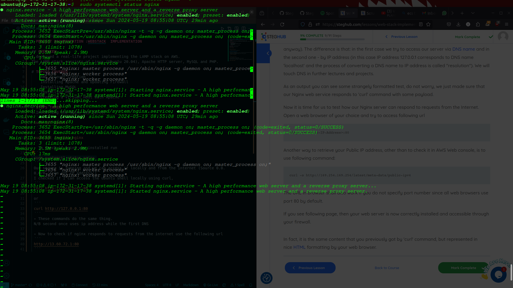  
 Our server is running and we can access it locally and from the internet (Source 0.0.0.0/0 'from any IP address')  
 To checked if I can access the ubuntu shell locally using curl:
 ```
 curl http://localhost:80
 ```
 or 
 ```
 curl http://127.0.0.1:80
 ```
  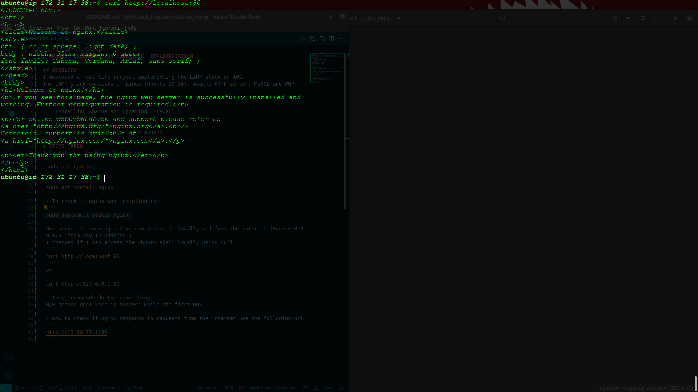  

 __N/B Both commands do the same thing. The second one uses the IP address while the first uses DNS.__

 - Now to check if nginx responds to requests from the internet use the following url
 ```
 http://13.60.72.1:80
 ```
  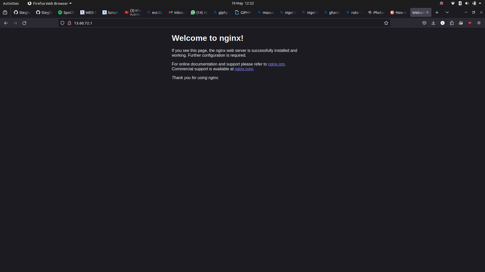  
 This will display nginx default page

 - Another way to retrieve your public address other than check the AWS console would be by using the command  
 ```
 curl -s http://169.254.169.254/latest/meta-data/public-ipv4
 ```

 ### 2.Installing MYSQL
 - We will use MYSQL as our (Database Management System)DBMS
 - Again using apt 
 ```
 sudo apt install mysql-server -y
 ```
- When finished log into MYSQL console ny typing
```
sudo mysql
```
  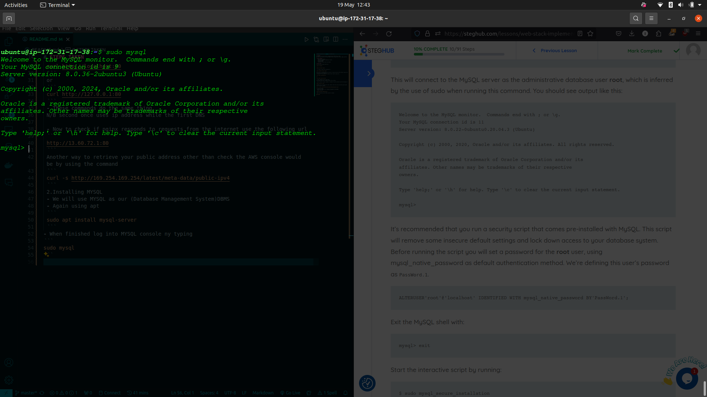  

- As recommended to run a security script that comes with MYSQL.  
The script will remove some insecure default settings and lock down access to my database system.  
Before running the script the script I set the a password for the root user,using `mysql_native_password` as a default authentication method.
```mysql
 ALTER USER 'root'@'localhost' IDENTIFIED WITH mysql_native_password BY 'Password.1';
 ```
- Exit the MYSQL console using
```mysql
 exit
```
- To start the interactive script run
```
sudo mysql_secure_installation
```
  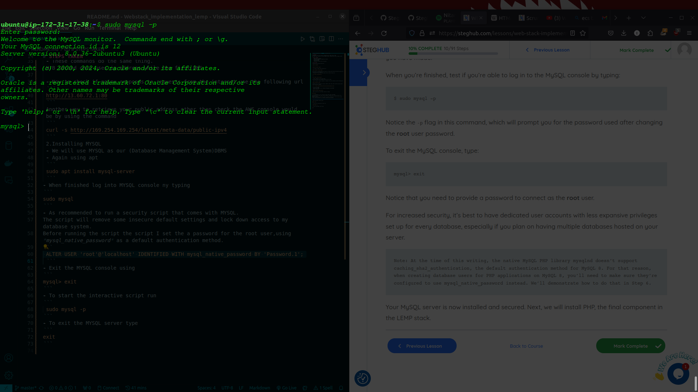  

- Log into MySQL with Password
```
 sudo mysql -p
```
- To exit the MYSQL server type 
```
exit
```

### 3.Installing PHP
- Here we installed `php-fpm` which stands for "PHP fastCGI process manager" and `php-mysql` which allows php to communicate with MYSQL-based databases.
- To run this packages at the same time use
```
sudo apt install php-fpm php-mysql -y 
``` 
- Check if php is installed
```
php -v
```
  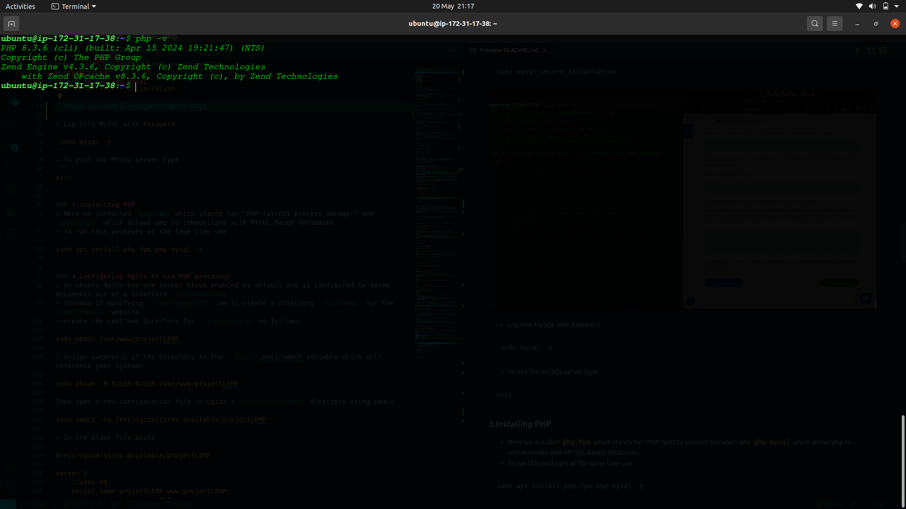  

At this point everything is installed  on our AWS EC2 instance   
 1.Linux (Ubuntu 24)  
 2.Nginx    
 3.MySQL  
 4.PHP
### 4.Configuring Nginx to use PHP processor
- On ubuntu Nginx has one server block enabled by default and is configured to serve documents out of a directory  `var/www/html.`
- Instead of modifying  `/var/www/html.` we'll create a directory `/var/www/` for the `your_domain` website 
- create the root web directory for  `your_domain` as follows:
```
sudo mkdir /var/www/projectLEMP
```
- Assign ownership of the directory to the  `$User` enviroment variable which will reference your system:
```
sudo chown -R $USER:$USER /var/www/projectLEMP
```
Then open a new configuration file in nginx's `sites-available` directory using nano.
```
sudo nano /etc/nginx/sites-available/projectLEMP
```
- In the blank file paste
```
#/etc/nginx/sites-available/projectLEMP

server {
    listen 80;
    server_name projectLEMP www.projectLEMP;
    root /var/www/projectLEMP;

    index index.html index.htm index.php;

    location / {
        try_files $uri $uri/ =404;
    }

    location ~ \.php$ {
        include snippets/fastcgi-php.conf;
        fastcgi_pass unix:/var/run/php/php8.3-fpm.sock;
    }

    location ~ /\.ht {
        deny all;
    }
}
```
- Here is a summary of what each of the above directive does
In Nginx configuration, `listen 80;` sets the server to listen for HTTP requests on port 80. `server_name projectLEMP www.projectLEMP;` specifies responses for "projectLEMP" and "www.projectLEMP" domains. The `index` directive orders index files (like `index.html`, `index.htm`, `index.php`) when a directory is requested. `server_name` identifies which domain names are handled by the server block. `location / { try_files $uri $uri/ =404; }` manages root requests, while `location ~ \.php$ { ... }` processes PHP files via FastCGI. Lastly, `location ~ /\.ht { deny all; }` restricts access to Apache-related files.

```
sudo ln -s /etc/nginx/sites-available/projectLEMP /etc/nginx/sites-enabled/
```
- You can test your configuration for syntax errors by typing 
```
sudo nginx -t 
```
  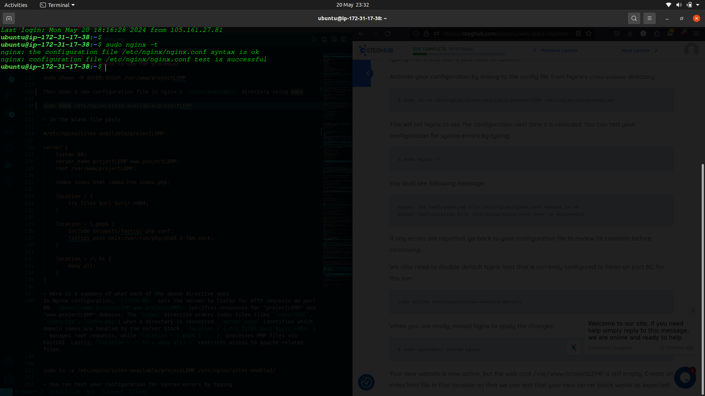  


- We can also disable the default Nginx host that is currently configured to listen to port 80,for this run:
```
sudo unlink /ect/nginx/sites-enabled/default
```
- When ready reload Nginx to apply the changes 
```
sudo systemctl reload nginx
```

  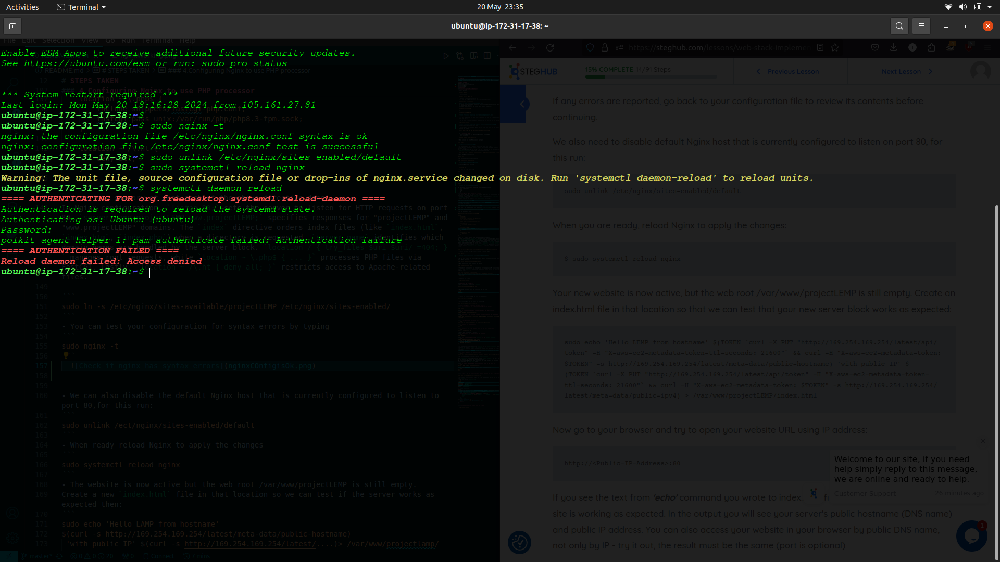  
- I solved the error by specifying the path daemon path  
```
sudo /bin/systemctl daemon-reload
```  

  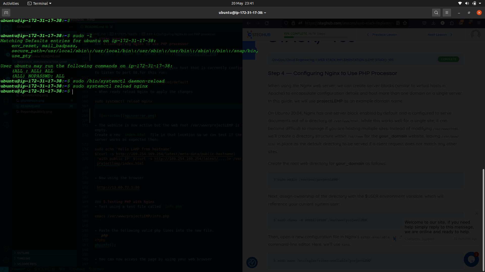  

- The website is now active but the web root /var/www/projectLEMP is still empty.  
Create a new `index.html` file in that location so we can test if the server works as expected then:
```
sudo echo 'Hello LEMP from hostname' $(curl -s http://169.254.169.254/latest/meta-data/public-hostname) 'with public IP' $(curl -s http://169.254.169.254/latest/meta-data/public-ipv4) > /var/www/projectLEMP/index.html
 ```

- Now using the browser
```
 http://13.60.72.1:80
```
  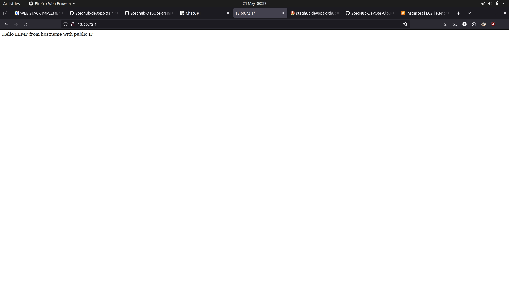  

### 5.Testing PHP with Nginx
- Test using a test file called `info.php`
```
emacs /var/www/projectLEMP/info.php
```
  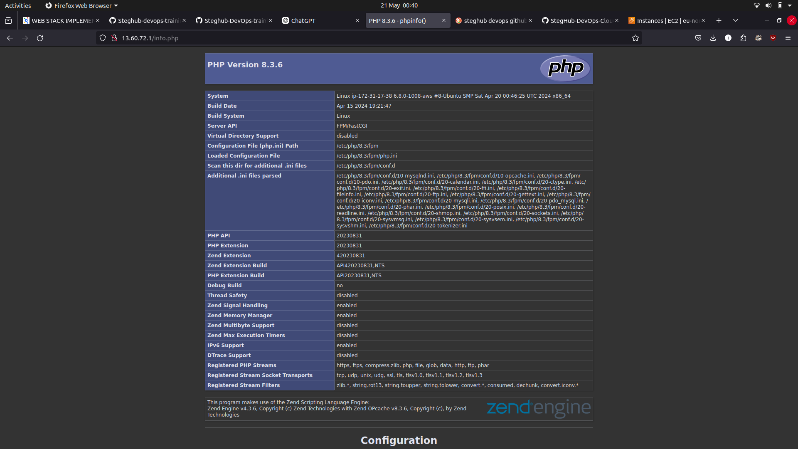  

- Paste the following valid php lines into the new file.
```php
<?php
phpinfo();
```

- You can now access the page by using your web browser
```
http://13.60.72.1/info.php
```

- After checking it you can remove the file using:
```
sudo rm /var/www/13.60.72.1/info.php
```
### 6.Retrieving data from MYSQL  database with PHP
###### First connect to the MYSQL console using the root account
```
sudo mysql
```
###### To create a new database,run the command in the MYSQL console:
```mysql
CREATE DATABASE `example_database`;
```
###### Now create a new user and give them full privileges on the database we created.
```mysql
CREATE USER 'example_user'@'localhost' IDENTIFIED WITH mysql_native_password BY 'PassWord.1';
```
###### Grant privileges to the new user
```mysql
GRANT ALL  ON example_database.* TO 'example_user'@'localhost';
```
###### Now exit the database using 
```mysql
exit
```
###### Connect to the MYSQL database using the new users credentials:
```mysql
mysql -u example_user -p
```
- The -p flag will prompt a password.
###### After log in you have access to the database 
```mysql
SHOW DATABASE;
```
  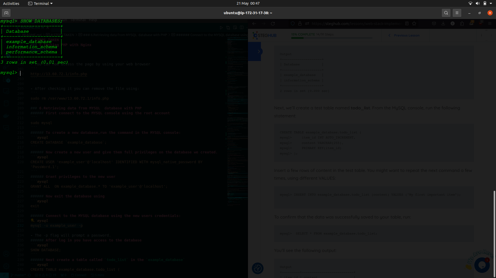  

###### Next create a table called `todo_list` in the `example_database`
```mysql
CREATE TABLE example_database.todo_list (
    item_id INT AUTO_INCREMENT PRIMARY KEY,
    content VARCHAR(255),
    PRIMARY_KEY(item_id)
);
```
This command creates a table called `todo_list` in the `example_database` database. The table has two columns: `item_id` and `content`.  
The `item_id` column is an auto-incrementing integer that serves as the primary key for the table.   
The content column is a `VARCHAR` column that stores the content of the to-do list item.

###### Insert data into the todo_list table
``` mysql
INSERT INTO example_database.todo_list (content) VALUES (Task One'), ('Task two'), ('Task three');
```
Todo Lists added and retrieved from the `example_database`

The `example_user` can run SQL queries on the `example_database`. Now let's focus on how we can retrieve the data at the application level.  
We will create a PHP script that connects to the MySQL database and retrieves the to-do list items from the `todo_list` table.

###### To confirm that the data was successfully saved to the table run 
```mysql
SELECT * FROM example_database.todo_list;
```
  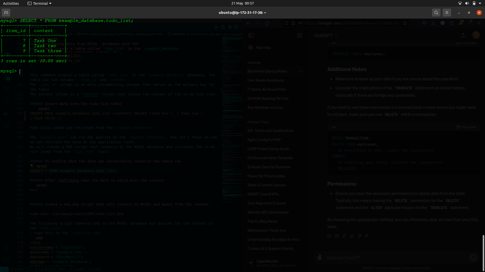  

###### After comfirming that the data is valid,exit the console
```mysql
exit
```

###### Create a new php script that will connect to MYSQL and query from the content.
```
sudo nano /var/www/projectLEMP/todo_list.php
```
The following script connects php to the MYSQl database and queries for the content of the `todo_list`
- copy this to the `todo_list.php`
```php
<?php
$servername = "localhost";
$username = "example_user";
$password = "PassWord.1";
$dbname = "example_database";
$table = "todo_list";

// Create connection
try {
    $db = new PDO("mysql:host=$servername;dbname=$dbname", $username, $password);
    echo "<h2>Connected successfully to the $dbname database</h2>";
    echo "<h3>Todo List</h3><ol>";
    foreach($db->query("SELECT * FROM $table") as $row) {
        echo "<li>Item ID: " . $row['item_id'] . " - Content: " . $row['content'] . "</li>";
    }
    echo "</ol>";
} catch (PDOException $e) {
    print "Error!: " . $e->getMessage() . "<br/>";
    die();
}
?>
```
##### Save and close then access using the browser
```
 http://13.60.72.1:80/todo_list.php
```
  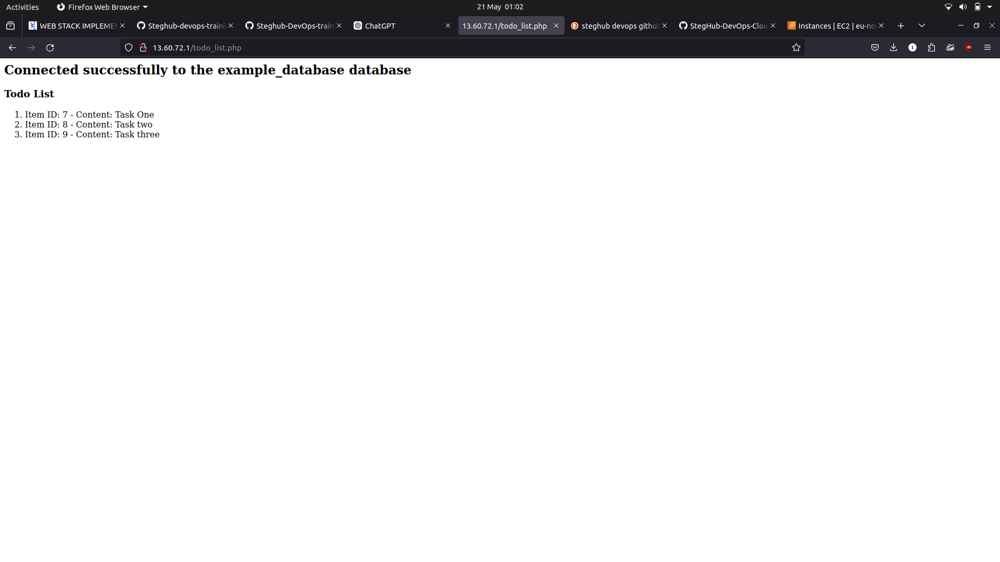  

# Summary
I successfully set up a LEMP stack on AWS, which includes Linux (Ubuntu 20.04), Nginx, MySQL, and PHP.   
I configured Nginx to use the PHP processor, tested PHP with Nginx, and demonstrated how to retrieve data from a MySQL database using PHP.   
This project shows a practical implementation of deploying a web server on AWS with a functioning backend database and PHP scripting.