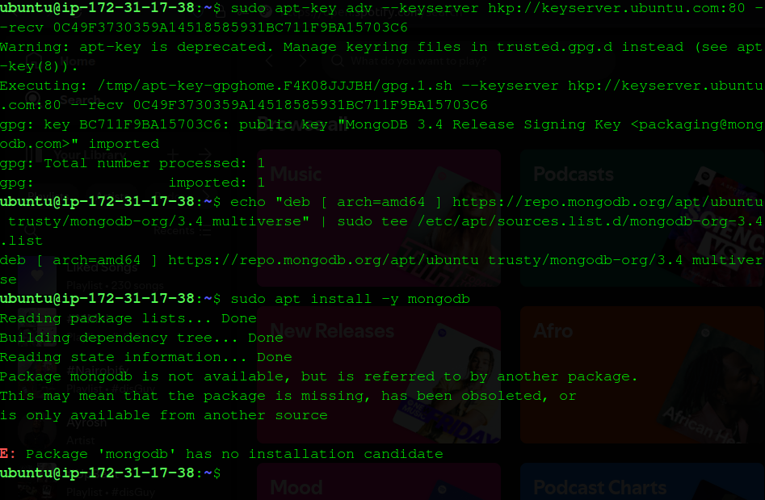
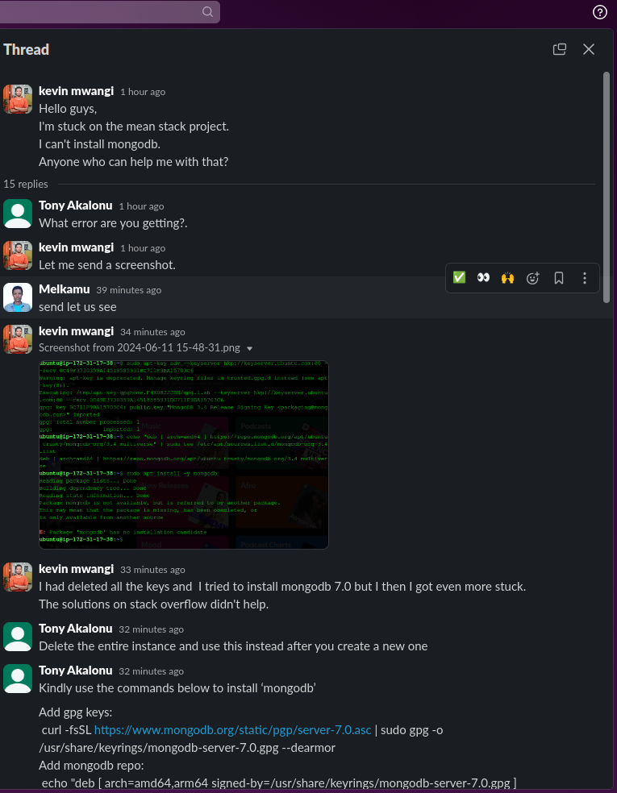
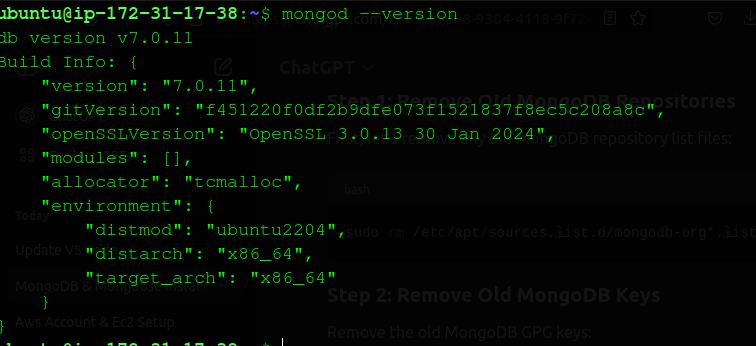
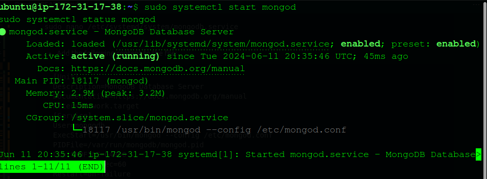
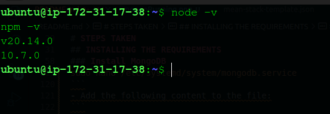

# WEB STACK IMPLEMENTATION (MEAN) in AWS


In this project we create a web solution using MEAN (MongoDB, ExpressJS, Angular, NodeJS)stack in AWS cloud

- MongoDB is a NoSQL database that provides a flexible and scalable solution for storing and retrieving data. It uses a document-oriented model, where data is stored in JSON-like documents.     MongoDB's schema-less nature allows for easy and dynamic data manipulation, making it ideal for agile development and rapid prototyping.  
[Learn more about MongoDb](https://www.mongodb.com/)  
- Express.js is a minimalistic and flexible web application framework for Node.js. It provides a set of robust features for building web applications and APIs. Express.js simplifies the process of handling HTTP requests, routing, and middleware integration. It also allows for easy integration with other libraries and frameworks, making it a popular choice for building server-side applications.  
[Learn more about Express.js](https://expressjs.com/)  
- Angular is a powerful front-end JavaScript framework developed by Google. It provides a comprehensive set of tools and features for building dynamic and responsive web applications. Angular follows the Model-View-Controller (MVC) architectural pattern, allowing for clear separation of concerns and modular development. It offers features like two-way data binding, dependency injection, and component-based architecture, making it a preferred choice for building complex and interactive user interfaces.  
[Learn more about Angular.js](https://angular.io/)

- Node.js is a server-side JavaScript runtime environment built on Chrome's V8 JavaScript engine. It allows developers to run JavaScript code on the server, enabling the development of scalable and high-performance web applications. Node.js provides a non-blocking, event-driven architecture, making it efficient for handling a large number of concurrent connections. It also offers a rich ecosystem of libraries and modules, making it easy to build server-side applications and APIs.  
[Learn more about Node.js](https://nodejs.org/)

## PREREQUISITES

Before we begin, let's ensure you have everything needed to proceed. Below are the prerequisites for this project:
  - AWS Account: You need to have an AWS account. 
  - Create an AWS EC2 Instance.
  - Basic Understanding of JavaScript.
  - Basic Understanding of Angular.
  - Basic Understanding of Node.js
  - Basic Understanding of Non-Relational Databases
  - Basic Understanding of MongoDB


# STEPS TAKEN

## INSTALLING THE REQUIREMENTS

### Install NodeJs
- Start the AWS server, Since we do this in all tasks there is an easier way to do start the servers using ssh config file  
[you can learn more about ssh config files  here](https://linuxize.com/post/using-the-ssh-config-file/)
```
  Host server_name
    HostName your_server_ip_or_dns_name
    User your_ssh_username
    IdentityFile ~/.ssh/your_private_key_file
```
 - Update & Upgrade Ubuntu
```
 sudo apt update && sudo apt upgrade -y
```
- Install certifications
```
 sudo apt -y install curl dirmngr apt-transport-https lsb-release ca-certificates
```
```
 curl -sL https://deb.nodesource.com/setup_18.x | sudo -E bash -
```
- Install NodeJs
```
sudo apt install -y nodejs
```

### Install MongoDB

- MongoDB stores data in flexible, JSON-LIKE documents. Fields in a database can vary from document to document and data structure can be changed over time. For our example application, we are adding book records to MongoDB that contain book name, ISBN number, author and number of pages.
```
sudo apt install gnupg curl
```
```
curl -fsSL https://www.mongodb.org/static/pgp/server-7.0.asc | sudo gpg -o /usr/share/keyrings/mongodb-server-7.0.gpg --dearmor
```

```
echo "deb [ arch=amd64 ] https://repo.mongodb.org/apt/ubuntu trusty/mongodb-org/3.4 multiverse" | sudo tee /etc/apt/sources.list.d/mongodb-org-3.4.list
```

```
echo "deb [ arch=amd64,arm64 signed-by=/usr/share/keyrings/mongodb-server-7.0.gpg ] https://repo.mongodb.org/apt/ubuntu jammy/mongodb-org/7.0 multiverse" | sudo tee
/etc/apt/sources.list.d/mongodb-org-7.0.list
```

- Install MongoDB
```
sudo apt -y install mongodb-org
```

- I kept getting this recurring error so I consoleted from slack and here is the step by the step I was given


- delete the previous entries
```
sudo rm /etc/apt/sources.list.d/mongodb-org*.list
```
```
sudo apt-key list
```
```
sudo apt-key del <key>
```
- Add gpg keys:
```
 curl -fsSL https://www.mongodb.org/static/pgp/server-7.0.asc | sudo gpg -o /usr/share/keyrings/mongodb-server-7.0.gpg --dearmor
```
``` echo "deb [ arch=amd64,arm64 signed-by=/usr/share/keyrings/mongodb-server-7.0.gpg ] https://repo.mongodb.org/apt/ubuntu jammy/mongodb-org/7.0 multiverse" | sudo tee /etc/apt/sources.list.d/mongodb-org-7.0.list
```
- Update package manager:
```
sudo apt update
```
- Install mongodb:
```
 sudo apt install -y mongodb-org
 ```
- Verify installation:
```
mongod --version
```


- After you do that above, your mongodb will fail to start, but that's easy to resolve
- Solution to failing to start after you install it.
- Create a new service file for MongoDB.
```
sudo nano /etc/systemd/system/mongodb.service
```
- Add the following content to the file:
```
  [Unit]
  Description=MongoDB Database Server
  Documentation=https://docs.mongodb.org/manual
  After=network.target
  [Service]
  User=mongodb
  ExecStart=/usr/bin/mongod --config /etc/mongod.conf
  PIDFile=/var/run/mongodb/mongod.pid
  LimitNOFILE=64000
  TimeoutStopSec=60
  Restart=on-failure
  [Install]
  WantedBy=multi-user.target

```
- Save and close the file `Ctrl+O` `Enter` `Ctrl+X`.
- Reload the systemd daemon:
```
sudo systemctl daemon-reload
```
```
sudo systemctl start mongod
sudo systemctl status mongod
```

- Install npm - Node package manager
```
sudo apt install -y npm
```
```
node -v
npm -v
```


- Install body-parser package
```
sudo npm install body-parser
```


- Create a folder named 'Books'
```
mkdir Books && cd Books
```
- In the Books directory, Initialize npm projects
```
npm init
```
- Add a file to it named server.js
```
sudo nano server.js
```
- Add this code
```js
var express = require('express');
var bodyParser = require('body-parser');
var app = express();
app.use(express.static(__dirname + '/public'));
app.use(bodyParser.json());
require('./apps/routes')(app);
app.set('port', 3300);
app.listen(app.get('port'), function() {
    console.log('Server up: http;//localhost:' + app.get('port'))
});
```

- Install Express and set up routes to the server

- Install mongoose
```
sudo npm install express mongoose
```

- In Books folder we create a folder named apps
```
mkdir apps && cd apps
```
- Create a file named routes.js
```
sudo nano routes.js
```
- Paste code
```js
   // Import necessary modules
const Book = require('./models/book');
const path = require('path');

module.exports = function(app) {

  // Get all books
  app.get('/book', async function(req, res) {
    try {
      let result = await Book.find({});
      res.json(result);
    } catch (err) {
      console.error(err);
      res.status(500).json({ error: 'Internal Server Error' });
    }
  });

  // Add a new book
  app.post('/book', async function(req, res) {
    try {
      const { name, isbn, author, pages } = req.body;
      const book = new Book({ name, isbn, author, pages });
      let result = await book.save();
      res.json({
        message: "Successfully added book",
        book: result
      });
    } catch (err) {
      console.error(err);
      res.status(500).json({ error: 'Internal Server Error' });
    }
  });

  // Delete a book by ISBN
  app.delete('/book/:isbn', async function(req, res) {
    try {
      let result = await Book.findOneAndRemove({ isbn: req.params.isbn });
      res.json({
        message: "Successfully deleted the book",
        book: result
      });
    } catch (err) {
      console.error(err);
      res.status(500).json({ error: 'Internal Server Error' });
    }
  });

  // Serve the index.html file for any other routes
  app.get('*', function(req, res) {
    res.sendFile(path.join(__dirname, '../public', 'index.html'));
  });
};

```
- In the apps folder, create a folder named models
```
mkdir models && cd models
```
- Create a file named book.js
```
sudo nano book.js
```
- paste
```js
      var mongoose = require('mongoose');

     var bookSchema = new mongoose.Schema({
       name: String,
       isbn: { type: String, index: true },
       author: String,
       pages: Number
     });

     module.exports = mongoose.model('Book', bookSchema);
```

- Access the routes with AngularJs

- Change directory back to Books
```
cd ../..
```
- Create a folder named public
```
mkdir public && cd public
```
- Add a file named `script.js` and paste:
```
nano script.js
```
```js
var app = angular.module('myApp', []);
    app.controller('myCtrl', function($scope, $http) {
      $http( {
        method: 'GET',
        url: '/book'
      }).then(function successCallback(response) {
        $scope.books = response.data;
      }, function errorCallback(response) {
        console.log('Error: ' + response);
      });
      $scope.del_book = function(book) {
        $http( {
          method: 'DELETE',
          url: '/book/:isbn',
          params: {'isbn': book.isbn}
        }).then(function successCallback(response) {
          console.log(response);
        }, function errorCallback(response) {
          console.log('Error: ' + response);
        });
      };
      $scope.add_book = function() {
        var body = '{ "name": "' + $scope.Name +
        '", "isbn": "' + $scope.Isbn +
        '", "author": "' + $scope.Author +
        '", "pages": "' + $scope.Pages + '" }';
        $http({
          method: 'POST',
          url: '/book',
          data: body
        }).then(function successCallback(response) {
          console.log(response);
        }, function errorCallback(response) {
          console.log('Error: ' + response);
        });
      };
    });
```

In public folder create `index.html` and paste
```
nano index.html
```
```html
   <!doctype html>
 <html ng-app="myApp" ng-controller="myCtrl">
   <head>
     <script src="https://ajax.googleapis.com/ajax/libs/angularjs/1.6.4/angular.min.js"></script>
     <script src="script.js"></script>
   </head>
   <body>
     <div>
       <table>
         <tr>
           <td>Name:</td>
           <td><input type="text" ng-model="Name"></td>
         </tr>
         <tr>
           <td>Isbn:</td>
           <td><input type="text" ng-model="Isbn"></td>
         </tr>
         <tr>
           <td>Author:</td>
           <td><input type="text" ng-model="Author"></td>
         </tr>
         <tr>
           <td>Pages:</td>
           <td><input type="number" ng-model="Pages"></td>
         </tr>
       </table>
       <button ng-click="add_book()">Add</button>
     </div>
     <hr>
     <div>
       <table>
         <tr>
           <th>Name</th>
           <th>Isbn</th>
           <th>Author</th>
           <th>Pages</th>
         </tr>
         <tr ng-repeat="book in books">
           <td>{{book.name}}</td>
           <td>{{book.isbn}}</td>
           <td>{{book.author}}</td>
           <td>{{book.pages}}</td>
           <td><input type="button" value="Delete" ng-click="del_book(book)"></td>
         </tr>
       </table>
     </div>
   </body>
 </html>
```

- Change the directory back up to 'Books'
```
cd ..
```
- Start the server by running this command:
```
node server.js
```
- The server is now up and running, we can connect it via port 3300. You can launch a separate Putty or SSH console to test what curl command returns locally.
```
curl -s http://localhost:3300
```

- It shall return an HTML page, it is hardly readable in the CLI, but we can also try and access it from the Internet.

- For this - you need to open TCP port 3300 in your AWS Web Console for your EC2 Instance.

- You are supposed to know how to do it, if you have forgotten - refer to [Project 1](https://steghub.com/lessons/web-stack-implementation-lamp-stack-in-aws-lesson-c/) (Step 1 — Installing Apache and Updating the Firewall)

- Your Security group shall look like this:

- Now we can access our Book Register web application from the Internet with a browser using Public IP address or Public DNS name.

- Quick reminder how to get your server's Public IP and public DNS name:

    You can find it in your AWS web console in EC2 details
    Run
``` 
  curl -s http://169.254.169.254/latest/meta-data/public-ipv4 for Public IP address 
```
```
  curl -s http://169.254.169.254/latest/meta-data/public-hostname for Public DNS name.
```
