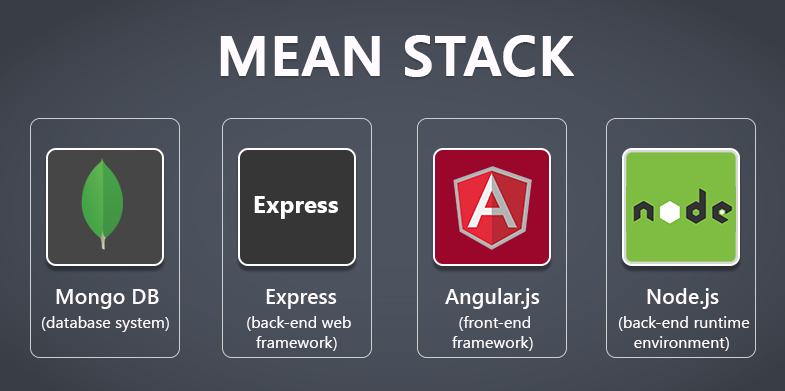

# WEB STACK IMPLEMENTATION (MEAN) in AWS

In this project we create a web solution using MEAN (MongoDB, ExpressJS, Angular, NodeJS)stack in AWS cloud

## Prerequisites

Before we begin, let's ensure you have everything needed to proceed. Below are the prerequisites for this project.
  - AWS Account: You need to have an AWS account. 
  - Create an AWS EC2 Instance.
  - Basic Understanding of JavaScript.
  - Basic Understanding of Angular.
  - Basic Understanding of Node.js
  - Basic Understanding of Non-Relational Databases
  - Basic Understanding of MongoDB

# STEPS TAKEN
## INSTALLING THE REQUIRED
