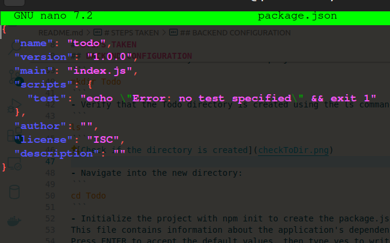

# MERN_WEB_STACK_101


In this project we create a web solution using __MERN__ (MongoDB, ExpressJS, ReactJS, NodeJS)stack in AWS cloud  

# TOPICS COVERED 
- AWS account creation  
- Basic understanding of Javascript.
- Basic understanding of Node js and React.
- Basic understanding of MongoDB
- How to Install Nodejs and NPM
- How to Install Express.js


# BACKEND CONFIGURATION
## INSTALLING NODEJS
 - Update ubuntu packages 
 ```
 sudo apt update
 ```
 - Upgrade Ubuntu 
 ```
sudo apt upgrade 
```
- Get the location of Node.js software from [Ubuntu repositories](https://github.com/nodesource/distributions#deb)
```
curl -fsSL https://deb.nodesource.com/setup_18.x | sudo -E bash - 
```
- Install Node.js on the server
```
sudo apt-get install -y nodejs
```
The  above command installs both *Nodejs* and *NPM*.  
NPM is a package manager for node like *apt* for Ubuntu.  
- Verify if node is installed using
```
node -v
```
- Verify if NPM is installed using
```
npm -v
```


- Create a new directory for the To-Do project then navigate into it:
```
mkdir -p Todo && cd Todo
```
__'-p' flag creates the directory if it does not exist__
- Verify that the Todo directory is created using the ls command:

- Initialize the project with npm init to create the package.json file.  
This file contains information about the application's dependencies.  
Press *ENTER* to accept the default values, then type yes to write out the package.json file.
- Check if the `package.json`  is present using:
```
ls
```
- Check the contents of package.json using nano:
```
nano package.json
```


## INSTALLING EXPRESS.JS
- Express is a framework for Node.js  
It helps to define routes for an application based on HTTP methods and URLs.

- To use express install it using npm:
```
npm install express
```
- Now create a file `index.js` with the command below
```
touch index.js
```
- Run the  __ls__ to confirm that index.js file is successfully created:  
```
ls
```
- Install the __dotenv__  
```
npm install dotenv
```
- Open the `index.js` with the command:
```
nano index.js
```
- Copy the code below inside the file
```js
const express = require('express');
require('dotenv').config();

const app = express();
// get the port from the environment variable or use port 5000
const PORT = process.env.PORT || 5000;

// define the index route
app.use((req, res, next) => {
    res.header("Access-Control-Allow-Origin", "\*");
    res.header("Access-Control-Allow-Headers", "Origin, X-Requested-With, Content-Type, Accept");
    next();
});

app.use((req, res, next) => {
    res.send('Welcome to the TO-DO app powered by MERN stack');
});

// start the server
app.listen(PORT, () => {
    console.log(`Server running on port ${PORT}`);
});
```
Use `Ctrl + o` and `Ctrl + x` to save and exit nano

- To start the server run 
```
node index.js
```

- Everything is running well.  
You can see the terminal running on __Server running on port 500__ in your terminal


- Refer to [Project 1](https://github.com/mwangiii/Steghub-devops-training/tree/master/Webstack_implementation_lemp) to learn how to install the Nginx Web server  
- To change the default port from **port 80**:  
    1.Open to the default file 
    ```
    sudo nano /etc/nginx/sites-available/default
    ```
    2.Change the listen directive from **80** to **5000**
    ```nginx
    server {
        listen 5000;
        server_name projectLEMP www.projectLEMP;
        root /var/www/projectLEMP;

        index index.html index.htm index.php;

    location / {
        try_files $uri $uri/ =404;
    }

    location ~ \.php$ {
        include snippets/fastcgi-php.conf;
        fastcgi_pass unix:/var/run/php/php8.3-fpm.sock;
    }

    location ~ /\.ht {
        deny all;
        }
    }

    ```
    3.Test the configuration using 
    ```
    sudo nginx -t
    ```
    4.Change the ec2 to listen to port 5000  
    I had a little bit of a hick up here so I used a [youtube tutorial](https://www.youtube.com/watch?v=j9oDMb7S6iw)  
    I finally did it
     

- Open up your browser and try access your server's public IP or Public DNS name followed by port 5000:
``` 
 http://13.60.72.1:5000
 ```
 

* Quick reminder how to get your server's Public IP and public DNS name:
 1. You can find it in your AWS web console in EC2  details.
 2. Run  
(for public IP)
``` 
curl -s http://169.254.169.254/latest/meta-data/public-ipv4
``` 
__OR__

(for Public DNS name)
``` 
curl -s http://169.254.169.254/latest/meta-data/public-hostname
``` 
## ROUTES 
- There are three actions that our To-DO applications needs to be able to do:  
  1.Create a new task.  
  2.Display list of all tasks  
  3.Delete a completed task  

- Each task will be associated with some particular endpoint and will use different standard [HTTP Request Methods](https://developer.mozilla.org/en-US/docs/Web/HTTP/Methods)  
**POST**, **GET**, **DELETE**.

- For each task,we need to create routes that will define various endpoints that the `To-do` app.  
- Create the folder routes 
```
mkdir routes -p && cd routes
```
You need multiple shells to connect to the same EC2
- Now create a file *api.js*
```
touch api.js
```
- Open the file with the command below
```
nano api.js
```
- Copy the command below
```javascript
const express = require('express'); 
const router = express.Router();

// Define the routes for the TO-DO app

// Route for getting the list of todos
router.get('/todos', (req, res, next) => {
    res.send('GET: list of todos [feature coming soon]');
});

// Route for adding a new todo
router.post('/todos', (req, res, next) => {
    res.send('POST: add a new todo [feature coming soon]');
});

// Route for updating an existing todo by ID
router.put('/todos/:id', (req, res, next) => {
    res.send('PUT: update a todo [feature coming soon]');
});

// Route for deleting a todo by ID
router.delete('/todos/:id', (req, res, next) => {
    res.send('DELETE: remove an embarrassing todo item [feature coming soon]');
});

module.exports = router;

```
## MODELS
- Mongodb is a nosql database so we need to create a model
- Install Mongoose in the Todo folder
```
npm install mong0ose
```
- create new folder models and then create a file named *todo.js*
```
mkdir -p models && touch models/todo.js
```
- Open the file todo.js
```
cd models && nano todo.js
```
- Copy the code:
```javascript
const mongoose = require('mongoose');
const Schema = mongoose.Schema;

// define the TO-DO schema
const TodoSchema = new Schema({
    action: {
        type: String,
        required: true
    },
    description: {
        type: String,
        required: true
    },
    status: {
        type: String,
        required: true
    },
    created_at: {
        type: Date,
        default: Date.now
    },
    updated_at: {
        type: Date,
        default: Date.now
    }
});

// create the TO-DO model
const Todo = mongoose.model('Todo', TodoSchema);

module.exports = Todo;
```
- In the `Routes` directory opn the file `api.js` and copy the code:
```js
const express = require('express');
const router = express.Router();
const Todo = require('../models/todo');

// define the routes for the TO-DO app

// Retrieve all TO-DO items
router.get('/todos', (req, res, next) => {
    Todo.find({}, 'action')
        .then(data => res.json(data))
        .catch(next)
});

// add a new TO-DO item
router.post('/todos', (req, res, next) => {
    if(req.body.action){
        Todo.create(req.body)
            .then(data => res.json(data))
            .catch(next)
    }else{
        res.json({
            error: "The input field is empty"
        })
    }
});
// update todo item by id
router.put('/todos/:id', (req, res, next) => {
    Todo.findByIdAndUpdate({_id: req.params.id}, req.body)
        .then(() => {
            Todo.findOne({_id: req.params.id})
                .then(data => res.json(data))
        })
        .catch(next)

});

// delete todo item by id
router.delete('/todos/:id', (req, res, next) => {
    Todo.findByIdAndDelete({_id: req.params.id})
        .then(data => res.json(data))
        .catch(next)
});

module.exports = router;
```

## MONGOBD DATABASE
- For the db we will use mLab which is ideal for our case  

 
 - create a dotenv file at the root of your project.
 ```
 touch .env
 ```
 - Paste the following string in the .env file to help connect the backend and the frontend.
 ```
 DB='mongodb+srv://<username>:<password>d@to-do-app-cluster.1viyb2v.mongodb.net/?retryWrites=true&w=majority&appName=TO-DO-app-cluster''
 ```
 **Replace the username and password with your actual username**
- Restart the server
```
node index.js
```
 

## POSTMAN TO TEST API
- You send JSON with the necessary fields.
- Open postman and create a **POST** request to the API ` http://13.60.72.1:5000/api/todos`
- Now make sure to set the header key as **Content-Type** as **application/json** 
- Make sure it supports **GET** **POST** **DELETE**  
- Testing **POST** in postman using  `POST http://13.60.72.1:5000/api/todos`

 

- Check if the data is in MongoDB

 

 - Testing **GET** in postman  using `GET http://13.60.72.1:5000/api/todos`

  
 - Testing **PUT** in postman using by adding an item with the id `6655ca85b98d37ab118c63a2` using `PUT http://13.60.72.1:5000/api/todos/6655ca85b98d37ab118c63a2`

  

 - Finally testing **delete** in postman using `DELETE http://13.60.72.1:5000/api/todos/"6655ca85b98d37ab118c63a2` to remove things from the DB

  

# FRONTEND CREATION
- Create the user interface for our web client(browser)
- Run 
```
npx create-react-app client
```
- This will create a new directory.
## INSTALLING FRONTEND DEPENDENCIES.
- We use concurrently to run the backend and frontend concurrently.
- To install concurrently run 
```
npm install concurrently --save-dev
```
- Let's add some server monitoring packages to the frontend. 
- We will use nodemon to monitor the backend server for changes and react-scripts to monitor the frontend server for changes.
- To install nodemon and react-scripts, run the following command:
```
npm install nodemon react-scripts --save-dev
```
## CONFIGURE  Frontend PACKAGE.JSON
- I updated the Todo/package.json file in the Todo directory to include the scripts for running the backend and frontend servers concurrently. 
- I also added the proxy to Todo/client/package.js for the frontend to communicate with the backend. 
- Here is the updated Todo/package.json and Todo/client/package.js/files:
```json
// Todo/package.json
{
  "name": "Todo",
  "version": "1.0.0",
  "description": "MERN stack implementation on AWS",
  "main": "index.js",
  "scripts": {
    "start": "node index.js",
    "server": "nodemon index.js",
    "client": "npm start --prefix client",
    "dev": "concurrently \"npm run server\" \"npm run client\""
  },
  "author": "Steghub",
  "license": "MIT",
  "devDependencies": {
    "concurrently": "^6.2.0",
    "nodemon": "^2.0.12",
    "react-scripts": "^4.0.3"
  }
}
```
```json
// Todo/client/package.json
{
  "name": "client",
  "version": "0.1.0",
  "private": true,
  "dependencies": {
    "@testing-library/jest-dom": "^5.11.4",
    "@testing-library/react": "^11.1.0",
    "@testing-library/user-event": "^12.1.10",
    "react": "^17.0.2",
    "react-dom": "^17.0.2",
    "react-scripts": "4.0.3",
    "web-vitals": "^1.0.1"
  },
  "scripts": {
    "start": "react-scripts start",
    "build": "react-scripts build",
    "test": "react-scripts test",
    "eject": "react-scripts eject"
  },
  "eslintConfig": {
    "extends": [
      "react-app",
      "react-app/jest"
    ]
  },
  "browserslist": {
    "production": [
      ">0.2%",
      "not dead",
      "not op_mini all"
    ],
    "development": [
      "last 1 chrome version",
      "last 1 firefox version",
      "last 1 safari version"
    ]
  }
}
```

- Before we test it in the browser let's update the inbound rules of the EC2 instance to allow traffic on port 3000.
-  we will be running the frontend server on port 3000.
I added a custom TCP rule for port 3000 to allow traffic from all IP addresses. 
 


- When we run:
```
npm run dev
```

- We should see - on the browser if we load `http://13.60.72.1:3000`


- Before we test it in the browser let's update the inbound rules of the EC2 instance to allow traffic on port 3000.
-  we will be running the frontend server on port 3000.
## UPDATE INBOUND RULES FOR EC2 INSTANCE.
I added a custom TCP rule for port 3000 to allow traffic from all IP addresses.
## TEST IN THE BROWSER
- If the EC2 server is still running you will see the client app working here
- You can retrieve all the to-do items using the client side [URL](http://13.60.72.1:3000/api/todos)

## CREATE REACT COMPONENTS
- I created a few React components to display the TO-DO items. 
- The components will be used to display the TO-DO items on the frontend.
- I created a new directory called components inside the client/src directory. 
- Inside the components directory, I created a new file called Todo.js and defined the Todo component. Here is the code for the Todo.js file:

```javascript
// client/src/components/Input.jss
import React, { Component } from 'react';
import axios from 'axios';

class Input extends Component {
    state = {
        action: '',
    }

    addToDo = () => {
        const task = {
            action: this.state.action
        }

        if (task.action && task.action.length > 0) {
            axios.post('/api/todos', task)
                .then(res => {
                    if (res.data) {
                        this.props.getTodos();
                        this.setState({ action: '' });
                    }
                })
                .catch(err => console.log(err))

        } else {
            console.log('Input field is empty')
        }
}

handleChange = (e) => {
    this.setState({
        [e.target.name]: e.target.value
    })
}

render() {
    let { action } = this.state;
    return (
        <div>
            <input type="text" name="action" value={action} onChange={this.handleChange} />
            <button onClick={this.addToDo}>Add</button>
        </div>
    )
}

export default Input;
```

- This code defines the Input component that will be used to add a new TO-DO item. - - The Input component has an input field and a button. The user can type the TO-DO item in the input field and click the button to add the TO-DO item. 
- The addToDo method is called when the user clicks the button.
- The handleChange method is called when the user types in the input field.

- Notice that we use **axios** to make a ****```POST** request to the backend to add a new TO-DO item. We will need to install the axios package. [axios] will make it easier to make HTTP requests from the frontend to the backend. To install the axios package, run the following command:
```
npm install axios
```
- Now let's create a few more components to display the TO-DO items. 
- I created a new file called ListTodo.js inside the /client/src/components directory. 
- Here is the code for the ListTodo.js file:
```javascript
// client/src/components/ListTodo.js

import React from 'react';

const ListTodo = ({ todos, deleteTodo }) => {
    return (
        <div>
            <ul>
                {todos && todos.length > 0 ? todos.map(todo => (
                    <li key={todo._id}>
                        {todo.action}
                        <button onClick={() => deleteTodo(todo._id)}>Delete</button>
                    </li>
                )) : <li>No TO-DO items</li>}
            </ul>
        </div>
    )
}

export default ListTodo;
```

- Let's also add a Todo.js component to display the TO-DO items.
-  I created a new file called Todo.js inside the /client/src/components directory. - - Here is the code for the Todo.js file:
```javascript
// client/src/components/Todo.js

import React, { Component } from 'react';
import axios from 'axios';

import Input from './Input';
import ListTodo from './ListTodo';

class Todo extends Component {
    state = {
        todos: []
    }

    componentDidMount() {
        this.getTodos();
    }

    getTodos = () => {
        axios.get('/api/todos')
            .then(res => {
                if (res.data) {
                    this.setState({ todos: res.data })
                }
            })
            .catch(err => console.log(err))
    }

    deleteTodo = (id) => {
        axios.delete(`/api/todos/${id}`)
            .then(res => {
                if (res.data) {
                    this.getTodos();
                }
            })
            .catch(err => console.log(err))
    }

    render() {
        let { todos } = this.state;
        return (
            <div>
                <h1>TO-DO List</hh1>
                <Input getTodos={this.getTodos} />
                <ListTodo todos={todos} deleteTodo={this.deleteTodo} />
            </div>
        )
    }
}

export default Todo;
```
- Finally, I updated the App.js file in the /client/src directory to include the Todo component.
- I also added some styling to the App.css file in the /client/src directory to style the TO-DO app.
- Here is the code for the App.js file:

```javascript
// client/src/App.js

import React from 'react';

import Todo from './components/Todo';
import 'App.css';

const App = () => {
    return (
        <div className="App">
            <Todo />
        </div>
    )
}

export default App;
```

- The App.css file will contain the following code:
```css
/* client/src/App.css */

.App {
    text-align: center;
    font-zize: calc(10px + 2vmin);
    width: 60%;
    margin-left: auto;
    margin-right: auto;
}

input {
    height: 40px;
    width: 50%;
    border: none;
    border-bottom: 1px solid #000;
    background-color: none;
    font-size: 1.5rem;
    color: #787a80;
}

input:focus {
    outline: none;
}

button {
    height: 45px;
    width: 25%;
    background: #101113;
    color: #787a80;
    border: none;
    cursor: pointer;
    font-size: 25px;
    margin-left: 10px;
}

button:focus {
    outline: none;
}

ul {
    list-style-type: none;
    padding: 0;
    text-align: left;
    padding: 15px;
    backcground: #171a1f;
    border-radius: 5px;
}

li {
    padding: 10px;
    margin: 10px;
    background: #282c34;
    color: #787a80;
    border-radius: 5px;
    overflow-wrap: break-word;
    cursor: pointer;

}

@media only screen and (max-width: 600px) {
    .App {
        width: 90%;
    }

    .input {
        width: 80%;
    }

    button {
        width: 100%;
        margin-top: 10px;
        margin-left: 0;
    }
}
```

## TEST NEW REACT COMPONENTS

- Finally time for live testing of the TODO app.
-  I ran the frontend server using the following command:
```
npm run dev
```

- I then navigated to `http://13.60.72.1:3000/api/todos` to test it out.


- The *TO-DO* app is working as expected. 
- The user can add a new TO-DO item, retrieve all TO-DO items, update a TO-DO item, and delete a TO-DO item. 
- We have sucessfully set up a MERN Stack Application development environment on AWS.
- The backend is working as expected and the frontend is also working as expected.

# KEYWORDS
- Port number: A numerical identifier used in computer networking to distinguish different communication endpoints, facilitating the routing of data between devices.
- CRUD operations: An acronym for Create, Read, Update, Delete, representing the basic functions used in database management systems for interacting with data.
- NoSQL: A type of database management system that stores and retrieves data using methods other than the traditional relational database model, often used for handling large volumes of unstructured or semi-structured data.
- Model: In software development, a representation of the structure and behavior of a system or component, often used in the context of Model-View-Controller (MVC) architecture.
- API: An Application Programming Interface, which defines the methods and protocols for communication between different software components or systems.
- Proxy: An intermediary server or software component that acts as an intermediary between clients and servers, facilitating communication and providing additional functionalities such as caching or security features.

# CONCLUSION
I now have a fully functional MERN stack application running on AWS. This guide covers the basics of setting up and deploying a MERN stack application but there are many additional features and improvements I made, such as adding user authentication, improving error handling, and optimizing the performance of the application.